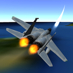

.. ****************************************************************************
.. CUI//REL TO USA ONLY
..
.. The Advanced Framework for Simulation, Integration, and Modeling (AFSIM)
..
.. The use, dissemination or disclosure of data in this file is subject to
.. limitation or restriction. See accompanying README and LICENSE for details.
.. ****************************************************************************

.. demo:: air_to_air

.. |classification| replace:: Unclassified
.. |date|           replace:: 2020-10-03
.. |group|          replace:: Demos
.. |image|          replace:: images/air_to_air_demo_150.png
.. |tags|           replace:: n/a
.. |title|          replace:: air_to_air demo
.. |startup|        replace:: 1v1.txt
.. |summary|        replace:: This is a collection of demos involving air-to-air combat.

.. include:: demo_template.txt

| This is a collection of several demos that demonstrate air-to-air combat using the :model:`WSF_SA_PROCESSOR` and :doc:`Advanced Behavior Trees (ABTs)<advanced_behavior_tree>`.
|
| The following demos are included (all demos use :model:`WSF_BRAWLER_MOVER`, unless otherwise indicated): 

* 1v1
   * This is a simple one-versus-one engagement
* 1v1_initial_prediction
   * This is a simple scenario illustrating a set of predictions from the :model:`WSF_SA_PROCESSOR`
* 2v2
   * This is a two-versus-two engagement
* 2v2_am
   * This is a two-versus-two engagement (uses :model:`WSF_AIR_MOVER`)
* 2v2_six_dof
   * This is a two-versus-two engagement (uses :model:`WSF_POINT_MASS_SIX_DOF_MOVER`)
* hvaa_dca
   * This is a HVAA-P/DCA mission
* escort
   * This is a bomber escort mission

1v1.txt
-------

| This scenario demonstrates a one-versus-one, head-to-head engagement (1v1) between two fighters.

1v1_initial_prediction.txt
--------------------------

| This scenario demonstrates the basic prediction capabilities of the :model:`WSF_SA_PROCESSOR`. Each different prediction will draw its own line segment (using :class:`WsfDraw`) onto the Map Display illustrating the movement of the aircraft being predicted.

2v2.txt
-------

| This scenario demonstrates a two-versus-two engagement (2v2) between two blue and two red fighters.

2v2_am.txt
----------

| This scenario demonstrates a two-versus-two (2v2) engagement, but this uses :model:`WSF_AIR_MOVER` for the movers instead of :model:`WSF_BRAWLER_MOVER`.

2v2_six_dof.txt
---------------

| This scenario demonstrates a two-versus-two (2v2) engagement, but this uses :model:`WSF_POINT_MASS_SIX_DOF_MOVER` for the movers instead of :model:`WSF_BRAWLER_MOVER`.

hvaa_dca.txt
------------

| This scenario demonstrates a High-Value Airborne Asset (HVAA) Protection / Defensive Counter-Air (DCA) mission with four blue fighters on Combat Air Patrol (CAP) defending a HVAA (AWACS) versus six red fighters that are seeking to shoot down the AWACS.

escort.txt
----------

| This scenario demonstrates an escort of a single bomber by four blue fighters. Six red fighters will attempt to shoot down the bomber.

.. warning::
   This demo does not work with Linux, due to a problem with the :model:`WSF_BRAWLER_MOVER`.
