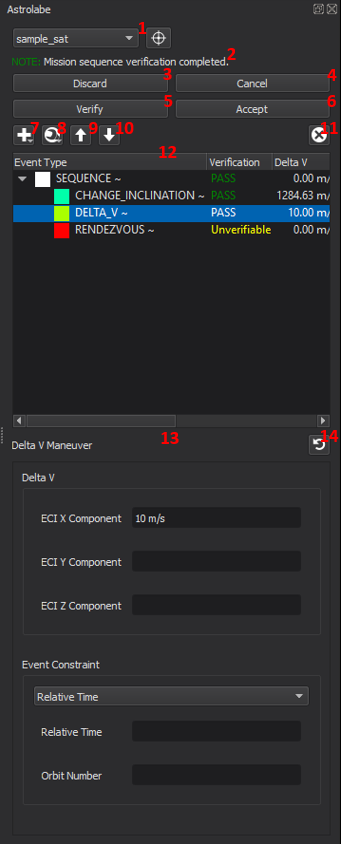

.. ****************************************************************************
.. CUI
..
.. The Advanced Framework for Simulation, Integration, and Modeling (AFSIM)
..
.. The use, dissemination or disclosure of data in this file is subject to
.. limitation or restriction. See accompanying README and LICENSE for details.
.. ****************************************************************************

Astrolabe - Warlock
-------------------

**Astrolabe** is a tool for easily creating
:ref:`mission sequences <WSF_SPACE_MOVER.orbital_mission_sequence>`
for space platforms

Astrolabe works on a single platform at a time, and can modify
the mission sequence for that platform. Unlike most other Warlock tools,
Astrolabe does not work on the selected platform. Instead, Astrolabe
works for a single platform selected using the tool. This allows the user to
examine other platforms using other Warlock tools without losing the
sequence being designed with Astrolabe.

When a sequence has been designed and accepted, the
selected platform will execute the mission sequence designed in Astrolabe
immediately, supplanting any existing sequence on the current platform.

Controls
========

Astrolabe can be activated from context menus for space-domain platforms.
When activated, Astrolabe will show the mission sequence for that platform.
Additionally, the Astrolabe dock can be shown via the View menu.

The following describes the controls in Astrolabe.

**1. Platform Selection**

These controls provide two means of selecting the platform for which
Astrolabe is displaying the mission sequence. First, users can select a 
platform in the drop down box. Second, users can select a platform from the
map display using the tool button. In both cases, only space platforms
that are locally controlled can be selected.

**2. Status Message**

Astrolabe will sometimes provide a status message giving updates on actions
taken, warnings, or errors.

**3. Discard**

This button will discard any designed sequence without executing that sequence
in the simulation.

**4. Cancel**

This button will cancel any currently executing mission sequence on the
selected platform.

**5. Verify**

This button runs a verification on the current mission sequence. For details on
this please see :ref:`Mission Sequence Verification <wk_astrolabe_mission_sequence_verification>`
below.

**6. Accept**

This button accepts the changes to the mission sequence, and causes the mission
sequence to be executed by the current platform.

**7. Add Mission Event**

This button opens a drop down menu with every orbital event that Astrolabe
supports. Selecting one will add a mission event of that type to the end of
the mission sequence.

**8. Transform Event**

This button opens a drop down menu with every event type into which the
currently selected event can be transformed. Selecting one of these items
will transform the currently selected mission event into the selected type.

**9. Move Event Up**

This button moves the currently selected mission event up in the mission
sequence, effectively swapping the order of the selected event and the
event immediately preceding it.

**10. Move Event Down**

This button moves the currently selected mission event down in the mission
sequence, effectively swapping the order of the selected event and the event
immediately following it.

**11. Remove Event**

This button removes the currently selected event from the mission sequence.

.. _sequence_panel:

**12. Sequence Panel**

This panel displays the mission sequence. By selecting an event in the mission
sequence, the details of that event will be loaded in the Details Panel on the
right side of Astrolabe. Events that have had changes made to them, but which
have not been added to the simulation will have a
'~' appended to the event type in this panel.

.. image:: ../images/wkf_astrolabe_modification_indicator.png

This panel also shows the results of mission sequence verification, and the
color key for the events in the orbit preview. Please see
:ref:`Mission Sequence Verification <wk_astrolabe_mission_sequence_verification>` and 
:ref:`Orbital Event Preview <wk_astrolabe_orbital_event_preview>` for details.

**13. Details Panel**

This panel displays the details of the currently selected mission event. Most
of the contents of this panel depend on the specific event type being displayed.
It is through this panel that users will modify the details of the events in
the mission sequences they are designing.

For fields that require units, the input elements will display text in red
until valid units are supplied. Further, for those input fields, the values
can be automatically converted to equivalent units from entries in the context
menu for that field.

.. image:: ../images/wkf_astrolabe_context_unit.png

**14. Reset Modifications**

This button resets any modifications made to the currently selected mission
event.

.. _wk_astrolabe_mission_sequence_verification:

Mission Sequence Verification
=============================

After a mission sequence is designed in Astrolabe, the sequence can be verified.
This checks a number of details about the mission and mission events and informs
the user if the given sequence is executable as designed. This allows the user
to quickly check for many errors in sequence construction before that sequence
makes it into the simulation.

Verification occurs in two steps: first, the input is checked to assure
that the event parameters are in their allowed ranges; second, the
mission sequence is run through AFSIM's standard verification process.

Errors in the first step are indicated with a dialog box outlining the problem.
To make correcting the issue easier, the offending event is selected so that
the user is directed immediately to the problem. In cases where there are
multiple errors for a single event, these are all displayed at the same time.
In cases where there are errors for multiple events, the user will be notified
for only the first event in the sequence that has an out-of-range event
parameter, so the user will have to select 'Verify' again until all such errors
are corrected.

Once all event parameters are in range, the results of the verification process
will be displayed in the :ref:`Sequence Panel <sequence_panel>`. Each entry in
the sequence will display five additional columns of information, as well as
a color key for use with the :ref:`orbital event preview <wk_astrolabe_orbital_event_preview>`.
In order, the extra columns of data are: the overall status of the verification,
the delta-v cost of the event, the delta-v budget remaining on the platform,
the simulation time of the event, and the date and clock time of the event.
The meaning of these fields is described below.

The overall verification status of the event is a one-word summary of the
results of the verification. The possible values are PASS, FAIL and Unverifiable.
When an event has a PASS, that means that the event can proceed, all pre- and
post-conditions on the event obtain, and that there is sufficient delta-v
available to execute the event. An event will show FAIL when some condition for
successful execution is not satisfied. To see the reason for the failure,
hover the mouse over the FAIL indication and the resulting error messages will
appear. An event is Unverifiable if there is some dependence on the actual
state of the simulation for the execution of the event. The prototypical
example of such an event is an Intercept event, which needs to know the
state of the target platform before it can compute the details of the event.
If any event either has a FAIL or Unverifiable status, all events following that
will be unable to be verified, so there will be no additional information
provided for events after such events.

The delta-v for each event lists the total delta-v used during that event.
The delta-v budget gives the remaining delta-v available for the platform.

The Sim Time of the event is the number of seconds since the beginning of the
simulation, and the Date of the event gives the equivalent date and clock time.

.. _wk_astrolabe_orbital_event_preview:

Orbital Event Preview
=====================

After the mission sequence has been verified, a preview of the mission sequence
can be visualized in the :doc:`../wkf_plugin/wk_map_display`. To see these previews, an event
that has had verification attempted must be selected in the
:ref:`Sequence Panel <sequence_panel>`. For each event
displayed, Astrolabe will display both the orbit before the event and the orbit
after the event. The color of the displayed events will match the color indicated
next to the event's name in the Sequence Panel, with the orbit before the event
drawn darker. If a sequence is selected, all events in that sequence will be
previewed. To make it clear where the platform would be for the event, a wedge
icon is placed on the orbit oriented so the arrow points along the final orbit
of the particular event. In some cases the orbit before and after an event
are identical (e.g., a staging event), in which case only one orbit is displayed.

For example, the following image shows the preview of an entire mission sequence.

.. image:: ../images/wkf_astrolabe_orbit_preview.png
