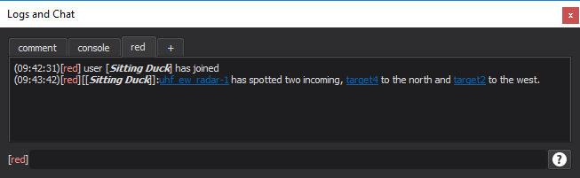
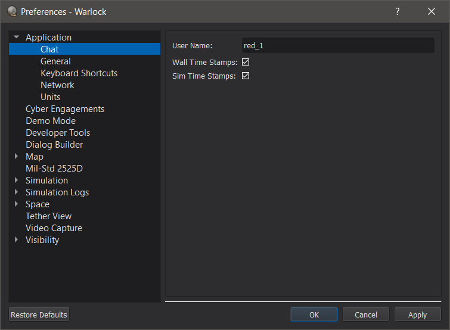

.. ****************************************************************************
.. CUI
..
.. The Advanced Framework for Simulation, Integration, and Modeling (AFSIM)
..
.. The use, dissemination or disclosure of data in this file is subject to
.. limitation or restriction. See accompanying README and LICENSE for details.
.. ****************************************************************************

Chat - Warlock
-----------------------

The Chat dialog allows for text-communication over the network.

To display the dialog, enable it in the view menu under "Chat".

Chat sources are categorized into tabs in the dialog.  New tabs may be created by clicking on the "+" tab.  Tabs may be renamed by double clicking the tab name.  

Tabs can be undocked from the main chat widget by right clicking them and selecting "Undock Tab". Tabs can be moved between windows by dragging. When closing a secondary window, all tabs will be moved to the main window.

The following commands may be entered into the dialog:

.. list-table::
   :header-rows: 1

   * -  Chat Commands
     -
   * - /help
     - Displays a help message
   * - /join <channel>
     - Joins the named chat channel on the current tab
   * - /leave <channel>
     - Leave the named chat channel on the current tab
   * - /channels
     - List the channels in the current tab
   * - /who
     - List the active participants in the current channel
   * - /<channel>
     - Changes the current channel to the named channel
   * - /<channel> message
     - Sends a message on the named channel

In addition, typing in the input field and hitting return will send a message on the current channel.

Links may be communicated across chat in the following format.

.. list-table::
   :header-rows: 1

   * - Link Commands
     -
   * - {p:name}
     - Creates a link the a platform with the given name
   * - {t:name}
     - Creates a link to a track with the given name
   * - {v:lat,lon,dist,tilt,rotate,text}
     - Creates a link to the described camera view

There are menu options available by right clicking on platforms, tracks, or the map view to automatically copy these links to the clipboard.

Logs may be written to file by right clicking on the dialog and choosing 'Save-as'. Saved files may be opened by right clicking on the dialog and choosing 'Load'.  Loaded files may be appended to using the chat input field.

Preferences
~~~~~~~~~~~

The chat preferences have options to set a username and to include (real) time stamps on chat messages.
Network preferences are set in a separate :doc:`Network Preferences<../warlock_pref_network>` page.

