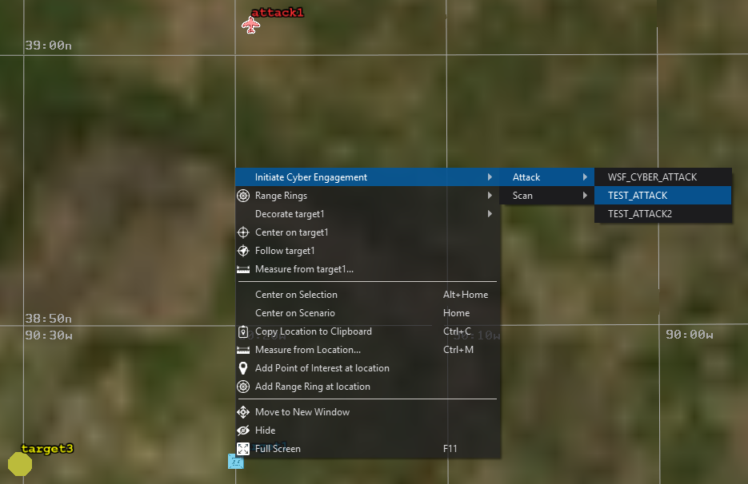

.. ****************************************************************************
.. CUI
..
.. The Advanced Framework for Simulation, Integration, and Modeling (AFSIM)
..
.. The use, dissemination or disclosure of data in this file is subject to
.. limitation or restriction. See accompanying README and LICENSE for details.
.. ****************************************************************************

Cyber Engagement Controller - Warlock
-------------------------------------

The Cyber Engagement Controller provides the ability to use predefined cyber attack types to attack or scan platforms directly from Warlock.

To use, select the attacking platform(s) then right click on the target platform. Select "Initiate Cyber Engagement," "Attack" or "Scan," and the desired attack type. The attacking platforms will then initiate the cyber engagement on the target platform.
