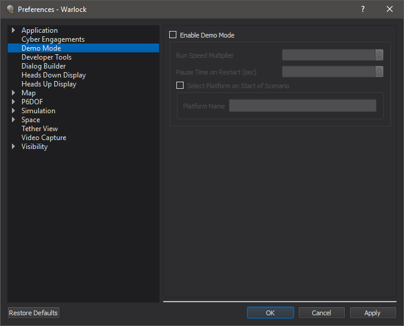

.. ****************************************************************************
.. CUI
..
.. The Advanced Framework for Simulation, Integration, and Modeling (AFSIM)
..
.. The use, dissemination or disclosure of data in this file is subject to
.. limitation or restriction. See accompanying README and LICENSE for details.
.. ****************************************************************************

Demo Mode - Warlock
-------------------

Demo Mode provides the user the ability to automatically restart the scenario on completion along with a few display settings. It is intended for use with  demonstrations during conferences or presentations where it is desirable to have a scenario running on loop in the background.

Preferences
===========

Demo Mode can be enabled from the Preferences dialog. A speed multiplier option is provided, along with the option to pause the simulation at a specific time when it restarts.

In addition, a platform can be selected automatically when the scenario starts.
