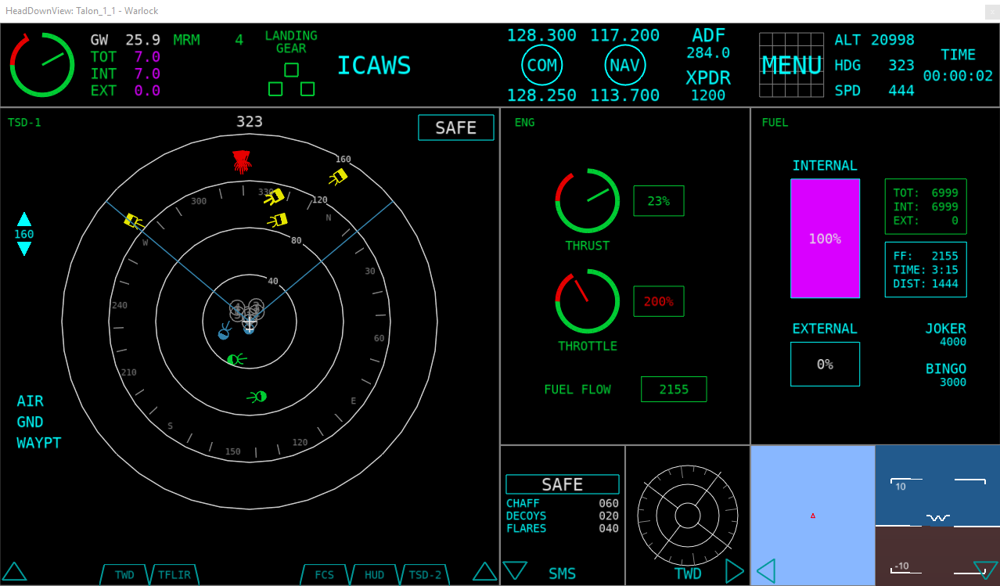
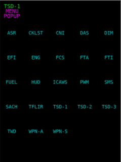
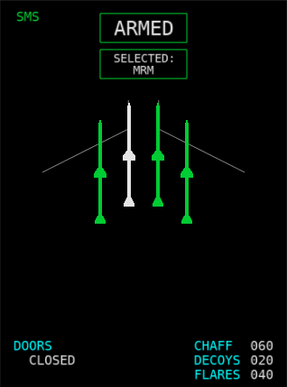
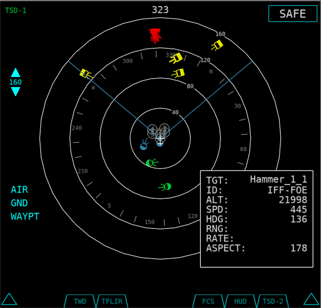

.. ****************************************************************************
.. CUI//REL TO USA ONLY
..
.. The Advanced Framework for Simulation, Integration, and Modeling (AFSIM)
..
.. The use, dissemination or disclosure of data in this file is subject to
.. limitation or restriction. See accompanying README and LICENSE for details.
.. ****************************************************************************

Head Down View - Warlock
------------------------

.. |ACES_DISPLAY_DOC| replace:: :doc:`ACES Display<../wkf_plugin/wk_aces_display>`

.. warning:: The Head Down View plugin is **DEPRECATED** and no longer supported. Users should avoid using it, since it will be removed from AFSIM in the near future. The |ACES_DISPLAY_DOC| should be used instead and provides many of the same features plus other capabilities.

The Head Down View shows a glass-cockpit-like head down display for the selected platform.  The tool is available on the context menu when right clicking on a platform. Multiple head down views may be opened at the same time.

.. note:: For all available data to be shown, a platform with a :doc:`Situation Awareness Processor <../wsf_sa_processor>` is necessary.

.. note:: The Head Down View is a prototype capability and is not complete.  As a result of this, it is disabled by default and must be enabled through the :doc:`Plugin Manager <../warlock_plugin_manager>`.

The display is broken into 12 default pages.  Pages may be expanded or contracted by clicking on the arrows at the bottom.  The pages are identified by the following numbers (default pages may be picked in Preferences):

.. image:: ../images/hdd_slots.png
   :scale: 75 %

Pages
=====
Pages may be changed by opening the menu button at the top left of one of the main pages (1-4).

Below is a list of pages along with their current functionality:

+-------+--------------------------------------------------------------------------+
| Page  |                                 Function                                 |
+=======+==========================================================================+
| ASR   | Not Implemented                                                          |
+-------+--------------------------------------------------------------------------+
| CKLST | Not Implemented                                                          |
+-------+--------------------------------------------------------------------------+
| CNI   | Not Implemented                                                          |
+-------+--------------------------------------------------------------------------+
| DAS   | Not Implemented                                                          |
+-------+--------------------------------------------------------------------------+
| DIM   | Not Implemented                                                          |
+-------+--------------------------------------------------------------------------+
| EFI   | Shows pitch and roll                                                     |
+-------+--------------------------------------------------------------------------+
| ENG   | Shows throttle, thrust, and fuel flow values                             |
+-------+--------------------------------------------------------------------------+
| FCS   | Not Implemented (Visual Placeholder)                                     |
+-------+--------------------------------------------------------------------------+
| FTA   | Not Implemented                                                          |
+-------+--------------------------------------------------------------------------+
| FTI   | Not Implemented                                                          |
+-------+--------------------------------------------------------------------------+
| FUEL  | Shows fuel information such as tank levels, fuel flow, and time to empty |
+-------+--------------------------------------------------------------------------+
| HUD   | (Visual Placeholder) Shows heading, speed (KTAS), and altitude           |
+-------+--------------------------------------------------------------------------+
| ICAWS | Not Implemented (Implemented in header)                                  |
+-------+--------------------------------------------------------------------------+
| NAV   | Shows an overhead map view of the aircraft (Not currently in menu)       |
+-------+--------------------------------------------------------------------------+
| PWM   | Not Implemented                                                          |
+-------+--------------------------------------------------------------------------+
| SMS   | Shows information on weapons, master arm, and external fuel tanks        |
+-------+--------------------------------------------------------------------------+
| SACH  | Not Implemented                                                          |
+-------+--------------------------------------------------------------------------+
| TFLIR | Not Implemented (Visual Placeholder)                                     |
+-------+--------------------------------------------------------------------------+
| TSD-1 | Shows the tactical situation using track information                     |
+-------+--------------------------------------------------------------------------+
| TSD-2 | Shows the tactical situation using track information                     |
+-------+--------------------------------------------------------------------------+
| TSD-3 | Shows the tactical situation using track information                     |
+-------+--------------------------------------------------------------------------+
| TWD   | Shows RWR/ESM threats                                                    |
+-------+--------------------------------------------------------------------------+
| WPN-A | Not Implemented                                                          |
+-------+--------------------------------------------------------------------------+
| WPN-S | Not Implemented                                                          |
+-------+--------------------------------------------------------------------------+

Header (Top Bar)
================

.. image:: ../images/hdd_header.png
   :scale: 75 %

The header bar at the top of the display shows off twelve different regions of information.  From left to right:

+---------------+--------------------------------------------------------------------------+
| Region        |                                 Function                                 |
+===============+==========================================================================+
| Engine        | Shows the thrust and throttle values                                     |
+---------------+--------------------------------------------------------------------------+
| Fuel          | Shows gross weight, as well as total, internal, and external fuel values |
+---------------+--------------------------------------------------------------------------+
| Weapons       | Shows weapons and their quantities.  The selected weapon will show white |
+---------------+--------------------------------------------------------------------------+
| Landing Gear  | Shows the landing gear positions.  Empty Green means the gear is up,     |
|               | red means the gear is moving, and solid green means the gear is down     |
+---------------+--------------------------------------------------------------------------+
| ICAWS         | Shows three warnings: Master Caution, Master Warning, and Stall Warning  |
+---------------+--------------------------------------------------------------------------+
| Blank         | None (Empty space)                                                       |
+---------------+--------------------------------------------------------------------------+
| COM           | None (Visual only)                                                       |
+---------------+--------------------------------------------------------------------------+
| NAV           | None (Visual only)                                                       |
+---------------+--------------------------------------------------------------------------+
| ADF/XPDR      | None (Visual only)                                                       |
+---------------+--------------------------------------------------------------------------+
| Menu          | None (Visual only)                                                       |
+---------------+--------------------------------------------------------------------------+
| Platform Info | Shows platform altitude(ft), heading (deg), and speed (KTAS)             |
+---------------+--------------------------------------------------------------------------+
| Sim Time      | Shows the time since simulation start                                    |
+---------------+--------------------------------------------------------------------------+

Artificial Horizon (EFI)
========================

.. image:: ../images/hdd_efi.png
   :scale: 75 %

The artificial horizon will show the platform orientation.

Engine Display (ENG)
====================

.. image:: ../images/hdd_eng.png
   :scale: 75 %

The engine display will show the thrust, throttle, and fuel flow (pounds per hour) values for the platform.

Fuel Display (FUEL)
===================

.. image:: ../images/hdd_fuel.png
   :scale: 75 %

The fuel display will show information on total, internal, and external fuel levels, as well as fuel flow, time and distance to empty, and joker and bingo levels. Units are pounds.

HUD Repeater (HUD)
==================

.. image:: ../images/hdd_hud.png
   :scale: 75 %

The HUD repeater display shows the platform's heading (deg), altitude (ft), and true airspeed (knots).

Moving Map Display (NAV)
========================

.. image:: ../images/hdd_nav.png
   :scale: 75 %

The moving map display will show the platform's location over a map.  The map is determined by the navigational map profile in the Map Definition preferences.  The map may be zoomed in and out using the mouse wheel.

Stores Management System (SMS)
==============================

The SMS display shows the platform's current weapon and external fuel tank configuration.

Weapon Drawing
++++++++++++++

Weapons will be shown in a two row 16 weapon layout if more than 8 weapons are present, or otherwise in a one row 8 weapon layout.  Weapons will be loaded from the middle outward depending on each weapons draw type.  The currently supported draw types are Bomb, SRM, and MRM.  They are loaded into the display in this order.  The currently selected weapon will be shown in white.

.. note::
   The weapon name must contain the string listed (Case insensitive), or it will default to drawing as an MRM.

+-----------------------+-----------+
| Weapon Name Contains  | Draw Type |
+=======================+===========+
| "bomb", "agm"         | Bomb      |
+-----------------------+-----------+
| "srm", "fox2", "srv"  | SRM       |
+-----------------------+-----------+
| default               | MRM       |
+-----------------------+-----------+

Master Arm and Selected Weapon
++++++++++++++++++++++++++++++

If the master arm is off, a SAFE box will be shown with a cyan outline.  When the master arm is switched on, the box will turn green.  If a weapon is then selected, it will be shown in a box below the master arm box.  If the weapon is out of ammo, its box will turn red.

Countermeasures and Doors
+++++++++++++++++++++++++

Countermeasure counts for chaff, decoys, and flares are shown. A doors label indicates the state of weapon bay doors (open/closed).

Tactical Situation Display (TSD)
================================

.. note::
   If Page 1 in the preferences is set to TSD, it will be expanded to maximum size by default.

The TSD shows the current 'Tactical Situation' for the current platform using track data. Entities are colored depending on identification information provided in the track data.  Hovering over an entity with the mouse will show additional information about that item in the lower right of the TSD.  Clicking the item will keep the window displayed until either some location away from the entity is clicked, or the track is lost.

Master Arm and Selected Weapon
++++++++++++++++++++++++++++++

If the master arm is off, a SAFE box will be shown with a cyan outline.  When the master arm is switched on, the box will turn green.  If a weapon is then selected, it will be shown in a box below the master arm box.  If the weapon is out of ammo, its box will turn red.

Symbols
+++++++

Entities are drawn as one of the following, depending on their identification:

.. |neutral| image:: ../images/hdd_neutral.png
   :width: 15pt
   :height: 25pt
   :align: middle

+----------------+---------------+------------+
| Identification |    Symbol     |            |
+================+===============+============+
| Bogie/Unknown  | Yellow square | |bogie|    |
+----------------+---------------+------------+
| Neutral        | White square  | |neutral|  |
+----------------+---------------+------------+
| Bandit/Threat  | Red triangle  | |bandit|   |
+----------------+---------------+------------+
| Friendly       | Green circle  | |friendly| |
+----------------+---------------+------------+
| Flight         | Blue circle   | |flight|   |
+----------------+---------------+------------+

Buttons
+++++++

The TSD includes the following buttons, which may be left-clicked with the mouse:

+----------------+--------------------------------------------------------+
| Button         |                         Action                         |
+================+========================================================+
| Range Up/Down  | Changes the current range in nm. Ranges include:       |
|                | 5, 10, 20, 40, 80, 160, 320, and 640 nm.               |
+----------------+--------------------------------------------------------+
| Air            | Toggles visibility of air domain entities              |
+----------------+--------------------------------------------------------+
| Gnd            | Toggles visibility of ground domain entities           |
+----------------+--------------------------------------------------------+
| Waypt          | Toggles visibility of waypoints/routes                 |
+----------------+--------------------------------------------------------+

Threat Warning Display (TWD)
============================

.. image:: ../images/hdd_twd.png
   :scale: 75 %

The TWD shows ESM/RWR tracks along with a possible identification id (Id is not implemented yet, so a "U" for unknown is used).  To get data into this display, a track processor with either the name "esm" or "rwr" (case insensitive) must be used.  Threats will show in the outer ring of the display as a white square with an id string in the middle.

Countermeasures
+++++++++++++++

Countermeasure counts for chaff, decoys, and flares are shown.

Preferences
===========

.. image:: ../images/wk_hdd_prefs.png

In the preferences, the resolution as well as the default page for each slot may be set.

.. note::
   If Page 1 is set to TSD, it will be expanded to maximum size by default.
