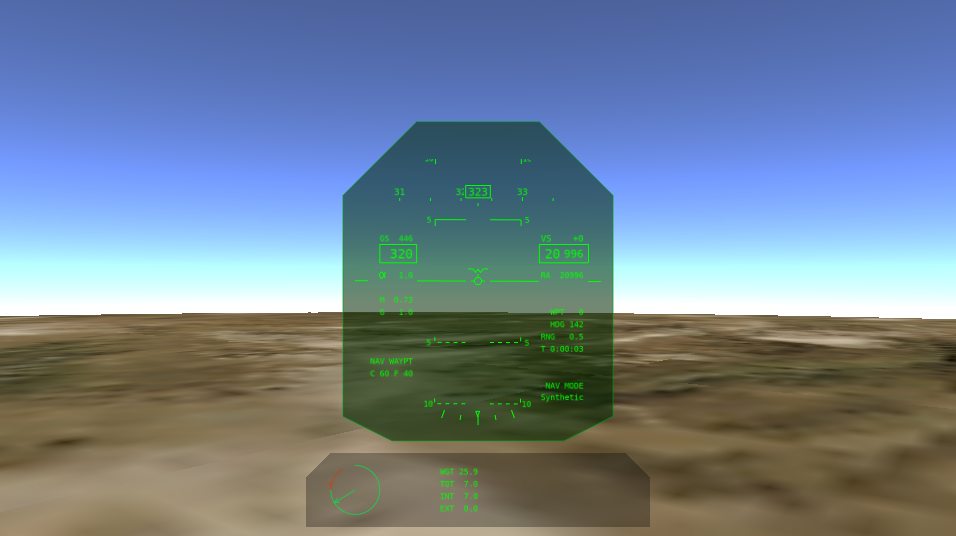

.. ****************************************************************************
.. CUI//REL TO USA ONLY
..
.. The Advanced Framework for Simulation, Integration, and Modeling (AFSIM)
..
.. The use, dissemination or disclosure of data in this file is subject to
.. limitation or restriction. See accompanying README and LICENSE for details.
.. ****************************************************************************

Head Up View - Warlock
----------------------

.. |ACES_DISPLAY_DOC| replace:: :doc:`ACES Display<../wkf_plugin/wk_aces_display>`

.. warning:: The Head Up View plugin is **DEPRECATED** and no longer supported. Users should avoid using it, since it will be removed from AFSIM in the near future. The |ACES_DISPLAY_DOC| should be used instead and provides many of the same features plus other capabilities.

The Head Up View shows an out-the-window (OTW) view that includes a generic head-up-display (HUD) overlay.  The tool is available after right-clicking on a platform in the context-menu.  Multiple head up views may be open at the same time, if desired.

.. note:: For all available data to be shown, a platform with a :doc:`Situation Awareness Processor <../wsf_sa_processor>` is necessary.

.. note:: The Head Up View plugin is a prototype capability and is not complete.  As a result of this, it is disabled by default and must be enabled through the :doc:`Plugin Manager <../warlock_plugin_manager>`.

Overview
========

The display is composed of the HUD (in the center) combined with a simple up-front-control (UFC) display beneath it.

The top of the HUD provides a horizontal heading tape with the current heading (degrees) shown in the center box of the tape.

The left side of the HUD presents ground speed (knots), calibrated airspeed (knots), angle of attack (alpha, deg), Mach, current g-load, and available g-load.  It also includes the HUD mode (such as NAV) as well as a count of chaff and flare expendable countermeasures.

The right side of the HUD shows vertical speed (feet per minute), barometric altitude (feet), radar altitude (feet), along with waypoint information, including waypoint number, heading to waypoint, range to waypoint (nm), and time to waypoint (hours:minutes:seconds). It also includes nav mode and pilot control information.

The bottom of the HUD presents a roll indicator.

A pitch/roll ladder is presented in the center, along with a velocity vector.

The UFC includes a normalized thrust indicator on the left. The green region is for military power (dry thrust) and the red region is for afterburner/reheat (wet thrust). A mass summary appears in the center (all showing values in thousands of pounds) that shows gross weight, total fuel, internal fuel, and external fuel.

.. note:: Not all data may be shown, since some mover types do not provide all of the presented data, but all available data will be shown.

Preferences
===========

.. image:: ../images/wk_headsup_prefs.png

From the preferences the resolution of the head up view may be set.
