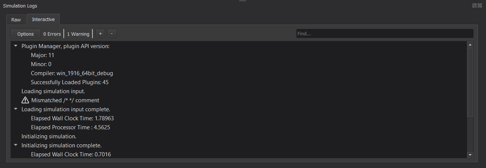

.. ****************************************************************************
.. CUI
..
.. The Advanced Framework for Simulation, Integration, and Modeling (AFSIM)
..
.. The use, dissemination or disclosure of data in this file is subject to
.. limitation or restriction. See accompanying README and LICENSE for details.
.. ****************************************************************************

Simulation Logs - Warlock
=========================

The Simulation Logs dialog allows the user to view, sort, and filter the outputs from the simulation.

Console Output
--------------

From the Console Output tab, unfiltered text output is displayed chronologically.

Within this tab, the user may export raw simulation logs using the context menu (Right-Click) option, "Export Simulation Logs".

.. image:: ../images/wk_log_raw_tab.png

.. include:: ../wkf_plugin/wkf_log_console_prefs.txt

Interactive
-----------

From the Interactive tab, the user may view, sort, and filter the simulation output.

This tab includes the following features:

* Options Button: Toggles visibility of the "Include" and "Sort by" options.
* Error Counter: A cumulative count of simulation errors, including fatal messages.
* Warning Counter: A cumulative count of simulation warnings.
* +/- Buttons: These buttons expand and collapse, respectively, all entry contents in the Results Display. The active option determines the visibility behavior for all future logs.
* Search Bar (Find...): Allows the user to search for logs containing a given word or phrase. This search is not case sensitive.
* Include Options: Allows type-based message filtration.
* Sort by Options: Allows message sorting by the first line (parent line) of each log entry.
   * Chronological: Time based ordering
   * Type: Type-based sorting (Fatal, Error, Warning, Infor, Debug, Developer). Entries of the same type are sub-sorted chronologically.
   * Alphabetical: Standard alphanumeric sorting of each log entry. Entries with the same parent line are sub-sorted chronologically.
   * Reverse: This checkbox will reverse the order of all log entries for each mode above.
   
.. note:: Sorting only affects the order of log entries respective to one another. It does not affect child lines within a given log entry.

* Results Display: A tree view to display filtered and sorted simulation logs
   * Entries of type Fatal, Error, Warning, Debug, and Developer appear with an indicative icon next to each entry.

.. include:: wkf_log_notification_prefs.txt
