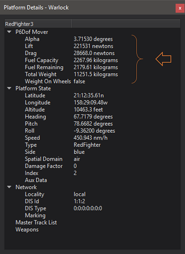

.. ****************************************************************************
.. CUI
..
.. The Advanced Framework for Simulation, Integration, and Modeling (AFSIM)
..
.. The use, dissemination or disclosure of data in this file is subject to
.. limitation or restriction. See accompanying README and LICENSE for details.
.. ****************************************************************************

P6Dof Data - Warlock
--------------------

.. note:: P6DOF Mover and its associated plugins are deprecated in favor of the new SixDOF Mover and its plugins. P6DOF Data has been deprecated in favor of SixDOF Data, so it is disabled by default and must be enabled through the :doc:`Plugin Manager <../warlock_plugin_manager>`.

The Warlock P6Dof Data plugin is responsible for populating the Platform Details with data specific to the P6Dof mover.

