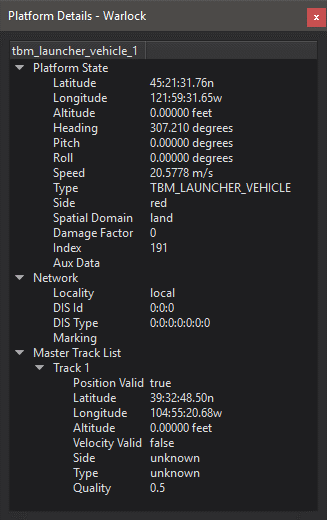

.. ****************************************************************************
.. CUI
..
.. The Advanced Framework for Simulation, Integration, and Modeling (AFSIM)
..
.. The use, dissemination or disclosure of data in this file is subject to
.. limitation or restriction. See accompanying README and LICENSE for details.
.. ****************************************************************************

.. |PLATFORM_DETAILS| replace:: Platform Details - Warlock

.. |PLATFORM_DETAILS_PLOT_IMAGE| image:: ../images/wk_platform_details_plot.png

.. |PLATFORM_DETAILS_DATA_RING_IMAGE| image:: ../images/wk_platform_details_data_ring.png

.. include:: wkf_platform_details.txt

.. image:: ../images/wk_platform_details_updater.png

Plug-ins may add data to the platform details.

.. include:: wk_platform_data_extension.txt

.. _Platform_Details-Warlock.Plotting:

.. include:: wkf_platform_details_plotting.txt

.. _Platform_Details-warlock.DataRings:

.. include:: wkf_platform_details_data_rings.txt

Data Displays
=============

.. image:: ../images/wkf_data_displays_prefs.png

Most items in the platform details dialog may be dragged onto the map or tether views to create a data overlay.  The overlays may be dragged around or closed using the close button which appears after hovering over the overlay.

.. note:: The preferences above will populate when the user edits the font size or color of the overlay.
