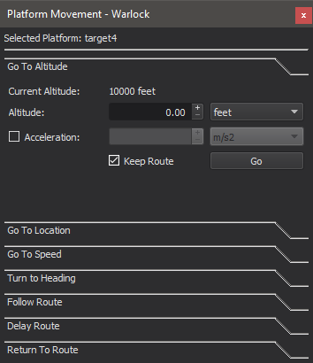

.. ****************************************************************************
.. CUI
..
.. The Advanced Framework for Simulation, Integration, and Modeling (AFSIM)
..
.. The use, dissemination or disclosure of data in this file is subject to
.. limitation or restriction. See accompanying README and LICENSE for details.
.. ****************************************************************************

Platform Movement - Warlock
===========================

The Platform Movement dialog allows a user to give basic movement commands to an AFSIM platform. A user can issue the following commands:

* Go To Altitude - The platform will attempt to move to the commanded altitude.
* Go To Location - The platform will attempt to move to the commanded position.
* Go To Speed - The platform will attempt to accelerate to the commanded speed.
* Turn To Heading - The platform will attempt to the turn to the commanded heading.
* Follow Route - The platform will follow the selected route starting at the specified waypoint.
* Delay Route - The platform will turn around 180 degrees, then return to its original route after the specified time.
* Return To Route - The platform will rejoin its route after having gone elsewhere.

The Platform Movement shortcut keys allow a user to give direction commands to a group of AFSIM platforms. A user can issue the following commands:

* Turn To Heading (Default key = H) - Platforms will attempt to turn to the commanded heading. Platforms always use their movers' default acceleration.
* Go To Location (Default key = G) - Platforms will attempt to move to the commanded position. Flyer altitudes remain unchanged. Platforms always use their movers' default acceleration.

.. note::
   A platform must have a mover on it to be able to control their movement.  The mover will determine how the platform response to each command. Some movers may not support all of the commands.
