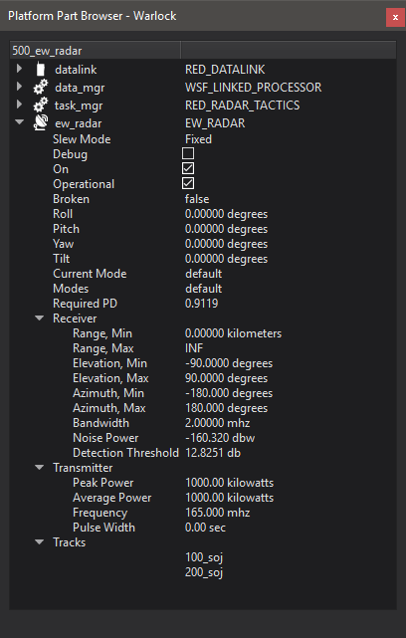

.. ****************************************************************************
.. CUI
..
.. The Advanced Framework for Simulation, Integration, and Modeling (AFSIM)
..
.. The use, dissemination or disclosure of data in this file is subject to
.. limitation or restriction. See accompanying README and LICENSE for details.
.. ****************************************************************************

Platform Part Browser - Warlock
===============================



The Warlock Platform Part Browser is responsible for displaying the :command:`platform parts<_.platform_part>` on the selected platform. The browser shows different properties depending on the type of platform part being displayed.

All platform parts show the following properties in the browser:

.. list-table::
   :header-rows: 1
   :widths: 20 80

   * - Platform Part Properties
     -
   * - Debug
     - A check box dictating whether or not to display :command:`_.platform_part.debug` information.
   * - On
     - A check box dictating whether or not the part is :command:`_.platform_part.on`
   * - Operational
     - A check box dictating whether or not the part is :command:`_.platform_part.operational`.
       When this checkbox is unchecked, the part is turned off and cannot be turned back on
       until this checkbox is checked again.
   * - Broken
     - Shows whether or not the part is :command:`_.platform_part.broken`.

Articulated Parts
~~~~~~~~~~~~~~~~~

Articulated parts (ie. weapons, comms, and sensors) contribute additional properties to the part browser:

.. list-table::
   :header-rows: 1
   :widths: 52 50

   * - Articulated Part Properties
     -
   * - Slew Mode
     - The :command:`slew mode<_.articulated_part.slew_mode>` of the articulated part.
   * - Roll
     - The :command:`_.articulated_part.roll` of the articulated part.
   * - Pitch
     - The :command:`_.articulated_part.pitch` of the articulated part.
   * - Yaw
     - The :command:`_.articulated_part.yaw` of the articulated part.
   * - Tilt
     - The :command:`_.articulated_part.tilt` of the articulated part.

Sensors
```````
If the articulated part is any type of sensor (ie. radar, acoustic, optical, etc), the following properties will be displayed for the sensor:

.. list-table::
   :header-rows: 1
   :widths: 24 80

   * - Sensor Properties
     -
   * - Current Mode
     - The current mode of the sensor
   * - Modes
     - A list of all of the sensor's :command:`modes<sensor.mode>`.
   * - Tracks
     - A list of the platform names for which the sensor has a track. If the sensor has no tracks, or does not produce tracks, "none" is displayed.

Radars
......

If the sensor of interest is a radar, the Part Browser displays additional properties for both the receiver and transmitter.

.. list-table::
   :header-rows: 1
   :widths: 35 65

   * - Radar Receiver Properties
     -
   * - Range, Min
     - The :command:`minimum range<_.antenna_commands.minimum_range>` at which the radar can interact with another object.
   * - Range, Max
     - The :command:`maximum range<_.antenna_commands.maximum_range>` at which the radar can interact with another object.
   * - Elevation, Min
     - The minimum angle of the :command:`elevation field of view<_.antenna_commands.elevation_field_of_view>`.
   * - Elevation, Max
     - The maximum angle of the :command:`elevation field of view<_.antenna_commands.elevation_field_of_view>`.
   * - Azimuth, Min
     - The minimum angle of the :command:`azimuth field of view<_.antenna_commands.azimuth_field_of_view>`.
   * - Azimuth, Max
     - The maximum angle of the :command:`azimuth field of view<_.antenna_commands.azimuth_field_of_view>`.
   * - Bandwidth
     - The operating :command:`_.receiver.bandwidth` of the radar.
   * - Noise Power
     - The :command:`noise power<_.receiver.noise_power>` of the radar.
   * - Detection Threshold
     - The :command:`detection threshold<_.receiver.detection_threshold>` of the radar signal.

|

.. list-table::
   :header-rows: 1
   :widths: 24 80

   * - Radar Transmitter Properties
     -
   * - Peak Power
     - The :command:`peak power<_.transmitter.power>` output of the transmitter
   * - Average Power
     - The average power for the currently set frequency
   * - Frequency
     - The current operating :command:`frequency<_.transmitter.frequency>` of the transmitter
   * - Pulse Width
     - The average :command:`pulse width<_.transmitter.pulse_width>` for a pulsed transmitter
   * - Pulse Repetition Interval
     - The :command:`pulse repetition interval<_.transmitter.pulse_repetition_interval>`, for a pulsed transmitter.
       If the :command:`pulse width<_.transmitter.pulse_width>` is zero, then the pulse repetition interval is not specified.
