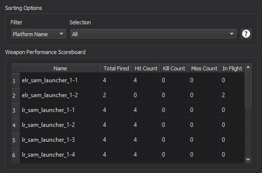

.. ****************************************************************************
.. CUI
..
.. The Advanced Framework for Simulation, Integration, and Modeling (AFSIM)
..
.. The use, dissemination or disclosure of data in this file is subject to
.. limitation or restriction. See accompanying README and LICENSE for details.
.. ****************************************************************************

Scoreboard - Warlock
--------------------

The Warlock Scoreboard displays statistics for local (non-networked) weapon performance within the simulation.

Based on the user's selection from the leftmost drop-down menu, the scoreboard can filter data by platform name, platform type, team name and weapon type. If the chosen filter contains any associated selections, they will appear by name in the rightmost drop-down menu, where the user can then choose to isolate a specific selection to display on the table.

Right-clicking the scoreboard brings up a context menu where the user can export their currently displayed data as a CSV file.

Fired, Hit, Miss, Kill, and In Flight are determinations made by Warlock. AFSIM reports GeometryResult codes within a WsfWeaponEngagement when a Weapon is Terminated. The charts presented on this page summarize the data provided within the WsfWeaponEngagement event.

* Fired is the number of WeaponFired events received.
* A Hit is scored when the GeometryResult code is cTARGET_IMPACT, cTARGET_PROXIMITY_ABOVE_GROUND, cTARGET_PROXIMITY_AIR_BURST, or cTARGET_PROXIMITY_GROUND_IMPACT.
* A Miss is scored when the GeometryResult code is cDUD, cFAR_AWAY_ABOVE_GROUND, cFAR_AWAY_GROUND_IMPACT, cFAR_AWAY_IN_AIR, or cPART_DISABLED_OR_DESTROYED.
* A Kill is scored when a hit is scored and the damage factor on the target platform is equal to 1.
* The In Flight count is the number of fires minus the number of hit and misses.  This means a missile is counted as In Flight once a WeaponFired event is received and will stay in flight until a WeaponTerminated event is received. If no WeaponTerminated event is received (such as the missile being intercepted by another missile), no Hit or Miss will be scored for the weapon and it will count as In Flight for the rest of the simulation.

.. note::
   This plugin will only display statistics from engagements that involve a local entity. It will not display statistics when the target platform is in an external simulation.
