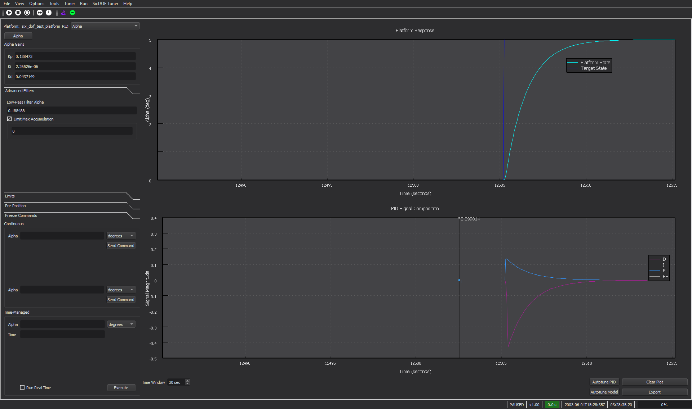
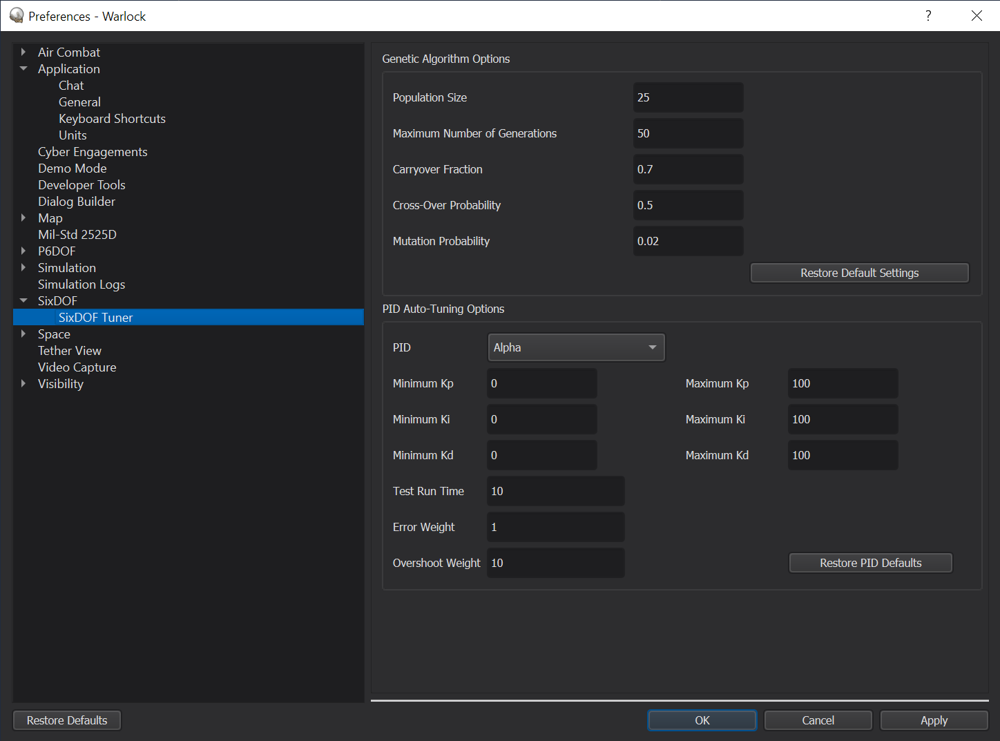

.. ****************************************************************************
.. CUI
..
.. The Advanced Framework for Simulation, Integration, and Modeling (AFSIM)
..
.. The use, dissemination or disclosure of data in this file is subject to
.. limitation or restriction. See accompanying README and LICENSE for details.
.. ****************************************************************************

SixDOF Tuner - Warlock
======================

The SixDOF Tuner tools assist a user in tuning the proportional, integral, derivative (PID) controllers used by the SixDOF navigation autopilot.

.. note:: The SixDOF Tuner has a highly specialized use case, and as a result, it is disabled by default and must be enabled through the :doc:`Plugin Manager <../warlock_plugin_manager>`.

Tuner Dialog
------------

The SixDOF Tuner Dialog provides users with an interface to send commands directly to a platform, observe its behavior, and control that behavior by modifying the gain factors associated with the PID controllers.

* Platform Selection - The platform selection box displays all of the SixDOF vehicles that currently exist in the scenario and allows the user to choose which vehicle to observe and tune.

* PID Selection - The pid selection box displays all of the PID controllers used by the selected platform. Once a PID controller has been selected up to three buttons will appear below the selection box, each representing one PID in the selected controller's command chain. Commands can only be sent to the PID controller selected in the selection box, but the other PID controllers that the control signal must pass through can be observed and modified by pressing their associated button.

* PID Gains - The proportional, integral, and derivative gain factors (Kp, Ki, and Kd, respectively) are displayed and can be directly modified to manipulate the behavior of the platform autopilot.

* Advanced Filters - The advanced filters tab shows all of the other available methods of controlling or limiting the PID controller outputs. The available options include:

   - Low-Pass Filter Alpha - Modifies the filtering done on the raw derivative signal before it is output to the controller. This can help reduce output noise caused by numerical imprecision in estimating the rate of change in the system. A value of 1.0 represents a totally raw derivative signal, with 0.0 representing a totally unresponsive derivative signal.

   - Maximum Accumulation - Places a limit on the maximum value of the integral signal generated by the PID controller. This is used to prevent integral wind-up that may lead to a less stable system.

* Limits - Displays all limits set on any PID within the currently selected command chain. These limits are not modifiable within the tuner dialog as they are set within the platform definition.

* Pre-Position - Allows the user to specify a platform state to easily return to using altitude and speed. Speed can be specified directly as a true air speed or calibrated air speed, or indirectly by specifying a Mach number or dynamic pressure. The selected platform is sent to the specified state upon pressing the "Set State" button. This orients the platform due north, and zeros its pitch, roll, and yaw angles and rates. When a taxi PID controller is selected the "Set State" button will send the selected platform to a valid position to test taxi behavior.

* Freeze Commands - Allows the user to freeze properties of the selected vehicle's state in order to isolate the individual behavior that is being tuned. Properties that can be frozen are:

   - Altitude
   - Speed
   - Position
   - Fuel Level
   - Roll
   - Pitch
   - Yaw

* Continuous Commands - Allows the user to specify and send commands to the selected PID controller. These commands will be executed by the platform upon pressing the corresponding "Send Command" button and can be observed in the plot views on the right in real time.

* Time-Managed Commands - Allows the user to specify and send a single command to the selected PID controller. When the user presses the "Execute" button the selected platform is sent to the pre-position state and given the specified command. The simulation then runs at maximum speed until the specified amount of time as elapsed within the simulation. The platform's behavior can then be observed in the plot views to the right. The behavior can be observed in real time by checking the "Run Real Time" checkbox.

* Platform State Plot - The Platform State Plot (top) displays both the current state of the platform property controlled by the PID controller currently being observed, as well as the current commanded state of that property.

* PID Controller Signal Plot - The PID Controller Signal Plot (bottom) displays the current values of the proportional, integral, derivative and feed forward signals currently being emitted by the PID controller being observed.

* Auto-Tune PID - Utilizes a Genetic Algorithm to automatically tune the PID controller currently being observed. It is recommended that the user review the platform responses even after the PID controller has been auto-tuned as manual manipulation of the PID gains may still be desirable to achieve acceptable behavior form the autopilot.

* Auto-Tune Model - Automatically tunes all PID controllers used by the currently selected platform.

* Clear Plot - Clears all data currently displayed within the plots.

* Export - Saves the current state of the PID gain values for future use with the model that has been tuned.

Tuner Preferences
-----------------

The tuner preferences menu provides and interface to modify the parameters of the Genetic Algorithm used to automatically tune the PID controllers. The parameters that can be modified for the algorithm as a whole and their effects are as follows:

* Population Size - Sets the number of different potential solutions, or specimens, that are evaluated during each generation. Increasing the population size will widen the search space of the algorithm, but requires additional computational time.

* Maximum Generations - Sets the maximum number of generations executed by the algorithm. Increasing the number of generations gives the algorithm more attempts to achieve a bettor optimized solution, but increases computational time.

* Carry-Over Fraction - Specifies the proportion of potential solutions that will be carried over from one generation to the next. A large carry over fraction allows the algorithm to converge toward an optimum solution by keeping a larger number of "fit" specimens, while a lower carry over fraction will widen the search space, allowing the algorithm to explore a larger variety of potential solutions. A carry over fraction between 0.7 and 1.0 is generally recommended.

* Cross-Over Probability - Specifies the probability that a specimen will "swap" a characteristic with another specimen in the population. This second specimen is selected in "tournament" fashion, as the fitter of two specimens chosen at random. Higher cross over allows the algorithm to expand its search toward an optimal solution by combining traits of other successful specimens. A cross-over probability between 0.5 and 0.8 is generally recommended.

* Mutation Probability - Specifies the probability that an aspect of a specimen will spontaneously change. A high mutation probability broadens the search space of the algorithm, but may hamper its ability to quickly converge to a good solution. A mutation probability between 0.01 and 0.10 is generally recommended.

The Tuner Preferences menu also provides some control over the genetic algorithm as it applies to specific types of PID controllers used by the SixDOF Autopilot. These parameters and their effects are as follows:

* Kp Range - Sets the minimum and maximum gain factors used by the proportional control channel of the selected PID controller. A high value can promote a speedy initial response, but may lead to significant overshoot.

* Ki Range - Sets the minimum and maximum gain factors used by the integral control channel of the selected PID controller. This value aids in reducing steady-state error, but should generally be smaller than Kp. 

* Kd Range - Sets the minimum and maximum gain factors used by the derivative control channel of the selected PID controller. A higher value can mitigate overshoot, but can also contribute to instability if the signal exhibits substantial variation (appearing "noisy" or otherwise difficult to predict).

* Command Run Time - Sets the amount of simulation time (in seconds) that each command sent by the genetic algorithm will be given to execute. The run time should give the platform adequate time to settle to the target state in order to obtain a good solution, but any time beyond that will increase the run time of the algorithm without any benefit.

* Error Weight - Sets the weight factor of the integral of the total error in the objective function used by the genetic algorithm for tuning. Increasing this factor relative to the overshoot weight will place more emphasis on total error, pushing the PID controller to a solution that achieves the target state quickly, with less emphasis on the magnitude of the overshoot.

* Overshoot Weight - Sets the weight factor of the overshoot term in the objective function used by the genetic algorithm for tuning. Increasing this factor relative to the error weight will place more emphasis on avoiding overshoot within the PID controller, pushing it to a solution that may achieve the desired state less quickly, but with less overshoot that may lead to undesired behavior of the system.

Best Practices
--------------

While the auto-tuning process has been incrementally refined and improved, it remains imperfect. In many cases, a vehicle can be tuned solely through the "Tune Model" button with adequate results. Indeed, the vehicles used in the updated demos were tuned with little or no manual intervention. This said, there are things the user can keep in mind to make the tuning process more efficient.

Note that the Tuner operates based on the limits defined by the :ref:`Limits_and_Settings_Label` block. Initially, this block is auto-generated by Mover Creator based solely on whether the vehicle is a weapon or a traditional aircraft. In other words, Mover Creator does not attempt to make a judgement on what a vehicle's capabilities should be, instead opting to generate a block which is fairly permissive and aggressive. These defaults may not be ideal for less agile vehicles, since the Tuner may test commands that vehicle cannot attain, which is likely to result in a poor-quality tune for that control channel.

Consider the limits of what the airframe can stabilize, too. For instance, in tuning the B-FW flying-wing demo aircraft, the maximum roll rate had to be reduced manually in the autopilot configuration script. A flying wing design is naturally unstable in controlled, banked turns, and restricting its commanded roll rate helped Tuner provide a much stronger autopilot.

For many aircraft using CAS, auto-tuning the beta channel can result in reasonable sideslip responses, but highly oscillatory behavior in ordinary flight. If this behavior is observed, a reduction in Kp for the beta channel appears to work well.

For some control channels, the Tuner may allow the integral gain to dominate; be skeptical of these results in particular. The tuner tests PIDs with step inputs, and for these, an integral-heavy controller may be perfectly reasonable, but it will probably perform poorly in flight. Especially check those controllers involved in active flight control damping, such as the roll, yaw, and pitch rate PIDs, and sometimes the alpha and beta PIDs, as well. Ki can be restricted by limiting either Max Accumulation or Ki itself to a very small value.

Automatically generated feed-forward tables provide an informed estimate for the input required to accomplish a command. In a sense, this replaces a chunk of the one-size-fits-all Kp gain with a more tailored response. In some cases, such as alpha and beta control for high-g missiles, feed-forward prediction combined with naturally fast system response can allow for very small Kp. Take care to only "correct" this if the system is not responding quickly enough for the mission's needs. Further, if the system shows too much instability in flight, consider limiting Kp for those channels to 0 completely.

In some cases, such as roll rate control for missiles, Tuner will prescribe a very small Kd value, but still produce a controller that produces some jitter. In this case, consider reducing Kd further, toward 0.

If you can spare the time, experiment with higher crossover or mutation rates and higher population sizes. A successful tune early-on saves time and money downstream, so it's OK to invest some time in the tuning process.

If you still find that you need to adjust values manually:

* Tuner searches in logarithmic space, because there are infinite possible vehicle configurations and we need to cover ground efficiently, particularly near 0. Do the same when manually adjusting values. Tuner uses base-10, but a binary search strategy is perfectly reasonable too -- the key is to take big swings if the starting point is completely unacceptable, and smaller as you home in on a useful solution.

* Remember that navigational controllers are working with and compensating for the lower-level controllers. If you need to adjust roll rate on an aircraft, for instance, you should also re-evaluate controllers that depend on it, like bank angle and roll heading.
