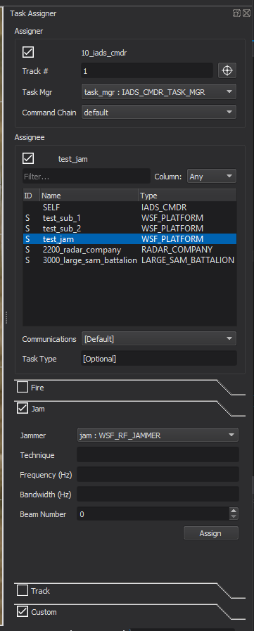

.. ****************************************************************************
.. CUI
..
.. The Advanced Framework for Simulation, Integration, and Modeling (AFSIM)
..
.. The use, dissemination or disclosure of data in this file is subject to
.. limitation or restriction. See accompanying README and LICENSE for details.
.. ****************************************************************************

Task Assigner - Warlock
=======================



The Warlock Task Assigner provides the user an interface for making firing, jamming, tracking, and custom task assignments from a :model:`WSF_TASK_PROCESSOR`.

Assigner
~~~~~~~~
To start a task assignment, a platform must be selected. On selection, the name of the platform is displayed in the Assigner section. Once all fields in this section have values, the box will check indicating this section is complete.

.. list-table::
   :header-rows: 1
   :widths: 20 80

   * - Assigner Properties
     -
   * - Track #
     - The local track number associated with this task assignment. This is a required field.
   * - Task Mgr
     - The task processor used to make the task assignment. The assigner must have at least one :model:`WSF_TASK_PROCESSOR`. 
   * - Command Chain
     - The command chain associated with this task assignment. Listed are all command chains found on the assigner.

Assignee
````````
An assignee must be selected to continue the task assignment. For the selected command chain in the Assigner section, the commander (C), all subordinates (S), and all peers (P) will be displayed. On assignee selection, the name of the platform is displayed in the Assignee section. The box will check when this section is complete.

.. list-table::
   :header-rows: 1
   :widths: 20 80

   * - Assignee Properties
     -
   * - Communications
     - The communication device used to send the task, if not a SELF task. By default, the first device defined on the platform will be used.
   * - Task Type
     - A user-defined name for the task. This field is optional and can be left blank.

Tasks
`````
The following tables show the four types of tasks that can be assigned. The boxes will be checked for task types that are available based on an assignee's resources.

.. list-table::
   :header-rows: 1
   :widths: 20 80

   * - Fire
     -
   * - Weapon
     - The weapon resource being tasked to start firing.
   * - Quantity
     - The number of rounds to fire.
     
.. list-table::
   :header-rows: 1
   :widths: 20 80

   * - Jam
     - 
   * - Jammer
     - The jammer resource being tasked to start jamming.
   * - Technique
     - The technique to use for this jamming assignment. This field is optional.
   * - Frequency
     - The frequency to use for this jamming assignment. Bandwidth must also be supplied.
   * - Bandwidth
     - The bandwidth to use for this jamming assignment. Frequency must also be supplied.
   * - Beam Number
     - The beam number of the transmitter to use for this jamming assignment.      

.. list-table::
   :header-rows: 1
   :widths: 20 80

   * - Track
     -
   * - Sensor
     - The sensor resource being tasked to start tracking.
   * - Mode
     - The sensor mode to use for this task.  

.. list-table::
   :header-rows: 1
   :widths: 20 80

   * - Custom
     -
   * - Processor
     - The processor resource for this task. This field is optional.
     