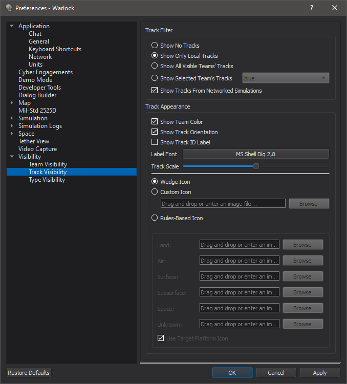

.. ****************************************************************************
.. CUI
..
.. The Advanced Framework for Simulation, Integration, and Modeling (AFSIM)
..
.. The use, dissemination or disclosure of data in this file is subject to
.. limitation or restriction. See accompanying README and LICENSE for details.
.. ****************************************************************************

Tracks - Warlock
----------------

Tracks icons appear on the Map Display for local tracks (:class:`WsfLocalTrack`) in the scenario, and information related to tracks is shown in the Platform Details dialog.

.. image:: ../images/wk_TracksDisplay.png

Platform Details
================

When a platform is selected, its Master Track List is added to the Platform Details dialog. Clicking on one of the tracks from the list will highlight the track in the Map Display.

.. image:: ../images/wk_TracksDetails.png

Preferences
===========

The Track Visibility Preferences page controls when track are shown to the user on the Map Display.

* Show No Tracks - No tracks will be shown on the Map Display.
* Show Local Tracks Only - Displays only the local tracks for selected platforms.
* Show All Visible Teams' Tracks - Displays all local track for all platforms that are on a team that is marked as visible.
* Show Selected Team's Tracks - Shows all tracks for the team indicated by the combo box.
* Show Tracks From Network Simulations - Displays tracks received from AFSIM applications that are connected via XIO.

There are also customization options for how the track will appear to the user. 

* Show Team Color - Tracks will be colored according to the reported team color.
* Show Track ID Label - Tracks will be labeled with the track ID according to the reported team. 
* Show Track Orientation - Controls whether track icons are billboarded or are angled according to a reported orientation.
* Label Font - Changes the font used to display track labels.
* Track Scale - Scales the track icon.

* Wedge Icon - Shows the default track icon on the Map Display. 
* Custom Track Icon - Shows a specified track icon on the Map Display. To select an icon, either drag/drop a supported image or use the browser to manually select one. 
* Rules-Based Icon - If the "Use Target Platform Icon" box is checked, shows the model of the tracked platform. Otherwise, uses a custom model based on the track's reported spatial domain. Unspecified icons use the Wedge icon.

Hovering over a track icon on the Map Display provides the following information: track id, side, type, spatial domain, and heading.
