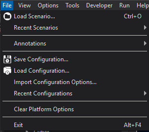

.. ****************************************************************************
.. CUI
..
.. The Advanced Framework for Simulation, Integration, and Modeling (AFSIM)
..
.. The use, dissemination or disclosure of data in this file is subject to
.. limitation or restriction. See accompanying README and LICENSE for details.
.. ****************************************************************************

File Menu - Warlock
-------------------

* Load Scenario... - Browse to load a :doc:`AFSIM scenario<wsf_core>`.
* Recent Scenario - Select to load from recently executed :doc:`AFSIM scenarios<wsf_core>`.
* Save Configuration - Save the current :doc:`application settings<warlock_user_configurations>` to file.
* Load Configuration - Load a saved :doc:`application settings<warlock_user_configurations>` file.
* Import Configuration Options... - Import some features from an :doc:`application settings<warlock_user_configurations>` file.
* Recent Configurations - Choose from a recently used :doc:`application settings<warlock_user_configurations>` file.
* Clear Platform Options - Clear out all of the :doc:`platform options<warlock_platform_options>`.
* Exit - Exit the application.

.. include:: wk_file_menu_extension.txt
