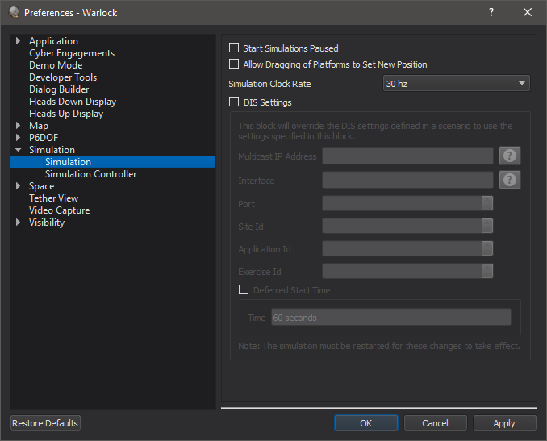

.. ****************************************************************************
.. CUI
..
.. The Advanced Framework for Simulation, Integration, and Modeling (AFSIM)
..
.. The use, dissemination or disclosure of data in this file is subject to
.. limitation or restriction. See accompanying README and LICENSE for details.
.. ****************************************************************************

Simulation Preferences - Warlock
--------------------------------

The Simulation Preferences page has a collection of user options that modify behavior of the simulation.

* Start Simulations Paused - This will cause the simulation to pause once it is loaded and initialized, instead of automatically starting. See :command:`dis_interface.no_autostart`.
* Allow Dragging of  Platforms to Set New Position - This allows user to drag platforms on the map to new locations to issue commands to the simulation to change the position of the platform.
* Simulation Clock Rate - This controls how often data is read from the simulation.  A high rate means platforms are updated more often and the simulation may not be able to support real-time.  If a scenario can't run real-time, consider lowering this rate.
* DIS Settings - Allows the user to override the DIS settings set within the scenario file that was loaded.  Changes to this dialog do not take effect until the simulation is reloaded. See :command:`dis_interface`.
* Deferred Start Time - The simulation will not connect to the network until after the specified amount of time has elapsed.  The simulation will run constructive mode (as fast as possible) until the specified time is reached. See :command:`dis_interface.deferred_connection_time`.
