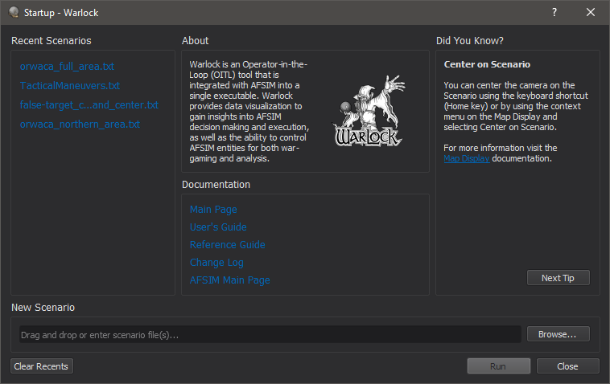

.. ****************************************************************************
.. CUI
..
.. The Advanced Framework for Simulation, Integration, and Modeling (AFSIM)
..
.. The use, dissemination or disclosure of data in this file is subject to
.. limitation or restriction. See accompanying README and LICENSE for details.
.. ****************************************************************************

.. |START_DIALOG| replace:: Start Dialog - Warlock

.. |help| replace:: :doc:`Warlock Help <warlock_help>`

.. include:: wkf_start_dialog.txt

.. note:: If multiple files were specified than the first file name will be listed with a +X more... following the file name.

.. note:: The Start Dialog will not appear when executing Warlock from the command line with the scenario file(s) supplied as arguments.
