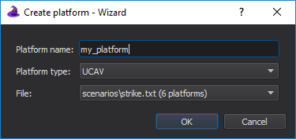

.. ****************************************************************************
.. CUI
..
.. The Advanced Framework for Simulation, Integration, and Modeling (AFSIM)
..
.. The use, dissemination or disclosure of data in this file is subject to
.. limitation or restriction. See accompanying README and LICENSE for details.
.. ****************************************************************************

Create Platform - Wizard
------------------------

The **Create Platform** dialog can be used to easily create new platforms from existing types.

It can be opened by right-clicking a platform in the :doc:`Platform Browser <wkf_plugin/wiz_platform_browser>` or platform type in the
:doc:`Type Browser <wkf_plugin/wiz_type_browser>` and selecting "Create new platform...".

Select a platform type, enter a name for your new platform, and finally select the file you would like to save the platform in.

The file list shows all files currently included in the project. The number of platforms found in each file (if any) will be indicated next to the name. The list will be sorted by highest number of platforms to lowest, and then alphabetically.
