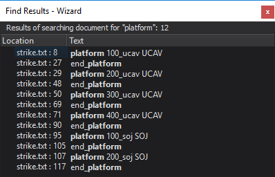

.. ****************************************************************************
.. CUI
..
.. The Advanced Framework for Simulation, Integration, and Modeling (AFSIM)
..
.. The use, dissemination or disclosure of data in this file is subject to
.. limitation or restriction. See accompanying README and LICENSE for details.
.. ****************************************************************************

Find Results - Wizard
---------------------

The **Find Results** is accessible from the View.
The Find Results appears as a tab in the :ref:`Output Panel <Wizard_Main_Window.OutputPanel>`
and displays the results of a `find in files` operation.  A list
of all matches is displayed.  Double-clicking on a match jumps to the match
location in the text editor.

