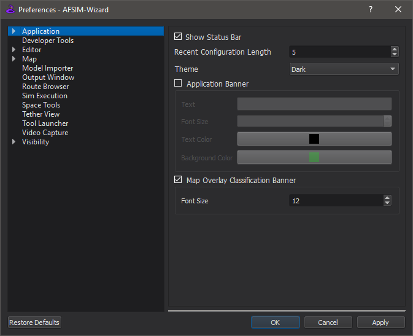

.. ****************************************************************************
.. CUI
..
.. The Advanced Framework for Simulation, Integration, and Modeling (AFSIM)
..
.. The use, dissemination or disclosure of data in this file is subject to
.. limitation or restriction. See accompanying README and LICENSE for details.
.. ****************************************************************************

.. |PREFERENCES| replace:: Preferences - Wizard

.. |MAP_DEFINTION_LINK| replace:: :doc:`Map Definitions<wizard_map_definitions>`

.. include:: wkf_preferences.txt

* Back-ups - provides an option to enable or disable automatic backups of the scenario (:doc:`Change History<wizard_change_history>`)
* :doc:`Text Editor<wizard_text_editor>` - allows the user to configure the appearance and behavior of the text editor.
* :doc:`Tool Launcher<wizard_external_tools>` - provides the ability to setup external tools to be launched by Wizard.

.. include:: wiz_preferences_extension.txt