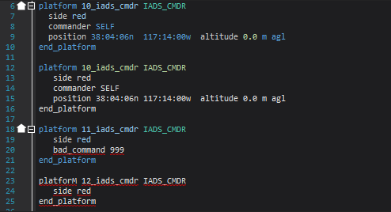
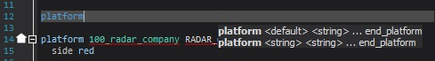
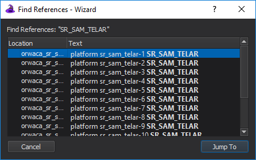

.. ****************************************************************************
.. CUI
..
.. The Advanced Framework for Simulation, Integration, and Modeling (AFSIM)
..
.. The use, dissemination or disclosure of data in this file is subject to
.. limitation or restriction. See accompanying README and LICENSE for details.
.. ****************************************************************************

Text Editor - Wizard
--------------------

The **Text Editor** provides an interface for displaying,
editing, navigating, and understanding your scenario files. It provides
a set of tools found in modern software Integrated Development
Environments (IDEs) (e.g., Microsoft Visual Studio). These tools include
syntax highlighting, auto-completion, syntax-tips, context sensitive
documentation, and file navigation. The following sections describe each
of these tools.

.. contents::
   :local:
   :depth: 2

Preferences
===========

.. image:: ./images/wizard_editor_prefs.png

The Text Editor options are found on the :doc:`Preferences <wizard_preferences>` dialog.

Options include:

- **Show Line Numbers**: When enabled, line numbers are shown in the left margin of the editor
- **Show Syntax Tips**: When enabled, syntax suggestions appear in the active editor
- **Auto-complete after '.'**: When enabled, Wizard will provide a list of valid member functions and/or variables when the '.' character is typed after an object name
- **Enable Pop-ups on Undo for Multiple/Different Files**: When enabled, Wizard will generate a confirmation dialog before making a change with Undo that would:

  - Affect multiple files
  - Affect a file that is not currently active/focused in a Wizard Text Editor after consecutive uses of Undo
- **Tab Size**: Determines the number of spaces inserted when 'Tab' is pressed
- **Font**: Editor text will appear in the selected font
- **Size**: Editor text will appear in the selected size
- **Styles**: Styles determine the text color and markup of Wizard's grammar. Using styles, the user can further customize the editor, and see changes in the example view before saving.

.. note:: The user may enable enable performance timers on the editor status bar from the :doc:`Developer Menu preference option<wizard_developer_menu>`.

.. note:: Users may hold the control-button and scroll the mouse wheel over an active editor to change the font size in editors.

Margins
=======

The margin to the left of the edit area contains line numbers, icons related to
errors, warnings, and instances and types, and line-folding boxes.

The line-folding feature provides the capability to collapse blocks of input to a
single line. Click the **+** and **-** buttons to expand and collapse sections.

Line numbers can be disabled from the Preferences dialog.

Right-Click Menu
================

The right-click menu provides convenient means for accessing many of the
commands that are targeted to the Text Editor. Simply right-click anywhere in the
Text Editor to bring up the right-click menu. Content of the menu will vary
depending on the context (i.e. cursor location and text selection).

Syntax Highlighting
===================

Syntax highlighting color codes the WSF commands in your scenario files,
which makes reading and understanding the content easier. The following
example illustrates the default coloring scheme.

Unknown Commands
~~~~~~~~~~~~~~~~

Take note that unknown commands are underlined in red. The first
platform (10_iads_cmdr) in this example contains no errors. The second
platform command is actually an *edit* of the first one, therefore,
*IADS_CMDR* is not recognized as valid input. The third platform block
contains an invalid command. The fourth platform block
is invalid because of the uppercase 'M'.

Reference Errors and Warnings
~~~~~~~~~~~~~~~~~~~~~~~~~~~~~

A reference error occurs when an object or type that does not exist is required.
A reference warning occurs in when a reference object or type is not found
but is not required for the simulation to execute. Right-clicking on the text with
the reference error or warning will provide options to correct the problem.
Reference errors may also occur when a name is reused.

.. _Wizard_Text_Editor.Syntax_Tips:

Syntax Tips
===========

The **Syntax Tips** feature provides guidance on what the current command expects
next from the user. In the following example we've started to type the
:command:`platform` command and the syntax tips are automatically suggested.
Syntax Tips can be disabled from the preferences.

Command Documentation
=====================

Through the use of context sensitive documentation, users can quickly jump to
the documentation for any selected command by right-clicking and selecting *Command
Documentation*. The information will be displayed in the Output Panel on
the :doc:`Command Documentation <wizard_command_documentation>` tab.
By selecting the 'Full Article' link, the actual html page where the command was
pulled from is displayed.

Go To Include
=============

The **Go To Include** feature provides a way to
quickly navigate to an included in a scenario file using the
:command:`include` command by bringing up the right-click menu and selecting
the 'Go To Include: <include-filename>'.

.. _Wizard_Text_Editor.Go_To_Definition:

Go To Definition
================

The **Go To Definition** feature provides a way to to quickly jump
to the file location for the currently selected WSF type. To use the feature,
select the WSF type and use the right-click menu to access the 'Go To Definition'
option. This feature is also available under the Edit menu
or by using hotkeys.

.. _Wizard_Text_Editor.Find_References:

Find References
===============

The **Find References** feature provides a way to quickly generate a list of
the locations where a given type is used. In the following image, we find all of the
references to the 'SR_SAM_TELAR' platform type. To use the tool,
select the WSF type and use the right-click menu to access the 'Find
References' option. This feature is also available under the Edit menu
or by using hotkeys.

.. _Wizard_Text_Editor.Find_In_File:

Find In File
============

The **Find In File** feature provides a way to search for a string in the current
file. The following image shows a find for the search string 'platform'.
This feature is also available under the Edit menu
or by using hotkeys.

.. image:: ./images/wizard_editor_find_in_files.png

.. _Wizard_Text_Editor.Find_In_Files:

Find In Files
=============

The **Find In Files** feature provides a way to search for a string in multiple files.
The results appears in the Output Panel on the :doc:`Find Results <wizard_find_results>` tab.
A list of all matches is displayed.  Double-clicking on a match jumps to the match
location in the text editor. This feature is also available under the Edit menu
or by using hotkeys.

.. _Wizard_Text_Editor.Go_To_Line:

Go To Line
==========

The **Go To Line** feature provides a way to jump the cursor to the specified line. This feature is also available under the Edit menu or by using hotkeys.

.. _Wizard_Text_Editor.Auto_Complete:

Auto Complete
=============

The **Auto Complete** feature provides guidance on what the user must type next when completing a command. It auto suggests known values and types when available. The feature is available from the Edit menu or with the hotkey combo **Ctrl+Space**.

.. _Wizard_Text_Editor.Comment_Uncomment:

Comment/Uncomment Selection
===========================

The Comment and Uncomment Selection feature provides the capability for users to place the currently selected lines of text in or out of comments. The first image below shows some selected lines, while the second image shows the results of commenting the selection. This feature is available under the Edit menu or by using hotkeys.

.. figure:: ./images/wizard_editor_comment_selection_selected.jpg

   Before: Lines selected for commenting

.. figure:: ./images/wizard_editor_comment_selection_commented.jpg

   After: Selection commented out
