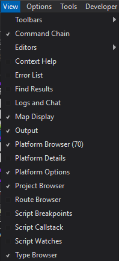

.. ****************************************************************************
.. CUI
..
.. The Advanced Framework for Simulation, Integration, and Modeling (AFSIM)
..
.. The use, dissemination or disclosure of data in this file is subject to
.. limitation or restriction. See accompanying README and LICENSE for details.
.. ****************************************************************************

View Menu - Wizard
------------------

Various windows from the application can be opened and closed from this menu.

This menu also contains options for managing :doc:`editors<wizard_text_editor>`.

* Close all but startup - Close all text editors but the start-up file for the scenario.
* Close all but included - Close all text editors not associated with the scenario.
* Close inactive - Close all text editors that are not visible.
* Close all - Close all text editors.
