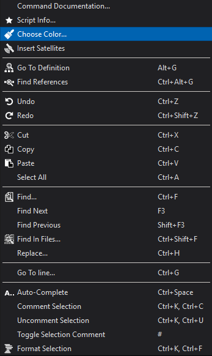
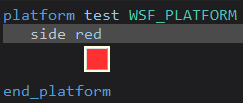
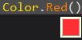

.. ****************************************************************************
.. CUI
..
.. The Advanced Framework for Simulation, Integration, and Modeling (AFSIM)
..
.. The use, dissemination or disclosure of data in this file is subject to
.. limitation or restriction. See accompanying README and LICENSE for details.
.. ****************************************************************************

Color Utils - Wizard
--------------------

The **Color Utils** Wizard plugin allows the user to construct and view script colors. This plugin also allows the user to view :command:`platform.side` colors.

Construct Color
===============

Right clicking on the :method:`Color.Construct` script method will add the "Choose color..." option to the context menu. Selecting this option will bring up a color dialog for the user to choose a customized color.
Once the OK button is clicked, the construct method will populate with the [0, 255] red, green, blue, and alpha (RGBA) values of the selected color.

.. note:: If there are existing values, they will be replaced.

Color and Side View
===================

This plugin allows the user to hover over :class:`Color` static script methods or the side name of the :command:`platform.side` command to view what the color looks like in AFSIM. If a color or side is unknown, the tip will show the "default" color defined in :doc:`Team Visibility<../wkf_pref_team_visibility>`.
