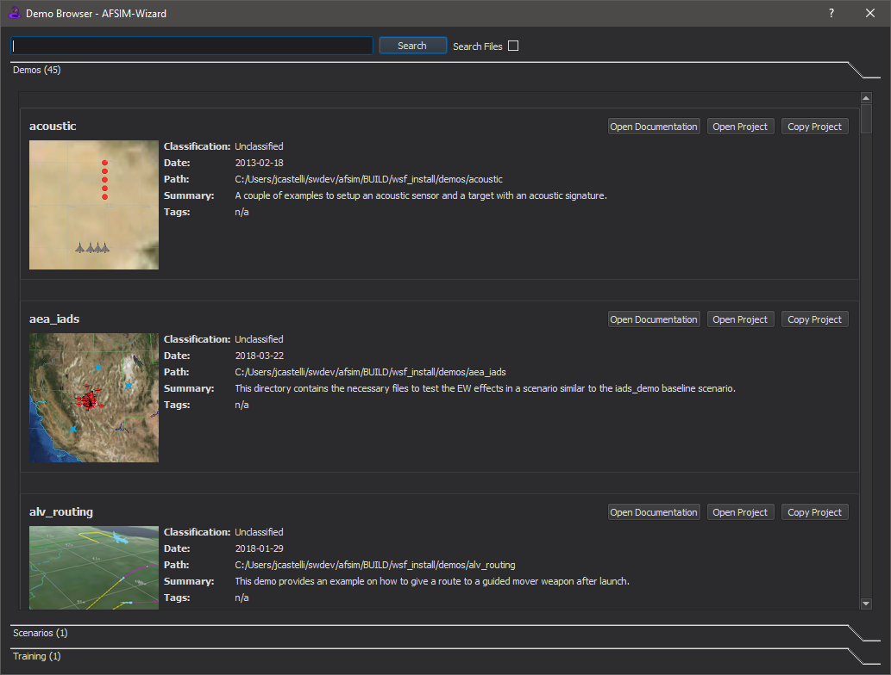
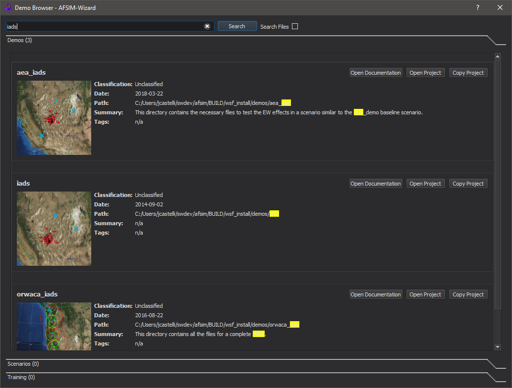

.. ****************************************************************************
.. CUI
..
.. The Advanced Framework for Simulation, Integration, and Modeling (AFSIM)
..
.. The use, dissemination or disclosure of data in this file is subject to
.. limitation or restriction. See accompanying README and LICENSE for details.
.. ****************************************************************************

Demo Browser - Wizard
---------------------

The **Demo Browser** is a browser tab accessible via the Help menu. The **Demo Browser** displays available demos in a two level hierarchy, first by demo group (e.g. "Analyst Training", "Demos") followed by demo name (e.g. "Acoustic Demo", "AEA Demo"). For a given demo, only meta-information is displayed, however, a link to the full documentation is provided.

.. contents::
   :local:
   :depth: 1

Basic Search Functionality
==========================

The **Demo Browser** provides a search field at the top of the page, allowing the user to perform text-based searches of all demos. Upon the user entering a text string and selecting the search button, the **Demo Browser** returns a filtered list of demos whose meta-information (i.e. Classification, Date, Path, Summary, and Tags) or documentation page contains the provided search string. All meta-information matching the search string is highlighted in yellow. The user can press the **x** button in the search bar to clear and regenerate the original list of demos in which to start a new search.

.. note:: Search functionality is case-insensitive but exact match (i.e. the content must match the entire search string verbatim).

File Search Functionality
=========================

The **Demo Browser** additionally provides a "Search Files" check-box. When enabled, the contents of all files in each demo are queried for the provided search string (in addition to the standard meta-information search). In this case, each demo in the returned list will now contain a "Matched Files" grouping. This grouping displays the filename, line contents, and line number for matching file lines.  Upon clicking the blue filename link, Wizard will open the demo (see Open Project section below) and will additionally navigate to the matched file and line. This functionally may be particularly useful for locating example usages of commands, script classes/methods, etc.

.. note:: Only the first matching line of a file will be displayed. To locate any additional matches in a particular file, you will need to first open the file via the provided hyperlink and then perform a manual "Find".

.. image:: ../images/wiz_demo_page_search_2.png
   :width: 1000

Open Documentation
==================

Opens the full documentation page associated with a particular demo.

Open Project
============

Opens the particular demo in Wizard, working from the pristine copy provided in the installation package (i.e. the "demo" directory). This functionality is predominately useful for simply viewing a demo's content.

.. warning:: Any changes made will permanently affect the pristine installation copy.

Copy Project
============

Exports the particular demo to a user-specified directory (selected via a pop-up dialog) and opens the exported copy in Wizard. On export, the entire content of the particular demo is copied to the selected location. Additionally, symbolic links to "base_types" and "site_types" are created at the selected location for the exported demo to import/reference. This functionality is predominately useful for bootstrapping (i.e. to extend/modify a particular demo or to re-use some subset of the demo to create a new scenario).

.. note:: Any changes made will affect only the exported copy thus leaving the installation copy pristine.

Adding Demos
============

To add a new demo to the **Demo Browser**, create a new project folder in the "demo" directory found at the top level of the installation. Inside this new project folder, create a directory named "doc" and place the following Sphinx RST directives within a filename of your choice suffixed with a ".rst" extension. Place an image file to be displayed as a thumbnail on the **Demo Browser** in the same directory.

Replace any symbols prefixed with "@" in the below template with the information applicable to the new demo.

**Template Sphinx RST Directives**::

   .. demo:: @DEMO

   .. |classification| replace:: @CLASSIFICATION
   .. |date|           replace:: @DATE
   .. |group|          replace:: @GROUP
   .. |image|          replace:: @IMAGE
   .. |tags|           replace:: @TAGS
   .. |title|          replace:: @TITLE
   .. |startup|        replace:: @STARTUP
   .. |summary|        replace:: @SUMMARY

   .. |i| image:: @IMAGE
      :height: 150 px
      :width:  150 px

   .. include:: ../demo_template.txt

   @DOCUMENTATION

=============== =========================================================
**Parameter**   **Description**
=============== =========================================================
@DEMO           Name to be displayed in the full documentation demo index
@CLASSIFICATION Classification level to be displayed
@DATE           Creation and/or last update date to be displayed
@GROUP          Group name under which the demo will be placed
@IMAGE          Image filename to be used as a thumbnail
@TAGS           Keywords to be utilized for search purposes
@TITLE          Title to be displayed
@STARTUP        AFSIM input used as startup file when loaded by Wizard
@SUMMARY        Short summary to be displayed
@DOCUMENTATION  RST directives to generate the full documentation page
=============== =========================================================

**Example**::

   .. demo:: Acoustic

   .. |classification| replace:: Unclassified
   .. |date|           replace:: 2013-02-18
   .. |group|          replace:: Demos
   .. |image|          replace:: acoustic_demo.png
   .. |tags|           replace:: Acoustic, Sensor, Signature
   .. |title|          replace:: Acoustic Demo
   .. |startup|        replace:: acoustic_demo.txt
   .. |summary|        replace:: A couple of examples to setup an acoustic sensor and a target with an acoustic signature.

   .. |i| image:: acoustic_demo.png
      :height: 150 px
      :width:  150 px

   .. include:: demo_template.txt

   | A couple of examples to setup an acoustic sensor and a target
   | with an acoustic signature.
   |
   | Just type "run acoustic_demo.txt" or "run acoustic_demo2.txt".

.. image:: ../images/wiz_demo_page_add_demo.png
