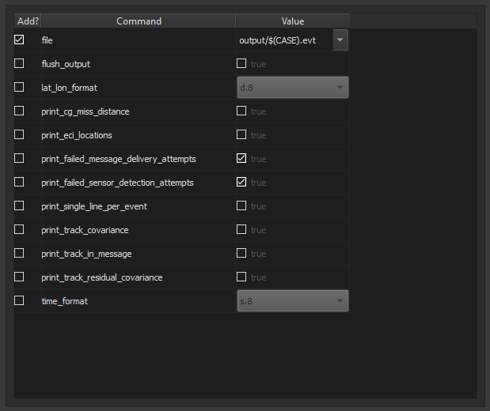

.. ****************************************************************************
.. CUI
..
.. The Advanced Framework for Simulation, Integration, and Modeling (AFSIM)
..
.. The use, dissemination or disclosure of data in this file is subject to
.. limitation or restriction. See accompanying README and LICENSE for details.
.. ****************************************************************************

.. |EO_PLUGIN| replace:: Event Output Editor
.. |CSV_EO| replace:: csv_event_output
.. |EVT_EO| replace:: event_output
.. |COMMAND_TEXT| replace:: A label denoting the particular
.. |DOC_CONTEXT| replace:: Right-clicking on the label brings up a context menu containing a documentation link for the
.. |DOC_LINK| replace:: More information can be found on the :command:`csv_event_output` and :command:`event_output` documentation.

|EO_PLUGIN| - Wizard
--------------------

.. image:: ../images/wiz_event_output.png

The |EO_PLUGIN| allows the user to add and edit |CSV_EO| and |EVT_EO| blocks in AFSIM input files.
This editor is intended to be a replacement to writing |CSV_EO| and |EVT_EO| blocks in AFSIM input files manually.
To access the editor, go to the Tools menu and click "|EO_PLUGIN|" or right-click on the editor and click "|EO_PLUGIN|".

.. note:: The editor tabs that open up in the background are read-only when the |EO_PLUGIN| is open.
          The editor tabs go back to normal when the editor is closed.

Features
========

The |EVT_EO| Type check boxes allow the user to toggle the settings and events tabs for the respective format.
The block format check boxes allow the user to toggle whether or not to write the block on a single line.

The Settings Tab
^^^^^^^^^^^^^^^^

The settings tab contains a table with all the available settings for the respective format.

Each row in the table contains the following:

* A check box denoting whether or not to add the setting into the block.
* |COMMAND_TEXT| setting (the "command").

   * |DOC_CONTEXT| setting.

.. note:: The URL redirection is guaranteed to work on Chrome and Firefox, but not Microsoft Edge or Internet Explorer.

* A widget denoting the "value" of the particular setting.

   * If the setting takes a boolean value, then the widget is a check box.
   * If the setting takes a literal value, then the widget is a combo box.

.. note:: * WSF supports multiple terminologies for boolean values, such as no/yes, disable/enable, and false/true.
            For simplicity, the |EO_PLUGIN| refers to boolean values using the false/true terminology.
          * The combo box contains some preset values and the last item in it allows the user to input a literal value manually.

The Events Tab
^^^^^^^^^^^^^^

.. image:: ../images/wiz_event_output_events.png

The events tab contains a list of all the available events supported by AFSIM.
The events are grouped by prefix (in particular, the portion of the event name before the first underscore).

Each item in the events list contains the following:
* |COMMAND_TEXT| event (the "command").

   * |DOC_CONTEXT| setting.

* Two check boxes allowing the user to disable or enable the event

   * If no check box is checked, then the event is not written out to the block.
   * If the disable check box is checked, then "disable <event>" is written out to the block.
   * If the enable check box is checked, then "enable <event>" is written out to the block.

The File Locator
^^^^^^^^^^^^^^^^

The combo box stores the names (absolute paths) of all the input files for the current scenario/project.
Changing the file name will stash the changes of the previous file load the other file.
The browse button opens a file dialog allowing the user to find any AFSIM input file to open with the |EO_PLUGIN|.

.. note:: Selecting the same entry in the combo box will reload the file.

The Buttons
^^^^^^^^^^^

Pressing "OK" writes the block out to file.
Pressing "Cancel" closes the editor without doing anything.
Pressing "Restore Defaults" will reset everything.

.. note:: The default is not to write anything to the block, so as to use the defaults set by :doc:`mission<../mission>`.

|DOC_LINK|
