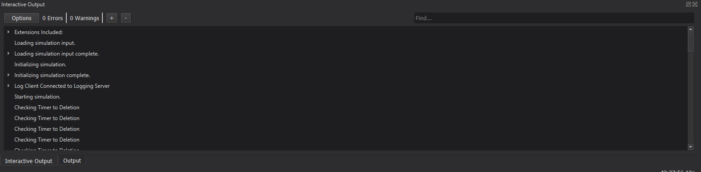
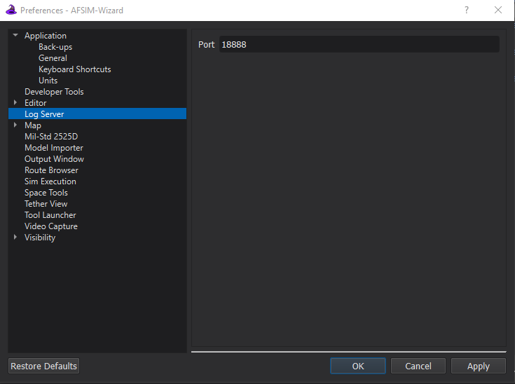

.. ****************************************************************************
.. CUI
..
.. The Advanced Framework for Simulation, Integration, and Modeling (AFSIM)
..
.. The use, dissemination or disclosure of data in this file is subject to
.. limitation or restriction. See accompanying README and LICENSE for details.
.. ****************************************************************************

Interactive Output - Wizard
===========================

Overview
--------
The Log Server plugin allows Wizard to act as a server to display log messages generated by mission instances in the Interactive Output pane. 
Mission instances may be executed from Wizard or directly from the command line.

Quick Start
-----------
The log server is configured to display all log messages in Wizard's Interactive Output view. With the plugin enabled, running a scenario from a Wizard or command line created mission instance will result in log messages accumulating in Wizard's Interactive Output. 

By default, the Log Server binds itself to the following socket::

    0.0.0.0:18888

This means that any IP registered to the user's machine may be used for the log server client.

Configuration
-------------
The user may configure the log server with a different port if desired or if necessary to avoid a collision.

In Wizard, log server configuration options are available from Options > Preferences > Log Server.

The following options are available:

* Port: The port on which the log server will listen. Acceptable range is 1-65535.

If running mission separately from wizard, it must be configured from the :ref:`command line<docs/mission:Command Line>` by providing options to mission.

.. include:: wkf_log_notification_prefs.txt
