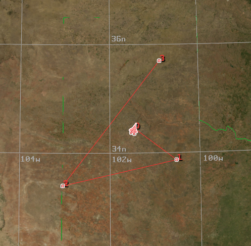

.. ****************************************************************************
.. CUI
..
.. The Advanced Framework for Simulation, Integration, and Modeling (AFSIM)
..
.. The use, dissemination or disclosure of data in this file is subject to
.. limitation or restriction. See accompanying README and LICENSE for details.
.. ****************************************************************************

Platform and Route Movement - Wizard
------------------------------------

Platforms and their routes can be interacted with on the :doc:`Map Display<../wkf_plugin/wiz_map_display>`.  To move a platform on the map first select the platform by left-clicking it on the map.  Once the platform is selected, press and hold the Ctrl key then left-click and drag the platform around the map. When the left mouse button is released the platform movement will stop and its position will be updated in the :doc:`text editor<../wizard_text_editor>`.  Moving individual route waypoints is done the same way.

.. image:: ../images/wiz_move_platform.png

Multi-Select Map Entities
=========================

Multiple entities on the map can be selected and moved at once.  One way this is done is by holding down the Ctrl key while individually clicking on the platforms and/or route waypoints you want to move.  The selected entities will appear highlighted on the map.  With all the desired entities selected, movement works as described above, press and hold the Ctrl key then left-click and drag the entities around the map.  When the left mouse button is released the entity movement will stop and their positions will be updated in the :doc:`text editor<../wizard_text_editor>`. 

.. image:: ../images/wiz_move_multiplatform.png

Another way to select multiple entities at once is through the box select capability.  With the Ctrl + Shift keys held down, left click and drag the mouse over the area containing the entities desired for selection.  A box will appear indicating that everything contained within it will be selected.  Once the desired area is covered release the left mouse button.  All entities that were inside the selection box will now be selected.

.. image:: ../images/wiz_box_select.png

