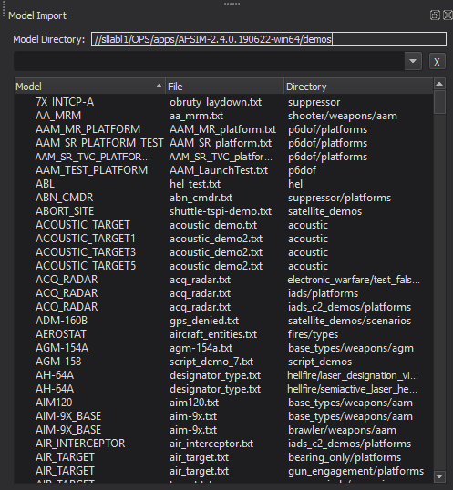

.. ****************************************************************************
.. CUI
..
.. The Advanced Framework for Simulation, Integration, and Modeling (AFSIM)
..
.. The use, dissemination or disclosure of data in this file is subject to
.. limitation or restriction. See accompanying README and LICENSE for details.
.. ****************************************************************************

Model Import - Wizard
=====================

The **Model Import** dialog in Wizard provides an interface to import platform types and their dependencies from external directories into an AFSIM project.

A JSON file in the external directory is used for book keeping. If the file does not exist, one can be generated at the user's request.

Files copied preserve file structure and are put in the same directory as the Imports File (see Preferences).

For convenience, a text file is generated which includes every imported file.
This file must be **manually included** into the scenario.

Preferences
-----------

In the Preferences menu, users have the following options:

.. image:: ../images/wiz_ModelImportPreferences.png

- Search Path

  - The path of the external directory to import types from.
  - Browse button is offered for convenience.

- Model Mapping File:

  - The name of the JSON file used for book keeping.
  - By default, this value is "importData.json".

- Imports File:

  - The name of the file generated to include imported files.
  - By default, this value is "imports/imports.txt".

- View Mode:

  - Name List

    - A sortable list of names of platform_type's.
    - This is the default option.

  - Category List

    - Displays a list of labels generated from the 'category' keyword.
    - Each platform_type is listed under every label that applies to it.
    - Labels may be manually adjusted by editing the ModelMapping File.

      - File Tree

    - Displays a tree which mirrors the file's layout in the filesystem

- Generate Model Mapping File

  - Scans the external directory to update the Model Mapping File.
  - User is prompted to overwrite existing data or attempt to merge with user-defined changes.

- Reload Model Mapping File

  - Reads the Model Mapping File from the disk to update the display.

Results
-------

The dock item for Model Import has the following sections:

- Directory

  - States where the external directory is.
  - This is a read only field.

- Search

  - Allows users to search the results.
  - Display updates as the user types.
  - Pressing Enter adds the current search to history, which can be selected in the future via the dropdown menu.
  - Clicking the X button will clear the search bar and history.

- View Area

  - Displays results in a tree or a list, depending on preferences.
  - Entries may be double-clicked to be imported into the project.

    - In "Category List" view:

      - Double-clicking a category will prompt to import an entire category.

    - In "File Tree" view:

      - Double-clicking a file will import it, regardless of what it contains.
      - Double-clicking a directory will prompt the user to import its contents.

Importing Files
---------------

When importing a type, the file it is defined in and all its dependencies are recursively copied into the project.
Dependencies are any file listed with 'include' or 'include_once' at the top of the file.
Any files included inside a block or after the definition of the type may not be copied.
To manually add dependencies, they may be listed under the "AdditionalDependencies" section in the Model Mapping File.

If an imported file already exists in the current project, the user will be prompted to skip or overwrite.
