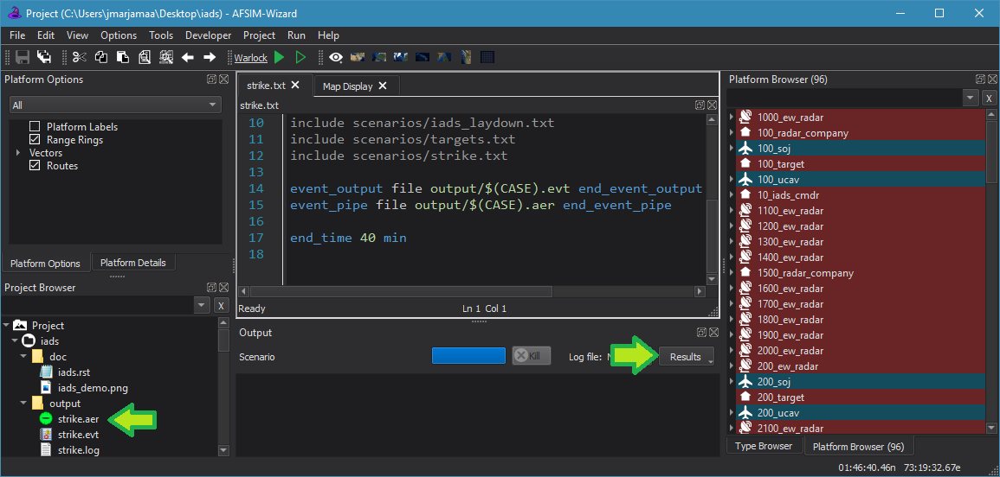

.. ****************************************************************************
.. CUI
..
.. The Advanced Framework for Simulation, Integration, and Modeling (AFSIM)
..
.. The use, dissemination or disclosure of data in this file is subject to
.. limitation or restriction. See accompanying README and LICENSE for details.
.. ****************************************************************************

Mystic Launcher - Wizard
------------------------

Wizard can launch the `Mystic<mystic>` application.  Simply double click on an event pipe AER file in the project browser or choose the event pipe file from the output drop-down in the output panel.
