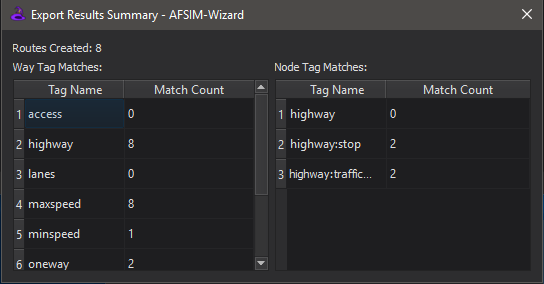

.. ****************************************************************************
.. CUI
..
.. The Advanced Framework for Simulation, Integration, and Modeling (AFSIM)
..
.. The use, dissemination or disclosure of data in this file is subject to
.. limitation or restriction. See accompanying README and LICENSE for details.
.. ****************************************************************************

OSM Converter - Wizard
----------------------

The **OSM Converter** in the Wizard Tools menu provides an interface to convert OpenStreetMap (OSM) files (.osm) into AFSIM :command:`route_network`.

Input
=====

By selecting Browse or dragging and dropping a valid OSM file to the input file field, the rest of the dialog will auto-complete based on the provided file name. The output file path and AFSIM route_network name may be edited if necessary at this point.

.. image:: ../images/wiz_OSMConverter.png

.. note::
   The tool does not create new directories, so please ensure the specified output file path is to an existing directory.

Tag Filters
===========

By default, the resulting route_network will contain all of the OSM ways contained in the input file (converted to AFSIM :doc`routes <../route>`) and their associated waypoint positions and intersections. The **Way Tag Data** and **Node Tag Data** buttons create way and node tag/value filters to parse additional data from the OSM file, which will be stored in the *aux_data* sections of the relevant waypoints or routes in the :command:`route`.

.. image:: ../images/wiz_TagAuxiliaryFilter.png

* **Tag Filter** - In OSM, tags describe specific features of map elements. This section of the table tells the dialog to extract elements with the specified key name.
* **Value Filter**  - Optional input to further filter along with the Tag Filter. Supports a *bool* output if the Tag/Value pair is found or just a value to output name.
* **Output Name** - The output variable name in the route/waypoint aux_data that the tag value will be written to.
* **Value Type** - This drop-down menu determines what AFSIM type the variable should be interpreted as *bool, int, double, string, unitary*.

A list of OSM map features is available in the `OSM Map Features <https://wiki.openstreetmap.org/wiki/Map_Features>`_, which also provides for tag/value pairs to filter from in the OSM file.

Exporting
=========

After clicking the Export button, there will be a pop-up dialog providing a short summary of the conversion.

.. note::
   The OSM Converter tool does not currently parse OSM Relation structures.

OSM Information
===============

Further information on OpenStreetMap can be found in the `OSM Wiki <https://wiki.openstreetmap.org/wiki/Main_Page>`_.

Databases
*********

OSM databases may be obtained online from the `OSM Database <https://www.openstreetmap.org>`_ or through one of the 3rd party tools directly.

Editors
*******

Other 3rd party edits available to pre-process and edit the osm files are recommended prior to conversion. A list of available editors is referenced in the `OSM Editors <https://wiki.openstreetmap.org/wiki/Editors>`_. A preferred tool that is widely used and very capable is the `JOSM <https://josm.openstreetmap.de/>`_ OSM Editor.
