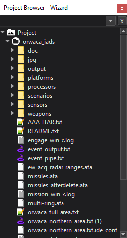

.. ****************************************************************************
.. CUI
..
.. The Advanced Framework for Simulation, Integration, and Modeling (AFSIM)
..
.. The use, dissemination or disclosure of data in this file is subject to
.. limitation or restriction. See accompanying README and LICENSE for details.
.. ****************************************************************************

Project Browser - Wizard
------------------------

The **Project Browser** is accessible from the View menu. The browser may be docked in the left or right docking areas of the main window or be free-floating.

The top of the browser contains a search field. Only files with names that contain the search string will be displayed in the browser. Click the 'x' button to clear the current search.

The browser displays the files associated with the project. The directory containing the project will always be shown as the first item in the browser. Additional directories may be added by right-clicking the **Project** entry at the top of the browser and selecting "Add Directory to Project"

Directories and files are displayed in the same hierarchy as the operating system's file structure. Each directory in the browser shows a full list of all files even if they are not 'included' in the project.

Files that are 'included' and recognized by Wizard as scenario files will have the |WIZARD_ICON| icon. If files external to any added directories are referenced by :command:`include` statements, those files are added to the **External Items** section. In other words, **External Items** are not in the directory branch of the current project.

A project may have one or more startup files. The startup files are the files passed to applications as command line arguments. Usually a project will have a single startup file which includes other files using :command:`include` statements. The startup files may be changed by right-clicking on a file in the browser and selecting "Set as Startup File". Startup files are identified by their underscored name and a trailing number in parentheses. Since more than one startup file may be selected this trailing number indicates the order in which the multiple startup files will be processed.

Right-clicking on a file in the browser will open a pop-up menu with several options related to the file. This may be Mystic, or if CME is properly configured in the preferences, then VESPA and Timeview may be launched from this menu by right-clicking on supported files (.rep, .evt, and .txt) and selecting 'Run in VESPA' or 'Run in Timeview'.

Some files containing geographic information may be double-clicked to load into the :doc:`map layer manager<../wkf_map_layer_manager>`.  These include |WORLD_ICON| ESRI shape files (.shp) and |ZONE_ICON| Geotiff files (.tif).

.. |WORLD_ICON| image:: ../images/world_icon.png
   :height: 16
   :width: 16
   
.. |ZONE_ICON| image:: ../images/zone_icon.png
   :height: 16
   :width: 16
