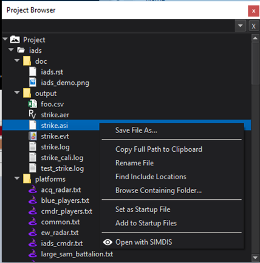
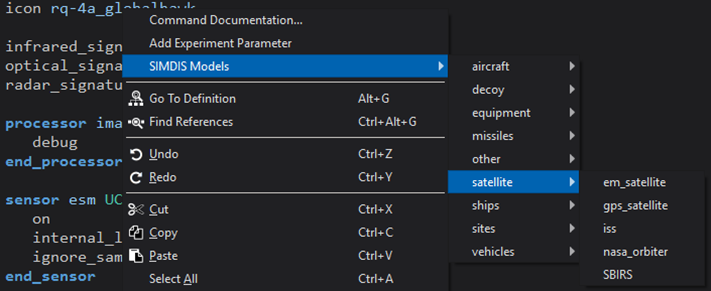

.. ****************************************************************************
.. CUI//REL TO USA ONLY
..
.. The Advanced Framework for Simulation, Integration, and Modeling (AFSIM)
..
.. The use, dissemination or disclosure of data in this file is subject to
.. limitation or restriction. See accompanying README and LICENSE for details.
.. ****************************************************************************

SIMDIS
------

The SIMDIS plug-in for Wizard integrates the use of the SIMDIS visualization application with wizard.

To begin, select the Configure SIMDIS... option from the Tools menu.  This will allow you to navigate to the SIMDIS application.  The configuration will be recalled in future Wizard sessions.

Once SIMDIS is configured, it may be executed by right clicking the "Open with SIMDIS" option.

Right clicking on a platform icon will provide an option to change the icon to a SIMDIS model from the "SIMDIS models" sub-menu.  This will also work on the hit_icon and kill_icon in the :command:`simdis_interface`.

Right clicking on a beam color in the :command:`simdis_interface` will provide an option "Set SIMDIS Beam Color..." which will launch a color chooser dialog to set beam's color.
