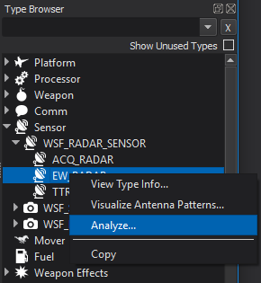

.. ****************************************************************************
.. CUI
..
.. The Advanced Framework for Simulation, Integration, and Modeling (AFSIM)
..
.. The use, dissemination or disclosure of data in this file is subject to
.. limitation or restriction. See accompanying README and LICENSE for details.
.. ****************************************************************************

SPLAT - Wizard
--------------

**SPLAT** (Sensor Plot Analysis Tool) has been integrated with Wizard so that sensors defined in a scenario can be more easily analyzed.

This tool aids the user in creating an input block definition recognized by :command:`sensor_plot<sensor_plot>`. The sensor_plot application will then produce the plots specified in the SPLAT dialog.

The **SPLAT** dialog can be opened by right-clicking on a sensor in the :doc:`Type Browser <wiz_type_browser>` and selecting the "Analyze" Option.
