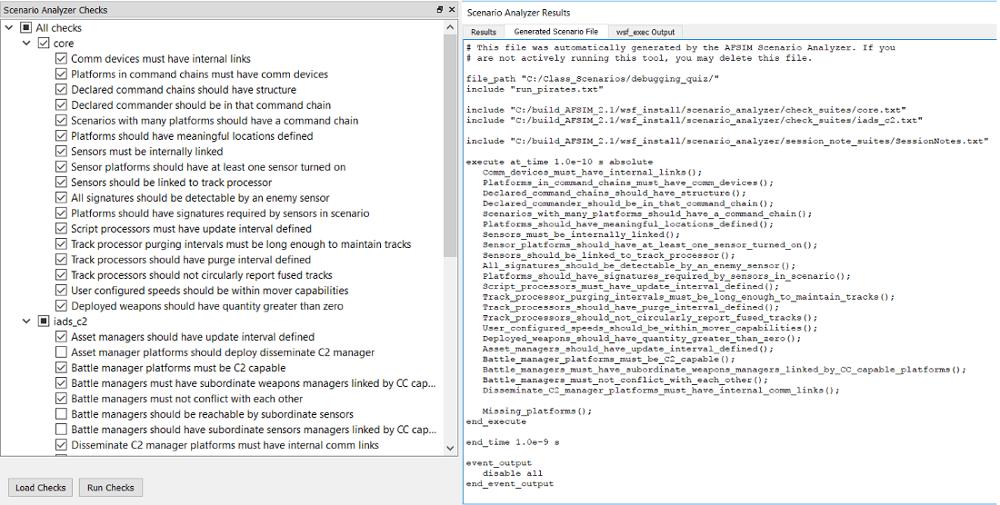
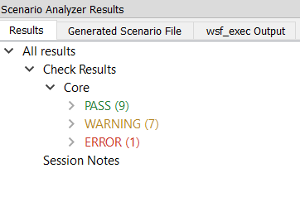
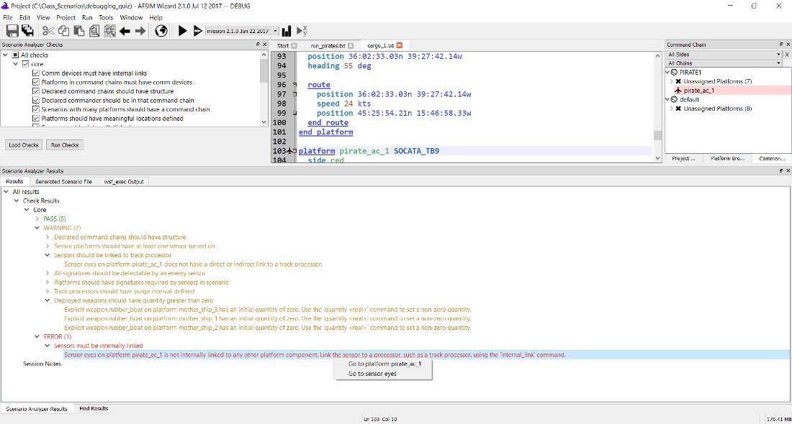
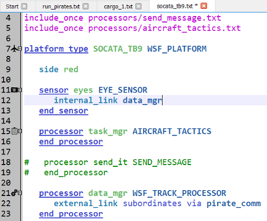
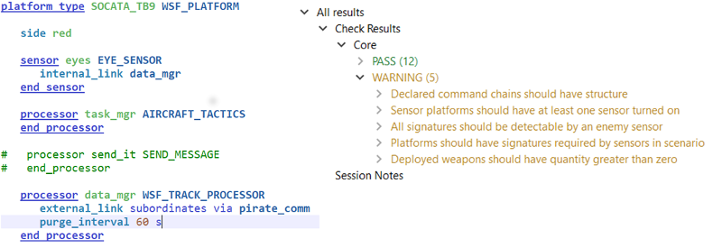
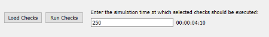
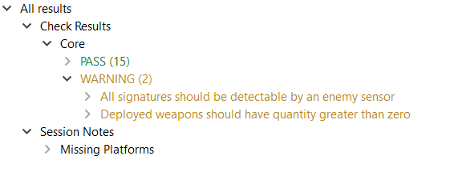
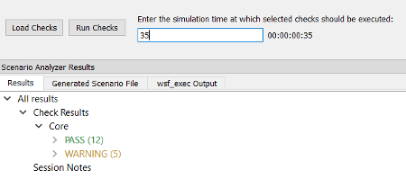

.. ****************************************************************************
.. CUI
..
.. The Advanced Framework for Simulation, Integration, and Modeling (AFSIM)
..
.. The use, dissemination or disclosure of data in this file is subject to
.. limitation or restriction. See accompanying README and LICENSE for details.
.. ****************************************************************************

.. _Scenario_Analyzer_Overview:

|  :doc:`Scenario Analyzer Tool Table of Contents <wiz_scenario_analyzer>`
|  :doc:`Next: Descriptions of Included Checks <scenario_analyzer_check_suites>`

Using the Scenario Analyzer
===========================

Overview
--------

.. image:: ../images/0_overview_sm.png

The Scenario Analyzer is a plug-in for Wizard (AFSIM's IDE) that helps analysts identify and resolve common errors during scenario creation. The Scenario Analyzer includes two categories of tests that analysts may run against a scenario: 'Checks' and 'Session Notes.'

**Checks**, which make up the core functionality of the Scenario Analyzer, are the tests that analysts may use to evaluate scenarios for unlinked sensors, command chains without communications devices, platforms without required signatures, and other common issues that directly involve the scenario content. Checks are organized into groups called 'suites.' The Scenario Analyzer comes with two suites of Checks, one for core AFSIM and one for IADS C2. Analysts have the option to run a single Check, several Checks, a full Check suite, or all available Checks against a scenario. Each Check has a corresponding severity level - either 'warning' or 'error' - that indicates how critical it is to resolve the issue identified by the check. When Check results are displayed to the analyst, they are grouped by suite. Within each suite, the results are further grouped by severity. Results from failed Checks are categorized as either **WARNING** or **ERROR**, depending on the severity of the Check, while results from passed Checks are categorized as **PASS**. A scenario passes a Check if every part of the scenario passes the Check. Alternately, a scenario fails a Check if any part of the scenario fails a Check. For example, the core AFSIM Check :ref:`Sensors must be internally linked <Sensors_must_be_internally_linked>` evaluates every sensor on every platform in the scenario and verifies that each sensor has an internal link to another platform part. In a scenario with 100 sensors, the Check will fail whether 1 sensor or 99 sensors are unlinked. This means that one failed Check may correspond to many instances of failure. When the Scenario Analyzer returns Check Results, it displays a detailed message for each instance of failure. The detailed message includes a description of the issue and instructions on how to address the issue if the solution is not self-explanatory. In addition, right-clicking on the detailed message brings up a context menu with links to locations in the scenario files that may be relevant to resolving the issue.

**Session Notes** are guaranteed to execute every time an analyst runs the Scenario Analyzer. While Checks look for issues arising from the content of a scenario, Session Notes evaluate the environment in which Checks are being run, and inform analysts of circumstances that may affect the validity or usefulness of the Check Results. For example, the Session Note called :ref:`Missing Platforms <Missing_platforms>` informs users of platforms that have not yet been added to the simulation at the time that checks are being run, since the absence of platforms could result in both false negatives and false positives in the Check Results. (For more information on when Checks are executed, as well as how to modify execution time, see `Advanced Feature: Modifying Check Execution Time`_). Results from Session Notes are displayed in the same pane as Check Results. Session Notes are not organized into suites or severity levels, but the results still include a detailed message for each instance of failure.

Like other Wizard plug-ins, the Scenario Analyzer can be loaded and unloaded using the Plug-in Manager, accessed from the **Tools** menu. When loaded, the plug-in adds two panes to the Wizard GUI, one used to select which Checks to run (Scenario Analyzer Checks) and one to display results (Scenario Analyzer Results). These panes can be added and removed from the GUI by selecting them in the **View** menu.

Loading Checks
--------------

.. image:: ../images/1_loading_checks.png

The Scenario Analyzer Checks pane contains an expanding check-box tree representing all of the available Checks organized by suite. When the Scenario Analyzer plug-in has been loaded in Wizard, all checks defined in the files in the **check_suites** directory for which dependencies are present will be automatically displayed in the Scenario Analyzer Checks pane.   

Each file in the Suites directory represents a separate suite of Checks. For example, all Checks displayed as part of the 'core' suite in the image of the **Scenario Analyzer Checks** pane are defined in **check_suites/core.txt**. Clicking the **Load Checks** button repopulates the check-box tree by parsing all text files in the check_suites directory. The Scenario Analyzer also loads or reloads Checks when Wizard is opened, when the active Project changes, and when the active executable changes. When Checks are loaded, the Scenario Analyzer examines each suite's dependencies and only loads Checks from that suite if all dependencies are present. Checks from suites than cannot be loaded are still visible in the Scenario Analyzer Checks pane, but they appear in light gray font and cannot be selected or run. In the image, the Scenario Analyzer did not load the IADS C2 suite of Checks because the wsf_iads_c2 plugin was missing. If a suite cannot be loaded, the Scenario Analyzer will display a pop-up message with the name of the suite and the names of the missing plug-ins or libraries, such as in pop-up displayed in this section. For more detail on how a Check suite's dependencies are defined and evaluated, see the 'dependencies script block' section within the :ref:`General Instructions <General_Instructions>` for adding new Checks.

.. image:: ../images/2_missing_dependencies.png

Selecting & Running Checks 
---------------------------

Analysts may select any combination of Checks to run against a scenario. In the **Scenario Analyzer Checks** pane shown in this section, all Checks in the 'core' suite and several individual Checks in the 'iads_c2' suite have been selected for execution.

Clicking **Run Checks** tests the scenario that has been set as the Startup File using all selected Checks. The Scenario Analyzer evaluates a scenario by generating a new scenario file that includes the Startup File, as well as all files in the check_suites and session_note_suites directories. This automatically generated file can be viewed in the **Generated Scenario File** tab in the **Scenario Analyzer Results** pane.

The scenario file displayed in the **Scenario Analyzer Results** image shows the result of running the selected Checks. Each of the selected Checks is set to execute immediately after the simulation has been initialized. In addition, all Session Notes contained in the files inside the session_notes_suites directory are scheduled to execute. In this case, only one Session Note is present: ``Warn_if_platforms_are_not_in_simulation()``. For more information, read the :ref:`Missing Platforms <Missing_platforms>` Session Note description.



Viewing & Using Results
-----------------------

To demonstrate how to view and use Scenario Analyzer output, we will examine the results of running the Core suite of Checks against the **debugging_quiz** scenario often used in the AFSIM Analyst Class. After selecting all Core Checks and clicking the **Run Checks** button, the output seen below appears in the Scenario Analyzer Results pane. We can see that the scenario passed nine Checks and failed eight, one of which was an error-level Check and seven of which were warning-level Checks. **Session Notes** appears in the Results tree but cannot be expanded, which tells us that at least one Session Note ran but that none returned useful information.



Expanding the **WARNING** and **ERROR** severity levels shows us the names of the Checks that the scenario failed. We can further expand each failed Check to see a detailed message for each instance of failure. As the picture of the full Wizard window below shows, the scenario failed the error-level Check :ref:`Sensors must be internally linked <Sensors_must_be_internally_linked>` because the sensor ``eyes`` on the platform ```pirate_ac_1`` is not internally linked to any other platform component. The scenario also failed the warning-level Check :ref:`Sensors should be linked to track processor <Sensors_should_be_linked_to_track_processor>` because the same sensor ``eyes`` on ``pirate_ac_1`` is not directly or indirectly linked to a track processor. The detailed message for the error-level failure instructs us to link ``eyes`` to a processor, such as a track processor, with an ``internal_link``. We could resolve both failures by ensuring that ``eyes`` is either linked directly to a track processor or linked to another platform that communicates with a track processor. Right-clicking on the message brings up a context menu with hyperlinks to ``pirate_ac_1`` and ``eyes``, which we can use to navigate to the relevant place in the scenario files.



Clicking on the link to ``pirate_ac_1`` takes us to the platform, and we can easily navigate from there to the platform type ``SOCATA_TB9`` of which ``pirate_ac_1`` is an instance. Sure enough, the sensor ``eyes`` is not linked to anything. Adding an internal link to the track processor ``data_mgr``, as shown in the image of the text editing pane, will address both failures by (1) ensuring that the sensor has an internal link to some other platform part and (2) ensuring that the sensor can communicate its data to a track processor.




If we save the scenario and rerun the Core Checks, we get the following results:

.. image:: ../images/8_results_after_one_mod.png

Adding the internal link from ``eyes`` to ``data_mgr`` fixed the issue that caused **Sensors must be internally linked** and **Sensors should be linked to track processor** to fail, but we now have a different error-level failure: :ref:`Track processor purging intervals must be long enough to maintain tracks. <Track_processor_purging_intervals_must_be_long_enough_to_maintain_tracks>` The detailed message for that Check reads:

    Sensor eyes on pirate_ac_1 has a mode default that requires     5.000000 seconds at a very minimum to get enough hits to maintain a     track, but the sensor eventually reports to track processor     data_mgr on platform pirate_ac_1, which has a purge interval of     only 0.000000 seconds. To address this, (1) decrease the mode's     'frame_time', (2) decrease the first value for     'hits_to_maintain_track', or (3) increase the 'purge_interval'.

We have several options to modify the scenario in order to pass this Check, but another warning-level failures, :ref:`Track processors should have purge interval defined <Track_processors_should_have_purge_interval_defined>`, helps us determine the right option. The detailed message for this Check reads:

    Track processor data_mgr on platform pirate_ac_1 has a track     purging interval of 0 seconds, so tracks will not be purged. User     'purge_interval <time_value>' or 'drop_after_inactive     <time_value>' to set a non-zero track purging interval.

These two detailed messages let us know that giving ``data_mgr`` a purge interval that is greater than the 5 seconds required by mode ``default`` on sensor ``eyes`` should resolve both Check failures. The final image in this section shows the required edit to ``data_mgr`` along with the Check Results yielded by re-running the Core suite after making the fix: The scenario now passes twelve of the seventeen Checks and fails only five warning-level Checks.



.. _Modifying_check_execution_time:

Advanced Feature: Modifying Check Execution Time
------------------------------------------------

The default behavior of the Scenario Analyzer is to run all selected Checks immediately after the simulation has been initialized, without offering users an option to adjust the Check execution time. However, if the :ref:`Missing Platforms <Missing_platforms>` Session Note determines that one or more platforms are missing from the simulation, the Scenario Analyzer will modify the controls in the **Scenario Analyzer Checks** pane by adding a text box than can be used to specify a simulation time at which Checks will be executed. Users can enter a time in either ``days:hours:minutes:seconds`` format or in seconds. The text to the right of the input box will display the chosen Check execution time using the first format.

.. image:: ../images/10_new_option_to_mod_exec_time.png



Changing the ``creation_time`` for ``pirate_ac_1`` from the previous section to a simulation time of 30 seconds illustrates why this feature may be useful. Making only this change and rerunning the Core Checks yields the results seen below:



Now that ``pirate_ac_1`` is not present at the time that Checks are run, three of the five warning-level failures that we saw at the end of the previous section have disappeared. The problems that caused those warnings, such as the failure to turn on any of the platform's sensors, have not been solved. However, ``pirate_ac_1`` is invisible to the Checks.

If we expanded the **Missing Platforms** Session Note, we would see the following message:

    Platform pirate_ac_1 is not present in the simulation at the time     that the checks are being run: This is likely because the platform's     creation time is 30.000000 seconds, while tool's default behavior is     to run all selected checks immediately after the simulation is     initialized. You may adjust the time at which checks are run to a     time after this platform's creation time by entering a time to     execute checks in the text box next to the 'Run Checks' button.     (Note that other platforms may get deleted if you advance the     simulation time.)

Because **Missing Platforms** has discovered that a platform is missing from the simulation, the Scenario Analyzer now offers the option to adjust the time at which Checks are executed. If we change the execution time to 35 seconds and rerun the Core Checks, we get the output seen in immediately below. Because ``pirate_ac_1`` is present in the simulation when the Checks run, the scenario fails the same five warning-level checks that we saw at the end of the last section. Additionally, the Missing Platforms Session Note no longer displays any output because all platforms are present at the Check execution time.



When adjusting the Check execution time, it is important to realize that advancing the simulation time to include later-created platforms in the Checks may mean that other platforms will have been deleted by the time the Checks run. Like running Checks before some platforms have been created, Running Checks after some platforms have been deleted may also lead to false positives and false negatives. Once again, the Missing Platforms Session Note will inform the user if platforms are not present when Checks execute. If Check execution time falls after a missing platform's creation time, the Session Note will state that the platform may have been deleted.

Once the execution time box appears and gives the user the option to adjust the time at which Checks are run, the box will remain visible and usable for the duration of the Wizard session. Closing Wizard or unloading and reloading the Scenario Analyzer plug-in will cause the box to disappear.

:ref:`Next: Descriptions of Included Checks <Scenario_Analyzer_Check_Suites>`
