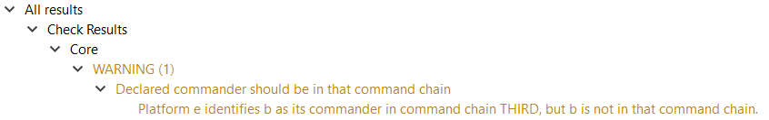
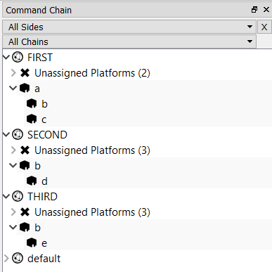

.. ****************************************************************************
.. CUI
..
.. The Advanced Framework for Simulation, Integration, and Modeling (AFSIM)
..
.. The use, dissemination or disclosure of data in this file is subject to
.. limitation or restriction. See accompanying README and LICENSE for details.
.. ****************************************************************************

.. _Scenario_Analyzer_Utilities:

|  :doc:`Scenario Analyzer Tool Table of Contents <wiz_scenario_analyzer>`
|  :doc:`Previous: Descriptions of Included Checks <scenario_analyzer_check_suites>`
|  :doc:`Next: Adding New Scenario Analyzer Checks <scenario_analyzer_add_checks_tutorial>`

Descriptions of Script Utilities
================================

Utilities for Communicating Results
-----------------------------------

:ref:`As described in the tutorial <General_instructions>` for adding new Scenario Analyzer Checks, Checks communicate their results in a way that can be displayed in the Scenario Analyzer Results pane by logging messages composed of strings that represent information about the Check (suite, severity, and name) and a detailed message describing any Check failures. When writing a new Check, :ref:`SendResultMessage <Send_result_message>` or :ref:`SendResultMessageWithLinks <Send_result_message_with_links>` should be called every time a failure is identified. If the Check evaluates a condition at the simulation level, it may be best to log only one result message each time the Check runs. On the other hand, if the Check evaluates a condition at the platform level, it might log a result for every platform that fails the Check, possibly resulting in many lines of detailed messages for a single check in the Scenario Analyzer Results pane.

Keep in mind that a Check will not appear in the Results pane at all - even if it has been selected and run - unless the Check calls one of these utilities. For example, a Check that calls SendResultMessage every time it identifies a failure but neglects to send a message if a scenario passes the Check (i.e., has no failures) will be absent from the Results pane whenever the Check has been passed. See :ref:`the portion of the tutorial <Adding_checks_using_the_afsim_scripting_language>` that deals with defining a Check completely in AFSIM script for an example of the suggested method of reporting passes and failures.

.. _Send_result_message:

void **SendResultMessage**\ (string suite, string severity, string check, string detail)
^^^^^^^^^^^^^^^^^^^^^^^^^^^^^^^^^^^^^^^^^^^^^^^^^^^^^^^^^^^^^^^^^^^^^^^^^^^^^^^^^^^^^^^^

Causes a result to be added to the Check Results tree in the Scenario Analyzer Results pane.

-  **suite** should be similar to the name of the file in which the    Check is defined, since the Scenario Analyzer Checks pane uses file    names to determine suite names.

-  **severity** should be 'WARNING' or 'ERROR' in the case of a failure    or 'PASS' if the entire scenario has passed the Check.    (:ref:`SendPassMessage <Send_pass_message>`    may also be used to report passes.)

-  **check** represents the name of the Check as it will be displayed in    the Results pane. It should match the Check's script name in the    suite file, but with spaces replacing underscores.

-  **detail** should include whatever information will help an analyst    to identify and fix the issue that caused the Check to fail.

See below for an example call to this utility and the corresponding Check Result:

::

   ScenarioAnalyzerUtils.SendResultMessage(
      "Core",
      "Declared commander should be in that command chain",   
      "WARNING",
      "Platform e identifies b as its commander in command chain THIRD, but b is not in that command chain.");

.. _Send_result_message_with_links:

void **SendResultMessageWithLinks**\ (string suite, string severity, string check, string detail, Array<string> linkedLocationTypes, Array<string> linkedLocationNames)
^^^^^^^^^^^^^^^^^^^^^^^^^^^^^^^^^^^^^^^^^^^^^^^^^^^^^^^^^^^^^^^^^^^^^^^^^^^^^^^^^^^^^^^^^^^^^^^^^^^^^^^^^^^^^^^^^^^^^^^^^^^^^^^^^^^^^^^^^^^^^^^^^^^^^^^^^^^^^^^^^^^^^^^

Causes a result to be added to the Check Results tree in the Scenario Analyzer Results pane with hyperlinks from the detail message to relevant locations in the scenario files.

This utility takes advantage of Wizard's capabilities for navigating AFSIM project files to allow those defining new Checks to associate a Check result with relevant 'locations' in the scenario files. Right clicking on a result's detail message will bring up a context menu of hyperlinked locations.

A location is identified by a 'type' and a 'name.' The types of all locations for which a Check author wants to add links must appear in the ``linkedLocationTypes`` array, while the names of all locations must appear in the parallel ``linkedLocationNames`` array. The following types will result in working links: ``'platform'`` (*not* ``'platforms'``), ``'sensors'``, ``'processors'``, ``'weapons'``, and ``'comms'``. A location's name must be the result of calling ``Name()`` on the object in AFSIM script, or ``GetName()`` in C++.

See below for an example call to this utility and the corresponding Check Result:

::

   // sensor fails the Check if it is not linked to any WsfTrackProcessor
   if (linkedTrackProcs.Size() <= 0 && linkedTrackMgrs.Size() <= 0)
   {
      checkPassed = false;

      Array<string> fileLocationTypes = Array<string>();
      Array<string> fileLocationNames = Array<string>();

      fileLocationTypes.PushBack("platform");
      fileLocationNames.PushBack(platform.Name());

      fileLocationTypes.PushBack("sensors");
      fileLocationNames.PushBack(sensor.Name());         

      string message = "Sensor " + sensor.Name() + " on platform " + platform.Name() + " is not linked directly or indirectly to a track processor";
      ScenarioAnalyzerUtils.SendResultMessageWithLinks(suite, check, severity, message, fileLocationTypes, fileLocationNames);
   }

.. image:: ../images/37_results_send_result_msg_links.png

.. _Send_pass_message:

void **SendPassMessage**\ (string suite, string check)
^^^^^^^^^^^^^^^^^^^^^^^^^^^^^^^^^^^^^^^^^^^^^^^^^^^^^^

Calling ``SendPassMessage`` does the equivalent of calling ``SendResultMessage`` with a ``severity`` value of 'PASS' and a ``detail`` value of 'Scenario passed this check.' (For passing checks, the detail message is not displayed.)

.. _Send_session_note_message:

void **SendSessionNoteMessage**\ (string sessionNote, string detail)
^^^^^^^^^^^^^^^^^^^^^^^^^^^^^^^^^^^^^^^^^^^^^^^^^^^^^^^^^^^^^^^^^^^^

Causes a Session Note result with a name of ``sessionNote`` and a detailed message of ``detail`` in the Scenario Analyzer Results pane below the Check Results tree.

Utilities for Navigating Command Chains
---------------------------------------

Other than ``GetTopCommander``, the utilities for navigating command chains take an ``origin`` platform as the starting point and recursively search up or down one or all of origin's command chains, looking for any platform that passes the script-defined check specified by the ``checkName`` argument. The utilities following this pattern return true if they encounter any platform that passes the check. ``checkName`` must be the name of an AFSIM script accessible in the global script context (at the simulation level) that takes one ``WsfPlatform`` as an argument and returns a Boolean value.

.. _Get_top_commander:

WsfPlatform **GetTopCommander**\ (string commandChain, WsfPlatform origin)
^^^^^^^^^^^^^^^^^^^^^^^^^^^^^^^^^^^^^^^^^^^^^^^^^^^^^^^^^^^^^^^^^^^^^^^^^^

Returns the top-level commander (the platform whose commander == SELF) above ``origin`` on the specified command chain.

.. _Check_down_one_command_chain:

bool **CheckDownOneCommandChain**\ (WsfPlatform origin, string checkName, string commandChain)
^^^^^^^^^^^^^^^^^^^^^^^^^^^^^^^^^^^^^^^^^^^^^^^^^^^^^^^^^^^^^^^^^^^^^^^^^^^^^^^^^^^^^^^^^^^^^^

Returns true if the script specified by ``checkName`` returns true for ``origin`` or for any platform subordinate to origin on the command chain with the name ``commandChain``.

.. _Check_down_all_command_chains:

bool **CheckDownAllCommandChains**\ (WsfPlatform origin, string checkName)
^^^^^^^^^^^^^^^^^^^^^^^^^^^^^^^^^^^^^^^^^^^^^^^^^^^^^^^^^^^^^^^^^^^^^^^^^^

Returns true if the script specified by ``checkName`` returns true for ``origin`` or for any platform subordinate to origin on any command chain.

This utility works by calling the script named ``checkName`` on origin, then on each of origin's subordinates on every command chain to which origin belongs, and then on each of the subordinate's subordinates on every command chain to which the subordinate belongs, and so on recursively. This utility may return true because a platform that has no command chains in common with origin passes the check. For example, using the command chain structure in the figure below, calling ``CheckDownAllCommandChains`` with platform **a** as the origin would call the specified check on **a,** and on **a**\ 's subordinates **b** and **c**. It will also call the check on **b**\ 's subordinates **d** and **e.** As a result, the utility will return true if platform **e** is the only platform for which the script specified by **checkName** returns true, even though platform **e** has no command chains in common with the origin platform **a**.

.. _Check_up_one_command_chain:

bool **CheckUpOneCommandChain**\ (WsfPlatform origin, string checkName, string commandChain)
^^^^^^^^^^^^^^^^^^^^^^^^^^^^^^^^^^^^^^^^^^^^^^^^^^^^^^^^^^^^^^^^^^^^^^^^^^^^^^^^^^^^^^^^^^^^

Returns true if the script specified by ``checkName`` returns true for ``origin`` or for any platform superior to origin on the command chain with the name ``commandChain``.

.. _Check_up_all_command_chains:

bool **CheckUpAllCommandChains**\ (WsfPlatform origin, string checkName)
^^^^^^^^^^^^^^^^^^^^^^^^^^^^^^^^^^^^^^^^^^^^^^^^^^^^^^^^^^^^^^^^^^^^^^^^

Returns true if the script specified by ``checkName`` returns true for ``origin`` or for any platform superior to origin on any command chain. See :ref:`CheckDownAllCommandChains <Check_down_all_command_chains>` for an explanation of how a utility examines all of a platform's command chains.

.. _Check_full_command_chain:

bool **CheckFullCommandChain**\ (WsfPlatform origin, string checkName)
^^^^^^^^^^^^^^^^^^^^^^^^^^^^^^^^^^^^^^^^^^^^^^^^^^^^^^^^^^^^^^^^^^^^^^

Returns true if the script specified by ``checkName`` returns true for any platform in any command chain to which ``origin`` belongs. This utility works by identifying the top-level command in every command chain to which origin belongs (using :ref:`GetTopCommander <Get_top_commander>`), and then calls the equivalent of :ref:`CheckDownOneCommandChain <Check_down_one_command_chain>` for every top-level commander, using the name of the command chain shared by the commander and origin as the ``commandChain`` argument.

Utilities for Identifying Connected Platform Parts
--------------------------------------------------

Each of the utilities in this category return an array of ``WsfPlatformPart``\ s that are connected to the origin platform or platform part in a particular way. Each of the utilities also takes a string parameter ``partType``: A connected platform part will only be included in the returned array if the platform part has a type that matches partType. Whether a platform part's type matches is determined by calling ``WsfObject::IsA_TypeOf(partType)``, which expects the part's base class name rather than its script class name. For example, if a call to ``LinkedAndReachablePlatformParts`` should return all WsfTrackProcessors linked to WsfPlatformPart origin, partType must be ``'WSF_TRACK_PROCESSOR'``, not ``'WsfTrackProcessor'``.

.. _Get_platform_parts_down_one_command_chain:

Array<WsfPlatformPart> **GetPlatformPartsDownOneCommandChain**\ (WsfPlatform origin, string partType, string commandChain)
^^^^^^^^^^^^^^^^^^^^^^^^^^^^^^^^^^^^^^^^^^^^^^^^^^^^^^^^^^^^^^^^^^^^^^^^^^^^^^^^^^^^^^^^^^^^^^^^^^^^^^^^^^^^^^^^^^^^^^^^^^

Returns an array of all platform parts with a type of ``partType`` located on ``origin`` or on platforms subordinate to origin on the specified command chain.

.. _Get_platform_parts_down_all_command_chains:

Array<WsfPlatformPart> **GetPlatformPartsDownAllCommandChains**\ (WsfPlatform origin, string partType)
^^^^^^^^^^^^^^^^^^^^^^^^^^^^^^^^^^^^^^^^^^^^^^^^^^^^^^^^^^^^^^^^^^^^^^^^^^^^^^^^^^^^^^^^^^^^^^^^^^^^^^

Returns an array of all platform parts with a type of ``partType`` located on ``origin`` or on platforms subordinate to origin on *any* command chain. This utility works by looking for matching platform parts on origin, then on each of origin's subordinates on every command chain to which origin belongs, and then on each of the subordinate's subordinates on every command chain to which the subordinate belongs, and so on recursively. As a result, some or all of the returns platform parts may be located on platforms to which origin does not belong. See :ref:`CheckDownAllCommandChains <Check_down_all_command_chains>` for an explanation of how utilities examine all of a platform's command chains.

.. _Internally_linked_platform_parts:

Array<WsfPlatformPart> **InternallyLinkedPlatformParts**\ (WsfPlatformPart origin, string partType)
^^^^^^^^^^^^^^^^^^^^^^^^^^^^^^^^^^^^^^^^^^^^^^^^^^^^^^^^^^^^^^^^^^^^^^^^^^^^^^^^^^^^^^^^^^^^^^^^^^^

Returns an array of all platform parts with a type of ``partType`` that are connected to ``origin`` either directly (by an ``internal_link`` from origin to the other platform part) or indirectly. A platform part ``otherPart`` is indirectly linked to origin if origin has an ``internal_link`` to an intermediate platform part, which in turn has an internal link to otherPart. There may be any number of intermediate platform parts between origin and otherPart. Keep in mind that internal links are directed: otherPart is only linked to origin if all links between the two parts are pointing in the origin->otherPart direction.

.. _Linked_and_reachable_platform_parts:

Array<WsfPlatformPart> **LinkedAndReachablePlatformParts**\ (WsfPlatformPart origin, string partType)
^^^^^^^^^^^^^^^^^^^^^^^^^^^^^^^^^^^^^^^^^^^^^^^^^^^^^^^^^^^^^^^^^^^^^^^^^^^^^^^^^^^^^^^^^^^^^^^^^^^^^

Returns an array of all platform parts with a type of ``partType`` that are connected to ``origin`` either by internal links on the same platform (i.e., those parts that would be returned by :ref:`InternallyLinkedPlatformParts <Internally_linked_platform_parts>`) or by a network of internal links, external links, and compatible communication devices. The utility discovers external links by finding all script processors (including derived types such as track processors) and linked processors to which origin is connected by internal links. Then, the utility follows those external links to find the platforms to which the processor reports. An external link alone is not enough to make a part on one platform reachable by a part on the other. The external link must be associated with comms of type ``WsfCommXmtrRcvr`` or a derived type that are (1) on the same network, (2) able to transmit and receive appropriately for the direction of the external link, and (3) connected to destination platform parts by internal links in the right direction.

The code block below contains an example of a WsfTrackProcessor on the ``cmdr`` platform that is linked and reachable from the WsfGeometricSensor on the ``sub`` platform. If the ``report_to`` statement or either of the ``internal_link``\ s were missing, ``track_proc`` would no longer be linked and reachable from sensor1. Similarly, ``comm1`` and ``comm2`` were not on the same network, if ``comm1`` lacked the ability to transmit, or if ``comm2`` lacked the ability to receive, ``track_proc`` would not be linked and reachable from the sensor.

::

   platform sub WSF_PLATFORM
      commander cmdr
      add comm comm1 WSF_COMM_XMTR
         network_name local_net
      end_comm
      
      add_processor linked_proc WSF_LINKED_PROCESSOR
         report_to commander via comm1
      end_processor
      
      add sensor sensor1 WSF_GEOMETRIC_SENSOR
         on
         frame_time 1 s
         reports_range
         internal_link linked_proc
      end_sensor
   end_platform
   
   platform cmdr WSF_PLATFORM
      commander SELF
      add comm comm2 WSF_COMM_RCVR
         network_name local_net
         internal_link track_proc
      end_comm
      
      add processor track_proc WSF_TRACK_PROCESSOR
         purge_interval 60 s
      end_processor
   end_platform

When following external links, the utility recursively searches for script processors and linked processors on each new platform discovered and also follows those links (as long as comms are correctly configured). This means that any number of intermediate platforms may appear between origin and its linked and reachable parts.

.. _Linked_and_reachable_platform_parts_choose_procs:

Array<WsfPlatformPart> **LinkedAndReachablePlatformPartsChooseProcs**\ (WsfPlatformPart origin, string partType, Array<string> processorTypes, bool followSpecifiedProcs)
^^^^^^^^^^^^^^^^^^^^^^^^^^^^^^^^^^^^^^^^^^^^^^^^^^^^^^^^^^^^^^^^^^^^^^^^^^^^^^^^^^^^^^^^^^^^^^^^^^^^^^^^^^^^^^^^^^^^^^^^^^^^^^^^^^^^^^^^^^^^^^^^^^^^^^^^^^^^^^^^^^^^^^^^^

This utility is nearly identical to :ref:`LinkedAndReachablePlatformParts <Linked_and_reachable_platform_parts>` with one important exception. While ``LinkedAndReachablePlatformParts`` follows all external links it encounters (as long as comms are configured correctly), ``LinkedAndReachablePlatformPartsChooseProcs`` allows the caller to specify a list of processor types representing either (1) the only types of processors whose external links should be followed when searching for linked and reachable platform parts or (2) the types of processors whose external links should be ignored. The Boolean argument ``followSpecifiedProcs`` determines whether external links belonging to the types listed in ``processorTypes`` should be followed or ignored. If ``followSpecifiedProcs == true``, only processors of a type included in processorTypes will have their external links evaluated. If ``followSpecifiedProcs == false``, all script or linked processors except those whose type is listed in processorTypes will have their external links evaluated.

There is one important exception to this general rule for determining which external links will be followed: If the platform part initially passed in as ``origin`` has external links, those links will be followed even if origin's type is one that would normally be ignored.

For example, :ref:`one of the Checks in the Core suite <Track_processors_should_have_purge_interval_defined>` warns of pairs of track processors that report fused tracks to each other. The Check is designed to catch two track processors that report to each other through any intermediate linked processors or script processors *except* intermediate track processors. For the purposes of this Check, WsfTrackProcessor B in the diagram below is 'linked and reachable' from A, but WsfTrackProcessor C is not.

**WsfTrackProcessor A WsfLinkedProcessor WsfTrackProcessor B WsfTrackProcessor C**

Someone wanting to re-implement this Check in AFSIM script could discover all track processors linked and reachable from WsfTrackProcessor A according to the Check's definition of 'linked and reachable' by passing an ``Array<string>`` with one item - ``'WSF_TRACK_PROCESSOR'`` - as the processorTypes argument and by passing ``false`` as the last argument. With WsfTrackProcessor A as origin, its external links would be followed, as would those belong to the WsfLinkedProcessor. However, WsfTrackProcessor B's external links would not be followed, so the utility would correctly identify B, but not C, as 'linked and reachable' from A. :ref:`See the tutorial <Scenario_Analyzer_Add_Checks_Tutorial>` for a full implementation of the Check in AFSIM script, which uses this utility.

|  :doc:`Previous: Descriptions of Included Checks <scenario_analyzer_check_suites>`
|  :doc:`Next: Adding New Scenario Analyzer Checks <scenario_analyzer_add_checks_tutorial>`
