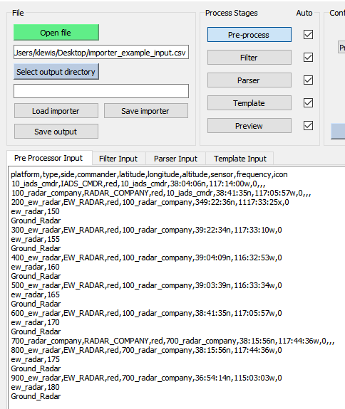
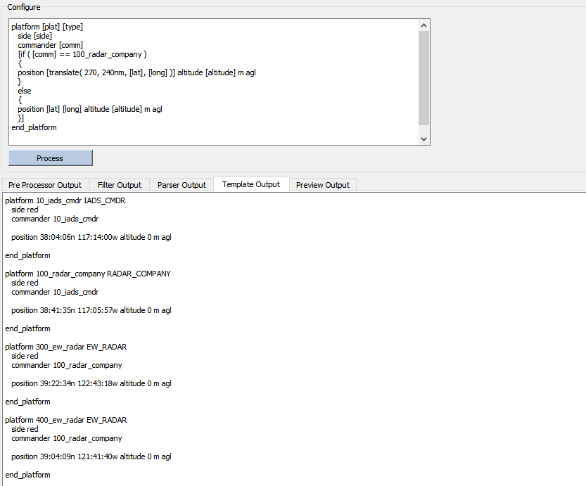
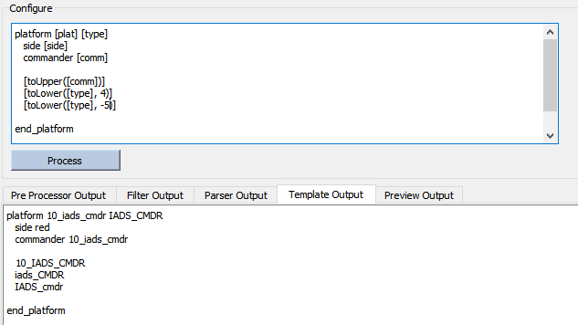
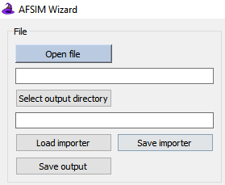
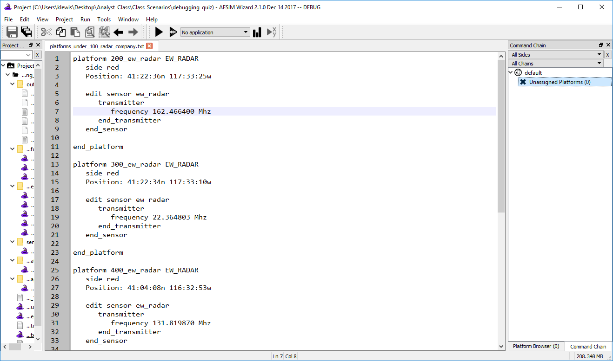

.. ****************************************************************************
.. CUI
..
.. The Advanced Framework for Simulation, Integration, and Modeling (AFSIM)
..
.. The use, dissemination or disclosure of data in this file is subject to
.. limitation or restriction. See accompanying README and LICENSE for details.
.. ****************************************************************************

.. _Scenario_Importer_Demo:

Scenario Importer Demo
----------------------

To demonstrate how a user might use the Scenario Importer, this section will walk through a use case and describe how one might put together a scenario from raw platform data provided externally.  This demonstration will show how to go from raw external data into a an AFSIM-ready scenario laydown.

File Input
==========

The first step is to load scenario data from the external file. Clicking the "Open file" button will bring up a new window prompting the user to select the input file of interest. If any pre-processing is required then it will be applied in the next step.

Pre-processing
==============

.. image:: ../images/demo_1b_remove_line.png
   :align: center

Any pre-processing program which the user has written can be loaded into the pre-processor and applied to the raw input. For this example, we have written a simple executable which merely removes the first line of input which contains header information not needed for the following import steps. Any errors or warnings generated by the external command will be written to the Importer's errors panel, and the output is viewable in the output tab to the bottom right to check for the intended changes.

.. _Scenario_Importer_Demo.Generating_a_Parser_Table:

Generating a Parser Table
=========================

Up until this stage the input data has been in a raw form without any capturing or tagging of desired data types. Users may need to generate a parser table to organize data into tagged and named columns. These will be essential to writing a formatting template which will generate the desired scenario file.

Adding Parser Columns
*********************

.. image:: ../images/demo_3a_parser_add_columns.png
   :align: center

Columns can be added on the table in the output panel by clicking the upper left *' + '* column, or by right clicking and setting the number of columns directly. Columns can be deleted by right clicking their header entries as well.

In this example case, the platforms will have a maximum of 10 unique data entries because the header contains 10 entries.

.. note:: At any point the user can view previous input or output from the stages by navigating between them on the input and output panels.  This action does not trigger any processing.

Reading Multi-Line Data Inputs
******************************

.. image:: ../images/bdemo_3b_parser_needs_multiline.png
   :align: center

Above, we can see that it appears some of the platform entries have parts and fields which are not on the same line. If the raw data happens to be of this form, the user can check *Multi Line Inputs*, which will force data entries to fill to the last column. Note that in this example, the entries which do not have sensors and icons - those which are not *ew_radar* platforms - have extra delimiters which tell the importer to add blank entries to a particular platform entry.

Below we see the proper output with *Multi Line Inputs* checked; each row contains all the data for a platform within the scenario, the user can now label the data for use in formatting.

.. image:: ../images/demo_3c_parser_with_multiline.png
   :align: center

Naming and Tagging Data Entries
*******************************

.. image:: ../images/demo_3d_parser_naming_tagging.png
   :align: center

Next the data columns should be named so that they can be called programatically in the next stage. Clicking on each column header will load its configuration panel, which can be filled in with a name, a non-comma delimiter, and a data type for validation purposes. Labeling the data type is not required, but doing so instructs the importer to check for the validity of the data depending on its type.

Filtering out Parser Errors
^^^^^^^^^^^^^^^^^^^^^^^^^^^^

.. image:: ../images/bdemo_3e_parser_errors.png
   :align: center

Having named and labeled all of the data entries the parsing stage has thrown up an error and a warning.

- Error: Invalid token

- Warning: 9 Empty tokens found

The warning can be ignored in this case; it refers to the empty data entries for the platforms which do not have sensors and icons, which are known to be correct.
Clicking on the error directs us to the data entry which was found to be invalid, in this case the *200_ew_radar* platform had positional values which were out of the legal range or formatted incorrectly. This could be solved by saving the importer settings up to this point, and going to edit the entries in the input data directly and re-loading the importer. Alternatively, the user may also use the **Filter Stage** to remove that particular entry.

.. image:: ../images/demo_3f_filter_remove_parser_errors.png
   :align: center

Back in the filter stage, the user can add a filter which excludes the lines which make up the *200_ew_radar* platform. Note that the Multi-line setting from the parser does not effect this stage, and so at this point in the processing the user will need to remove all three lines which include the platform, sensor, and icon, in order to not have extra platform parts hanging around in the parser.

Moving back to the parser stage after making this change will trigger a re-processing of the filtered data, at which point the *200_ew_radar* entry has been removed and processing can proceed without errors.

.. _Scenario_Importer_Demo.Formatting_with_the_Template_Stage:

Formatting with the Template Stage
==================================

With the scenario data tagged and ready to be written, all that remains is aggregating the data in the proper format. The *template* which we write in this stage will act as a format for each data entry that was output from the parser, which can be conveniently viewed on the template input panel to the bottom right. There are several functions which users have available to them which are documented in the :ref:`template stage description<Scenario_Importer_Stages.Template_Stage>` and demonstrated below.

Writing platform parts with tokens
**********************************

.. image:: ../images/demo_4a_template_tokens.png
   :align: center

Using the column names from the input data the user can input platform parts and fields using the token notation, which is simply to capture the name with square brackets: \[ ]. If we call for a platform part which does not exist for a particular record, it will simply appear as a blank in the formatted output.  The user can additionally use conditionals to vary the formatting on a per-platform basis to get around this.

Conditional formatting
**********************

.. image:: ../images/demo_4c_conditional.png
   :align: center

In this example, it is desired to only print the icons of *ew_radar* platform types. To do this, write a condition in the template, which resembles the AFSIM script format for a conditional and is also described in the template stage description linked above. Specifically, the user can test that the platform type is *EW_RADAR* and only list the icon in that case, note that in the output below the template only the first visible *300_ew_radar* platform gets assigned an icon.

.. image:: ../images/demo_4d_conditional_alternative.png
   :align: center

Alternatively, the user can test for the existence of a particular data entry directly. Conditional statements will interpret any lone token as a test that it exists for a particular platform entry.

Randomized Output
*****************

.. image:: ../images/bdemo_4e_random_frequency.png
   :align: center

The user may also chose to randomize any numeric values in the scenario using random tokens. In the example above, a random transmitter frequency will be set in the range of 150 - 180 MHz to any platform which has a sensor containing a transmitter.

Translating Platform Coordinates
********************************

Users have the option to translate any positional data (latitude and longitude) on a per platform basis as well. Given a 0 - 360 degree heading, distance and input positions, the translate token will output a translated lat-long pair.

In the example above will translate all platforms under the command of *100_radar_company* 240 nautical miles to the west. Note that if no units are input for distance, the Importer will use kilometers by default.

.. image:: ../images/demo_4g_translate_with_randoms.png
   :align: center

Random tokens can also be used for both the direction and distance inputs when translating platform positions, as demonstrated in the template shown above.

Changing token cases
********************

For convenience there are also toCase functions if for any reason the input scenario data had incorrect cases for platorm types or other fields.  Changes can be applied to entire tokens or a selection of a particular length.

Finalizing Scenario Output
==========================

.. image:: ../images/bdemo_5a_multifile.png
   :align: center

Initially, the preview stage will simply show the output from the previous templating stage.  From here, the user is able to divide the output into multiple files. If the scenario contained platforms on multiple sides the user can divide them into files for each side, or as in the example the user can divide the platforms into files by their commander.

With the data finalized, the user is now able to select an output directory and save the formatted output files.  The current Scenario Importer configuration can also be saved in order to quickly process similar data in the future.  Saving the configuration for future use allows for expedient processing of future data sets and reduces potentially tedious data entry steps.

.. image:: ../images/demo_5b_saved.png
   :align: center

With the scenario laydown successfully converted into AFSIM commands, the imported files can now be used by AFSIM.

