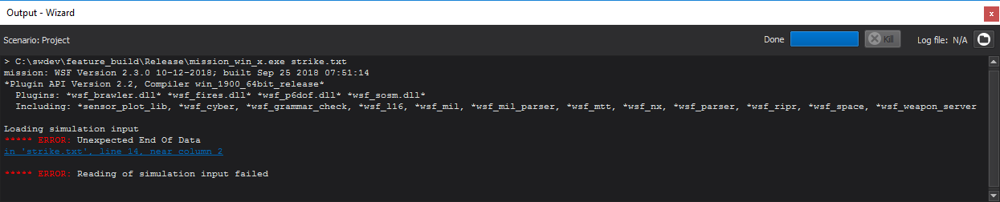

.. ****************************************************************************
.. CUI
..
.. The Advanced Framework for Simulation, Integration, and Modeling (AFSIM)
..
.. The use, dissemination or disclosure of data in this file is subject to
.. limitation or restriction. See accompanying README and LICENSE for details.
.. ****************************************************************************

Output - Wizard
===============

The **Output** window is accessible from the View menu. It appears as a tab in the :ref:`Output Panel <Wizard_Main_Window.OutputPanel>`

The output from running the scenario is displayed in this window. If an error is found in the input file, a link to the error location will appear. Clicking the link will open the file and jump to the error location. While the scenario is running, the **Kill** button may be used to abort execution.

The number of lines of output in the window is limited. For scenarios with a lot of output, there is an ability to log the output to a file. You may specify a log file by clicking the folder icon next to the "Log file" label.

.. include:: ../wkf_plugin/wkf_log_console_prefs.txt
