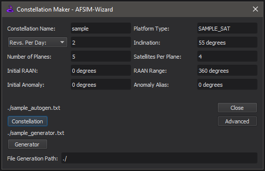

.. ****************************************************************************
.. CUI
..
.. The Advanced Framework for Simulation, Integration, and Modeling (AFSIM)
..
.. The use, dissemination or disclosure of data in this file is subject to
.. limitation or restriction. See accompanying README and LICENSE for details.
.. ****************************************************************************

Constellation Maker - Wizard
----------------------------

The **Constellation Maker** is a tool for automatically generating the input
for a constellation of satellites. See also :class:`WsfConstellationMaker`
which provides a scripted version of this capability.

The constellations generated by this tool are organized into a set of orbital
planes. Each plane will contain a given number of satellites, each with the
same orbit, but at different locations (different anomaly values) on that
orbit. The full set of options that control the details of the satellites'
orbits are explained below.

The constellation maker operates in two modes. In the first, the options
provided in the Constellation Maker dialog will be used to generate an
input file containing platforms for each member of the constellation. This
output is generated using the 'Constellation' button at the bottom of the
dialog. In the second, the options provided to the Constellation Maker are
used to generate a script file that will generate the file. This allows for
further customization of the constellations by modifying the generated
script before it is run to create the input file. The option to create a
generator script is exposed by selecting 'Advanced'. The script produced
by the Constellation Maker contains comments with instructions about what can
be safely modified.

Files generated by the Constellation Maker contain a comment block with the
options used to generate the file. These comments should not be modified,
because they may be overwritten if the Constellation Maker is re-run. Also,
when the Constellation Maker is selected, the active file in the editor is
scanned for this comment block, and the options loaded into the dialog to make
it easy to modify existing constellations or generators. If the active
file does not contain such a comment block, the dialog will instead use the
most recent set of options entered.

Options
=======

The following options specify the details of the generated constellation. Units
must be provided for those values that require them. The input field will
display text in red if the input does not have correct units.

**Constellation Name**

This gives the name of the constellation. The generated platforms will have a
name of the form <name>_<plane>_<satellite>. So the 4th satellite in the second
plane of the 'sample' constellation will have the name 'sample_1_3'. Note that
the plane and satellite numbers begin at 0. This option also impacts the
name of the generated file. As this field is modified, the name of the
file that will be generated is shown above the 'Constellation' and 'Generator'
buttons.

**Platform Type**

This will set the type of the generated platform. This type can be any
platform type defined elsewhere. For the generated input files to work,
that platform type should contain a :model:`WSF_SPACE_MOVER`.

**Orbit Size**

The size of the orbit is specified using one of four equivalent options:
Altitude, Semi-major axis, Period, or Revolutions per Day. Selecting a
different input method for the orbit size will automatically convert the
previously selected input value into its equivalent for the newly selected
input method. For whichever input method is selected, Constellation Maker will
only allow the orbit to have an equivalent altitude of at least 100 km.

* **Altitude**: This will set the periapsis (and apoapsis, the orbit is circular) altitude of the orbit.

* **Semi-major Axis**: This will set the semi-major axis of the the orbit.

* **Period**: This will set the period of the orbit.

* **Revs. Per Day**: This will set the number of revolutions per day for the orbit.

**Inclination**

This will set the inclination of the orbit. This value must be
in the range [0.0, 180.0] degrees.

**Number of Planes**

This will set the number of orbital planes for the constellation. This value
is constrained to be in the range [1, 360].

**Satellites Per Plane**

This will set the number of satellites per orbital plane. This value must be
in the range [1, 360].

**Initial RAAN**

This sets the Right Ascension of the Ascending Node for the first orbital
plane. This value must be in the range [0.0, 360.0) degrees.

**RAAN Range**

This sets the range over which the remaining planes are distributed. This is
a range measured from the initial RAAN value. For example, if the initial RAAN
value is 20 deg, and the range is 180 degrees, the RAAN values of the orbital
planes will be spread evenly over the range from 20 to 200 degrees. This value
must be in the range [0.0, 360.0] degrees.

**Initial Anomaly**

This sets the anomaly value of the first satellite on the orbital plane. This
value must be in the range [0.0, 360.0) degrees.

**Anomaly Alias**

This sets the offset to the first satellite on one orbital plane from the
first satellite on the previous orbital plane. For example, an alias of
15 degrees means that the satellites on the second plane will be 15 degrees
farther along the orbit than their counterparts on the first plane. This value
must be in the range [0.0, 360.0) degrees.

**File Generation Path**

This sets the path to the generated files. As this value is changed, the
labels above the 'Constellation' and 'Generator' action buttons are updated to
indicate the location of any generated files.

Controls
========

The Constellation Maker can be activated in the Tools menu, or from the context
menu in an editor that is displaying a file generated by the Constellation
Maker.

The following describes the controls on the Constellation Maker.

**Constellation**

Generate a constellation. The name of the generated input file appears above
this button. Invoking this action will not close the Constellation Maker.

**Close**

Close the Constellation Maker.

**Advanced**

Toggle additional options and controls.

**Generator**

Generate an input file with a script that will generate the constellation. This
mode of operation allows for customization of the generated platforms using the
generated script. The name of the generated input file appears about this
button. Invoking this action will not close the Constellation Maker.

Input Conjunction
=================

If the selected parameters for the constellation would create a constellation
that would suffer a conjunction between the members of the constellation, a
warning will be displayed in the Constellation Maker interface.

.. image:: ../images/wiz_constellation_maker_conjunction_warning.png
