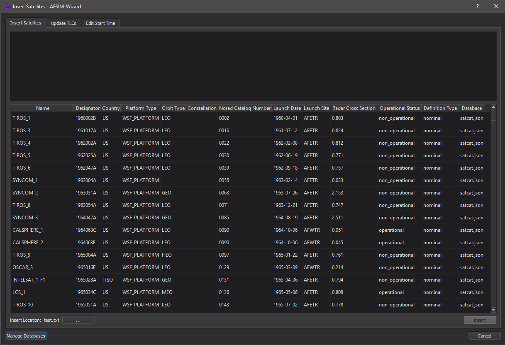
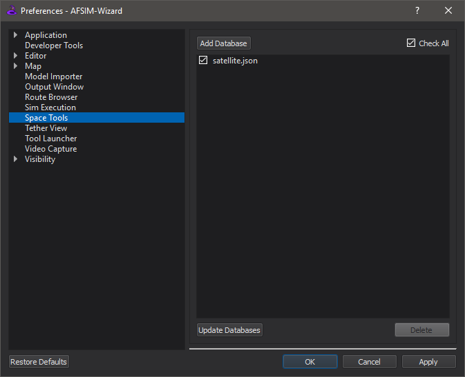

.. ****************************************************************************
.. CUI
..
.. The Advanced Framework for Simulation, Integration, and Modeling (AFSIM)
..
.. The use, dissemination or disclosure of data in this file is subject to
.. limitation or restriction. See accompanying README and LICENSE for details.
.. ****************************************************************************

Satellite Inserter - Wizard
---------------------------
.. contents::
   :local:
   :depth: 1

Overview
========

The Satellite Inserter is a part of the Space Tools plugin that allows the user to insert satellite definitions into scenarios, update satellite two line elements (TLEs), and manage the start time/date/epoch based on existing space platforms. The Satellite Inserter is accessible from Tools->Satellite Inserter, or by right clicking on an editor and selecting "Insert Satellites".

Insert Satellites Tab
=====================

The "Insert Satellites" tab is where you can insert available satellites into the scenario. The available satellites are in the lower protion of the dialog. Clicking on a column's header will sort the column in ascending order, then clicking it again will sort it in descending order. To select multiple items, hold the Ctrl button and click on the desired rows, or hold Shift and select the last file to have grouped satellites selected. Pressing Ctrl + A will select all satellites matching the current filter. Once the desired satellites are selected, click the "Insert" button. The satellite definitions, along with any necessary include files, will be inserted at the end of the insert location (shown at the bottom left of the tool). The insert location can be changed by clicking the "..." button. Once the Insert button is clicked, it will be disabled until new satellites are selected to be inserted. The file at the insert location will also be opened and shown once this button is clicked. You can also change the location by right clicking on the desired editor and selecting "Insert Satellites".

.. note:: Only satellites with unique names will be inserted. If a platform with the same name already exists in the scenario, the satellite will not be inserted. If multiple satellites with the same name are selected to be inserted, only the first satellite will be inserted. Satellites with the same designators are allowed to be inserted. Warnings will be displayed if any of these situations occur.

The upper portion contains a list of filters. To add a filter, right click on the table cell to apply a filter to that cell's column. Right clicking on a filter allows the user to delete the filter-rule, or delete all filter-rules.  The user may also save or load a filter from here. Saved filters will be stored in the user preferences for application at a later time.

Databases
*********

The available satellite definitions are organized into JSON databases. These databases describe the satellites' attributes and are used to populate the tool. The user can manage their own JSON satellite databases from the Space Tools preferences located in Options->Preferences, or by clicking the "Manage Databases" button on the tool. 

The default databases, satellite.json and satcat.json, are located in the demos/satellite_demos directory. These databases point to the definitions in the demos/satellite_demos/satellites directories. The database, satcat.json, was created using data from Celes Trak's `SATCAT <https://www.celestrak.com/pub/satcat.txt>`_.

The minimum amount of data in the database must include a JSON array called "platforms". Each platform in this array must include at least a platform "name" and a "file" path where the definition is located. See the Database Format below.

Other data that can be entered are:

- platform_type
- designator
- country
- definition_type
- orbit_type
- constellation
- classification
- norad_catalog_number
- launch_date
- launch_site
- radar_cross_section
- operational_status

.. note:: The "file" path must be relative to the location of the JSON file.

.. note:: Visit `Celes Trak <https://www.celestrak.com/satcat/launchsites.php>`_ for a full list of launch_site descriptions.

To add a database, open Preferences and click "Space Tools", or click the "Mangage Databases" button on the lower left corner of the tool, then click "Add Database". This will open a file dialog to select a JSON file. Select the desired file(s) and click "Open" to add it. You can check or uncheck any of the added databases to add/remove it from the table. Click "Check All" once to check all added databases, and click again to uncheck all databases. Once the desired databases are checked, click "OK" or "Apply" to update the table.

If a database(s) is changed or removed while Wizard is open, click "Update Databases". Any deleted databases will disappear, and the existing databases will update.

To remove databases from preferences, select the ones that will be deleted and click "Delete" under the database list. All selected items will be removed.

.. note:: To help automate the process of creating databases, use make_satcat_database and convert_platforms_to_json found in the tools/misc directory.

Database Format
^^^^^^^^^^^^^^^

.. parsed-literal::

      ...
      {
         "platforms": [
            {
               "name": "Platform_Name_1",
               "platform_type": "PLATFORM_TYPE",
               "designator": "YYYYNNNAAA",
               "country": "Country_Name",
               "definition_type": ["nominal" | "tle"],
               "orbit_type": ["LEO" | "MEO" | "HEO" | "GEO"],
               "constellation": "Constellation_Name",
               "classification": "Classification_Level",
               "norad_catalog_number": "NNNN",
               "launch_date": "YYYY-MM-DD",
               "launch_site": "Launch_Site",
               "radar_cross_section": "NNNN",
               "operational_status": "Operational_Status",
               "file": ".\\relative\\path\\from\\JSON\\file\\to\\Platform_Name_1\\definition.txt"
            }
            ...
         ]
      }
      ...

Update TLEs Tab
===============

.. image:: ../images/wiz_satellite_inserter_tles.png

To update TLEs in a scenario, select the "Update TLEs" tab. In this tab, you can add/remove files that contain TLE updates. To add a TLE set file, click "Add TLE Set". Select the desired file(s) that contain the updated TLEs and select "Open" to add. Then check or uncheck files to determine which will be used to update the TLEs. Only checked files will be searched. Click the "Update TLEs" button to update the TLEs.

.. note:: TLEs will be updated by the TLE with the latest epoch over all input files.

To remove TLE set files, select the files that need to be removed and click "Remove" under the TLE set list. All selected files will be removed from the list.

For more information on TLEs, see :command:`Two Line Elements<WSF_SPACE_MOVER.orbit>`.

Example
*******

Consider a scenario that contains the following platforms:

.. parsed-literal::

   ...
   platform Platform1 WSF_PLATFORM
      ...
      add mover WSF_SPACE_MOVER
         orbit
            1 36287U 10001A   19093.96307495 -.00000292  00000-0  00000-0 0  9995
            2 36287   1.4396 352.0597 0001920 174.4823 152.2071  1.00274485 33783
         end_orbit
      end_mover
      ...
   end_platform
   platform Platform2 WSF_PLATFORM
      ...
      add mover WSF_SPACE_MOVER
         orbit
            1 36287U 10001A   19093.96307495 -.00000292  00000-0  00000-0 0  9996
            2 36287   1.4396 352.0597 0001920 174.4823 152.2071  1.00274485 33783
         end_orbit
      end_mover
      ...
   end_platform
   platform Platform3 WSF_PLATFORM
      ...
      add mover WSF_SPACE_MOVER
         orbit
            1 36828U 10036A   19093.49771867 -.00000164  00000-0  10000-3 0  9994
            2 36828  54.1489 187.1521 0078332 232.7902  69.4191  1.00287084 31827
         end_orbit
      end_mover
      ...
   end_platform
   ...

With update file:

.. parsed-literal::

      BEIDOU 3                
      1 36287U 10001A   19093.96307495 -.00000292  00000-0  00000-0 0  9997
      2 36287   1.4396 352.0597 0001920 174.4823 152.2071  1.00274485 33783
      BEIDOU 3_2                
      1 36287U 10001A   19092.96307495 -.00000292  00000-0  00000-0 0  9998
      2 00000   0.0000 000.0000 0000000 000.0000 000.0000  0.00000000 00000
      BEIDOU 4                
      1 36590U 10024A   19093.44858549 -.00000148  00000-0  00000+0 0  9992
      2 36590   1.5727  36.5332 0002254  40.6874 355.7867  1.00272495 32399
      BEIDOU 5                
      1 36828U 10036A   19093.49771867 -.00000164  00000-0  10000-3 0  9994
      2 36828  54.1489 187.1521 0078332 232.7902  69.4191  1.00287084 31827
      ...

In this example, Platform1 and Platform2 will be updated with the TLE from BEIDOU 3, and Platform3 will be updated with BEIDOU 5's TLE resulting in:

.. parsed-literal::

   ...
   platform Platform1 WSF_PLATFORM
      ...
      add mover WSF_SPACE_MOVER
         orbit
            BEIDOU 3
            1 36287U 10001A   19093.96307495 -.00000292  00000-0  00000-0 0  9997
            2 36287   1.4396 352.0597 0001920 174.4823 152.2071  1.00274485 33783
         end_orbit
      end_mover
      ...
   end_platform
   platform Platform2 WSF_PLATFORM
      ...
      add mover WSF_SPACE_MOVER
         orbit
            BEIDOU 3
            1 36287U 10001A   19093.96307495 -.00000292  00000-0  00000-0 0  9997
            2 36287   1.4396 352.0597 0001920 174.4823 152.2071  1.00274485 33783
         end_orbit
      end_mover
      ...
   end_platform
   platform Platform3 WSF_PLATFORM
      ...
      add mover WSF_SPACE_MOVER
         orbit
            BEIDOU 5
            1 36828U 10036A   19093.49771867 -.00000164  00000-0  10000-3 0  9994
            2 36828  54.1489 187.1521 0078332 232.7902  69.4191  1.00287084 31827
         end_orbit
      end_mover
      ...
   end_platform

Edit Start Time Tab
===================

.. image:: ../images/wiz_satellite_inserter_edit_start_time.png

The "Edit Start Time" tab gives you the capability to update the scenario start time based on existing space platforms. You can manually edit the time, date, or epoch, or choose from the following options: the current scenario time, latest epoch, or the current time (UTC time zone). Changing the time or date will update the epoch and vice versa. Selecting the arrow of the "Start Date" edit, opens a calendar for the user to click on the desired date. 

The latest epoch option selects the latest epoch of all space platforms defined in the scenario. The default epoch for a space platform is Jun 1 2003 at 12:00:00. If there are not any existing space platforms in the scenario, selecting this option will default to the current world time (UTC) or the current scenario time, whichever is later. 

Once the time is set, clicking "Update Start Time" will remove all uncommented instances of "start_time", "start_date", "start_epoch", and "start_time_now". Then, the new start date and time will be added at the end of the first startup file. Selecting the option "Set As Epoch" will add the start epoch instead of date and time. The tool will also add a comment showing the previous start date and time.
