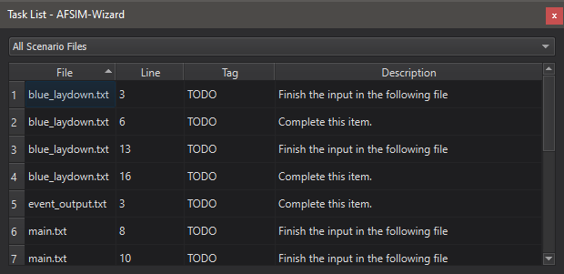
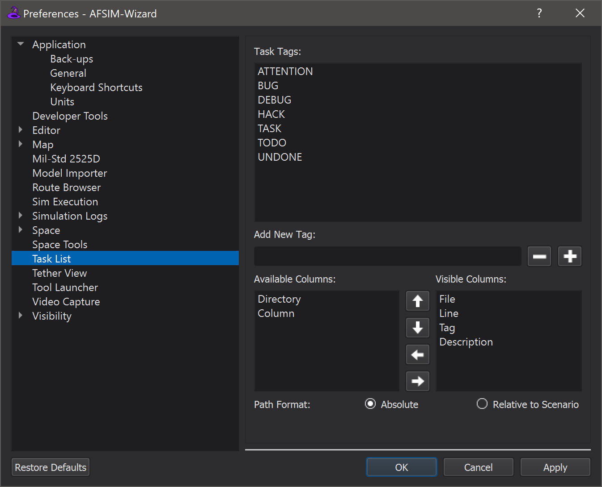
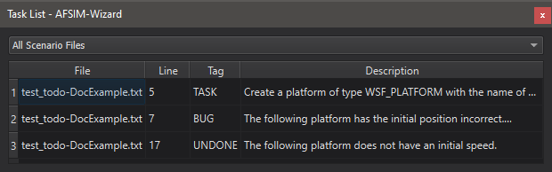

.. ****************************************************************************
.. CUI
..
.. The Advanced Framework for Simulation, Integration, and Modeling (AFSIM)
..
.. The use, dissemination or disclosure of data in this file is subject to
.. limitation or restriction. See accompanying README and LICENSE for details.
.. ****************************************************************************

Task List - Wizard
==================

Wizard's Task List gathers *tasks* from active project files, presents them in a unified list, aids navigation.
Tasks may serve as reminders or indicators of future work objectives.
The delimiting characters for a task are the same for :ref:`comments<docs/wsf_user_input_format:comments>`:  ``#``, ``//``, and ``/**/``.
The Task List is accessible from the View Menu.

Features
--------

Task Table
""""""""""

Tasks are presented in the Task Table, a fully customizable view of project tasks.
The following data columns are visible by default:

* File
* Line
* Tag
* Description

The following data columns are hidden by default and available via Task List Preferences:

* Column
* Directory

From the Task Table, the user may double-click a task to view it in the associated project file.

Task Filter
"""""""""""

The Task Filter allows the user to control task visibility by file context.
It contains the following filters:

* All Scenario Files
* Open Scenario Files
* Current Scenario File

Preferences
-----------

Configure the Task List via Options > Preferences > Task List.

Task Tags
"""""""""

Tags are keywords used by the Task List to locate tasks in a project.
To add a custom task tag, type the tag name in the Add New Tag field and click Add (+).
To remove a tag, select it in the tag list and click Remove (-).

Default tags include:

* ATTENTION
* BUG
* DEBUG
* HACK
* TASK
* TODO
* UNDONE

Column Order and Visibility
"""""""""""""""""""""""""""

Task Table data columns are fully customizable and may be configured using the arrow buttons, located between the column visibility lists.

* Up Arrow    - Swap the selected column with the preceding column
* Down Arrow  - Swap the selected column with the succeeding column
* Left Arrow  - Hide the selected visible column
* Right Arrow - Show the selected hidden column

Example
-------

Here is an example scenario with a few tasks::

   # This is a normal comment, not a task.

   # TASK Create a platform of type WSF_PLATFORM with the name of your choosing.

   /*
   BUG

   The following platform has the initial position incorrect.
   Change to 1n 2e.
   */
   platform p WSF_PLATFORM
      position 4n 3e
   end_platform

   // UNDONE The following platform does not have an initial speed.
   platform q WSF_PLATFORM
      add mover WSF_AIR_MOVER
         route
            position 0n 0e
            position 0n 1e
            position 1n 1e
            position 1n 0e
         end_route
      end_mover
   end_platform

Here is the Task List with the tasks from an example scenario:

