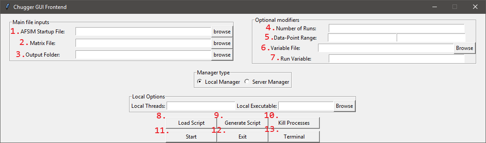
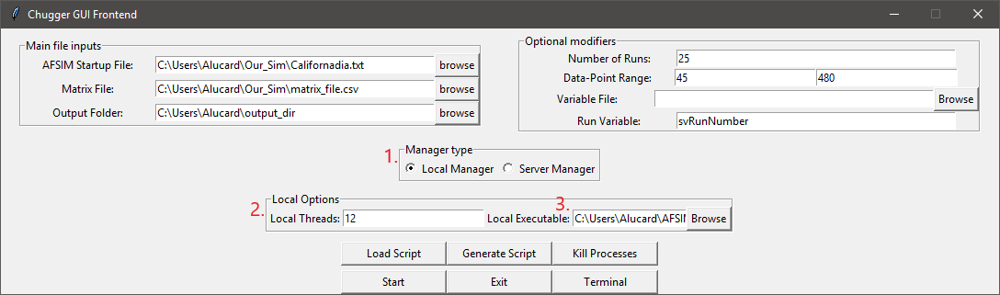
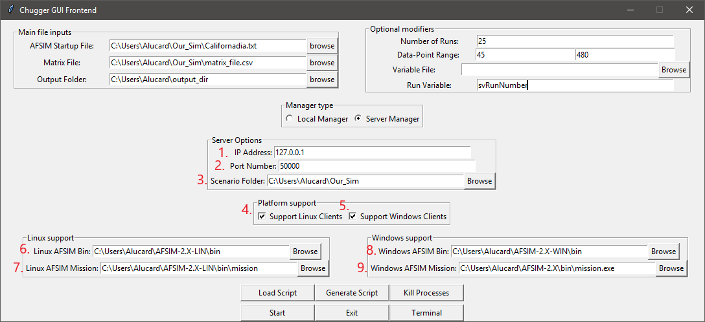
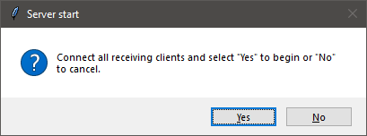
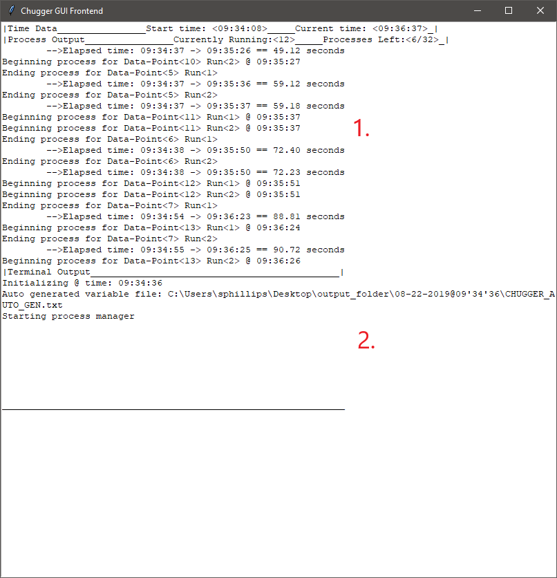
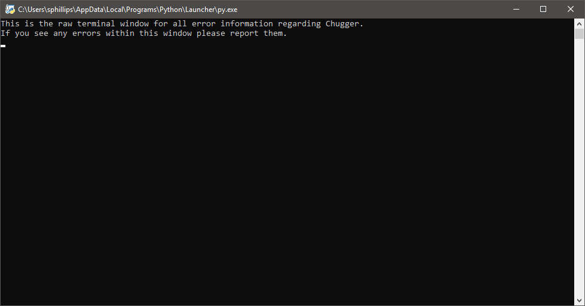
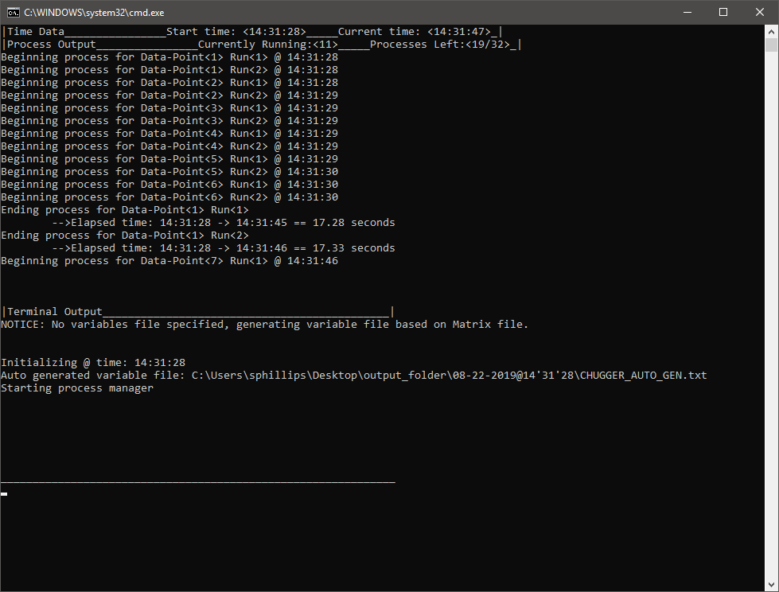
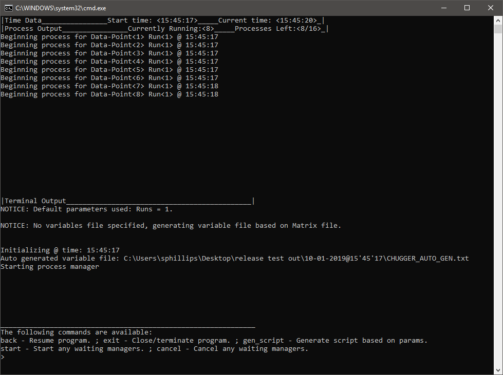
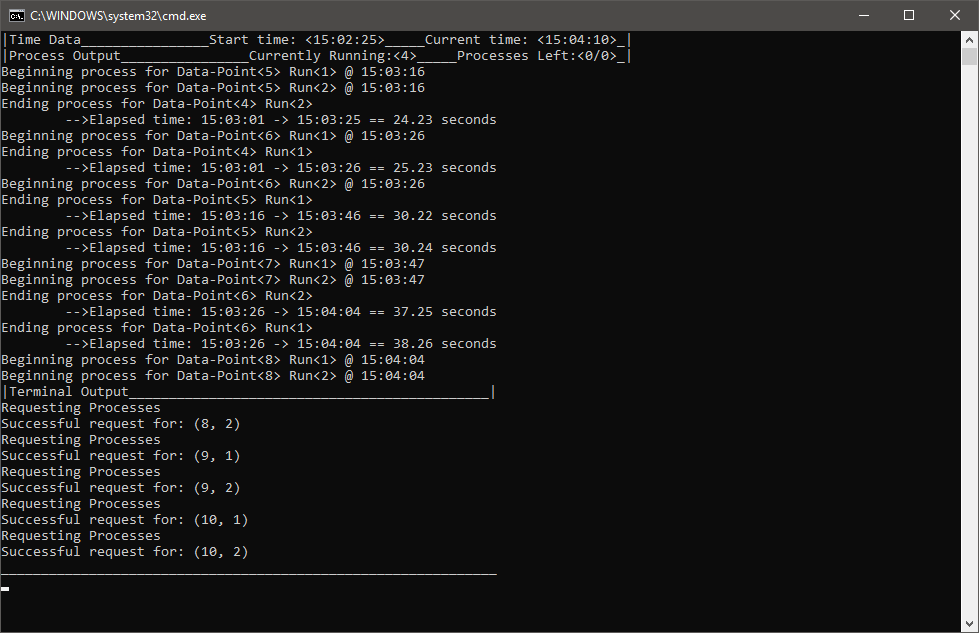

.. ****************************************************************************
.. CUI
..
.. The Advanced Framework for Simulation, Integration, and Modeling (AFSIM)
..
.. The use, dissemination or disclosure of data in this file is subject to
.. limitation or restriction. See accompanying README and LICENSE for details.
.. ****************************************************************************

Chugger v0.91 BETA Matrix Execution Script
------------------------------------------
Chugger is an execution script that will run a series of simulations based on data-points found within a matrix (DOE) file in a
\*.csv format. Chugger v0.91 features a Local Manager and a Server Manager. 
This script serves as an alternative to PIANO, and is compatible with Windows and Linux.

.. contents::
   :local:
   :depth: 1

Disclaimer
==========
Chugger is still in its development stage with more features and improvements to be added. **Use Chugger at your own risk**. This
script has been tested in multiple instances in both controlled and real-application runs, but it does not mean its completely bullet-proof.
Please report any bugs, glitches, and possible suggestions for what features should be added. 

Currently the Server Manager is in development and is subject to overhauls. It is advisable to use the Local Manager
instead.

Requirements
============
- **ChuggerServer.py** - For Local/Server Managements.
- **ChuggerClient.py** - For setting up Clients to connect to a running Server Manager.
- **PackSys.py** - Package system for communicating data between the ChuggerServer.py and ChuggerClient.py
- **Python 3.6.2** - Needed in order to run python scripts.

	.. note::
	   Earlier or later versions of Python have not been tested thoroughly for compatibility with Chugger v0.91. Only Python 3.6.2 has been
	   tested.

User Guide
==========
This page will also display what it would be like to setup a Manager through the GUI Frontend and the CMD Frontend. We will assume the following.

- Script is located in the directory **C:\\Users\\Alucard\\ChuggerServer.py**
- Simulation is located in the directory **C:\\Users\\Alucard\\Our_Sim**

	- Scenario file is **C:\\Users\\Alucard\\Our_Sim\\Californadia.txt**
	- Matrix file is **C:\\Users\\Alucard\\Our_Sim\\matrix_file.csv**
- Our output directory is located in the directory **C:\\Users\\Alucard\\output_dir**
- AFSIM Windows Binary is located in **C:\\Users\\Alucard\\AFSIM-2.X-WIN\\bin**

	- Our Windows mission executable is **C:\\Users\\Alucard\\AFSIM-2.X\\bin\\mission.exe**
- AFSIM Linux Binary is located in **C:\\Users\\Alucard\\AFSIM-2.X-LIN\\bin**

	- Our Linux mission executable is **C:\\Users\\Alucard\\AFSIM-2.X-LIN\\bin\\mission**

GUI (Graphical User Interface) Frontend Overview
================================================
Chugger will launch a GUI Frontend view by default when no arguments are passed in the console. It will also launch only on
platforms with Python installations that support the Tkinterface module.

.. note::
   Some Linux distributions and installations may not have Tkinterface as part of the Python 3.6+ installation.
   Chugger will fall back on the CMD Frontend if it fails to find the Tkinterface module.

The GUI Frontend Features three windows: the Control Window, The Terminal Window, and the Python Window.

GUI Frontend: Control Window
~~~~~~~~~~~~~~~~~~~~~~~~~~~~
The following image below is the window that first opens when the user opens the GUI Frontend.

1. **AFSIM Startup File**
	Specify the startup file for a given simulation. This file should ideally be located in the root directory of the simulation.
2. **Matrix File**
	Specify the matrix file to retrieve data-points from.

	.. note::
	   If the user is having issues with strings being parsed incorrectly when running any Manager. The user must be
	   sure that the matrix file containing values with quotations are excel compliant. Meaning that the value must have three quotations
	   Ex. \"\"\"sample_weapon\"\"\" when viewed in Notepad++. Previously, PIANO specific implementations required the user to modify the raw .csv file to have values
	   be surrounded by single quotation. Chugger will not parse these quoted values correctly if they only contain a single quotation.
3. **Output Folder**
	The folder directory where all Chugger and Simulation data will be stored. If it does not exist, Chugger will create one.

	.. note::	
	   This output directory will serve as a parent directory for all "timestamp" directories. 
	   Ex. C:\\Users\\Alucard\\output_dir\\08-15-2019\@15'16'45 such that 
	   "C:\\Users\\Alucard\\output_dir" is a pre-made directory, and "08-15-2019\@15'16'45" is a Chugger generated directory
4. **Number of Runs**
	Specify the number of runs each Data-point will be given during the Manager runtime.
5. **Data-Point Range**
	Specify the min and max value range for Data-points to run based on a given matrix file. This range must be valid within the matrix.
6. **Variable File**
	Specify a predefined file containing all variables to be used in a given simulation. The variable file is parsed using a Regular Expression
	within the Local Manager.

	.. parsed-literal:: r"(^\$define)[ \t]+([\w\d\.-]+)[ \t]+(\"?[\w\d\.\/-]*\"?[^#\n\/\/])"

	.. note::
	   By default Chugger will generate a variable file based on the first row of a matrix file.
7. **Run Variable**
	Specify a variable that Chugger to insert run seed values during each data-point run.

	.. note::
	   By default Chugger will use \"run_seed\" as its run variable. In order to utilize a different run_seed with each
	   data-point run, the user must either use "run_seed" or define their own using this entry.

8. **Load Script**
	Load a Chugger generated Script file that is either a Windows Batch file or a Linux Bash Script file (\*.bat or \*.sh).
	The script generated by Chugger will not only act as script file, but also as config file.

	.. note::
	   If the user generates their own config files using relative paths, Chugger will not attempt to get the real paths based
	   on the file structure of the user's system. This is subject to change in the future. It is suggested to make config files
	   through Chugger rather than by hand.
	
9. **Generate Script**
	Generate a script file that is based on the entry parameters specified by the user. The script file acts as both a config file and
	an executable file to bypass the need to use the GUI Frontend. This action can result in failure if the user didn't pass valid parameters.

10. **Kill Processes**
	Destroy any running processes associated with a Manager.

	.. warning::
	   This option should be used lightly when using the Server Manager. This current version of Chugger contains exception
	   handling for most Server disruptions and kill signals, and current testing shows proper file clean up in those instances. However,
	   it can not be assured that proper cleanup of simulation data on remote machines will occur in every possible situation.

	.. warning::
	   If the user kills a Local Manager during runtime, the information generated will remain on the Local system. However, if any Server Manager
	   and Clients are killed during runtime successfully, that information will be deleted. Currently there are some exception events that may occur
	   to prevent this clean up. 
11. **Start**
	Launch a Manager based on the entries passed by the user. This action can result in failure if the user didn't pass valid parameters.
12. **Exit**
	Exit the script. This action will also kill any running Managers.
13. **Terminal**
	This opens the Terminal window if the user accidentally closes it.

.. note::
   If the user attempts to start a Manager or generate a script that does not satisfy all the requirements to launch a manger, the user will be
   prompted with a error message indicating what cause the error notification. Below is an example of a error message.

	.. image:: ../images/Chugger_Sample_Error.png

.. note::
   If the user launches a Manager with or without certain values (mainly optional entries), the user will be given a notice regarding what default
   value or information was used in place. This does not indicate a failed launched Manager, it merely serves as a notice to the user of certain
   Manager characteristics to be aware of. Below is an example of a notice message.

    .. image:: ../images/Chugger_Sample_Notice.png

GUI Frontend: Control Window - Local Manager
~~~~~~~~~~~~~~~~~~~~~~~~~~~~~~~~~~~~~~~~~~~~
The following will present the options available for launching a Local Manager.

1. **Local Manager**
	Option to indicate that the user wishes to launch a Local Manager. Selecting this option will prompt the required options needed
	to successfully launch a Local Manager.
2. **Local Threads**
	Entry to indicate the number of threads the user wishes to have run concurrently on a given local CPU.

	.. note::
	   If the user specifies the value that is equal to the number of
	   threads offered by the user's CPU. The responsiveness of the user's computer will decrease.
	   It is advisable to limit the amount of threads to 1 less than the maximum offered.
3. **Local Executable**
	Indicate the executable file to be used to run the given simulation with.

	.. note::
	   The AFSIM version tested with Chugger are versions 2.4 and 2.3. However, previous versions
	   should be compatible.

GUI Frontend: Control Window - Server Manager
~~~~~~~~~~~~~~~~~~~~~~~~~~~~~~~~~~~~~~~~~~~~~
The following will present the options available for launching Server Manager.

1. **IP Address**
	The value specified will be the Server Manager’s address for which Clients will connect to.
2. **Port Number**
	The value specified will be the Server Manager's port number for which Clients will connect to.
3. **Scenario Folder**
	The directory containing all required files for running the user's simulation.
4. **Support Linux Clients**
	Specifies that the Server will be open to Clients on Linux based Operating Systems.

	.. note::
	   In order to serve Linux Clients, the user must have binaries for the AFSIM Linux distribution.
5. **Support Windows Clients**
	Specifies that the Server will be open to Clients on Windows based Operating Systems.

	.. note::
	   In order to serve Windows Clients, the user must have binaries for the AFSIM Windows distribution.
6. **Linux AFSIM Bin**
	The binary directory containing the Linux mission executable.
7. **Linux AFSIM Mission**
	The executable that will be used by Clients on Linux based Operating Systems.
8. **Windows AFSIM Bin**
	The executable that will be used by Clients on Windows based Operating Systems.
9. **Windows AFSIM Mission**
	The binary directory containing the Windows mission executable.

.. note::
   The reason for packaging both the scenario folder and the binary folder of AFSIM is to allow for the Clients to have all the required files for executing the simulation remotely. 
   This implementation is heavily borrowed from PIANO’s method of Server execution. This implementation is subject to change in the future.

When the user is launching the Server, the following prompt will appear.

The user must connect all Clients during this instance in order to setup the Server Manager to establish a connection.

GUI Frontend: Terminal Window
~~~~~~~~~~~~~~~~~~~~~~~~~~~~~
The following image below displays a sample Terminal Window with an example run.

1. **Process Output**
	Output subsection that will output all process information.

2. **Terminal Output**
	Output subsection that will contain Any backend information regarding the data management.

.. note::
   Any information sent to this Terminal Window will be logged into .txt files for view after a given Manager finishes its runtime.

GUI Frontend: Python Window
~~~~~~~~~~~~~~~~~~~~~~~~~~~
This window is only open to allow for interchangeability between the CMD Frontend and GUI Frontend. The window also displays any error information.
This window can be disregarded or minimized.

.. warning::
   Exiting this Python Window will result in the immediate exiting of the script without any proper handling.

GUI Frontend: Client Side
~~~~~~~~~~~~~~~~~~~~~~~~~
Currently, the Client side version of Chugger (ChuggerClient.py) needed for remote connection does not feature a GUI Frontend.
This feature will be added to the Client side version of Chugger in future iterations.

CMD (Command) Frontend Overview
===============================
Chugger features a command-line parser that allows the user to pass a series of flags to control the creation of the Manager
and it's parameters. 

.. parsed-literal::
	Quick CMD Frontend Reference:  
	[-h] 
	[-startup] <file path> 			- Required
	[-matrix] <file path> 			- Required
	[-output] <file path> 			- Required
	[-local] 				- Required for Local Manager
	[-local_threads] <number of threads>	- Required for Local Manager
	[-local_exe] <file path>		- Required for Local Manager
	[-server]				- Required for Server Manager
	[-ip] < IPV4 address>			- Required for Server Manager
	[-port] <port number>			- Required for Server Manager
	[-scenario] <folder path>		- Required for Server Manager 
	[-linux]				- Required for Server Manager if supporting Linux
	[-linux_exe] <file path>		- Required for Server Manager if supporting Linux
	[-linux_binary] <folder path>	 	- Required for Server Manager if supporting Linux
	[-windows]				- Required for Server Manager if supporting Windows
	[-windows_exe] <file path>		- Required for Server Manager if supporting Windows
	[-windows_binary] <folder path> 	- Required for Server Manager if supporting Windows
	[-runs] <number of runs>		- Optional flag
	[-dp_range] <min_dp> <max_dp>		- Optional flag
	[-variables] <file path>		- Optional flag
	[-run_variable] <variable name>	 	- Optional flag

CMD Frontend: Required flags
~~~~~~~~~~~~~~~~~~~~~~~~~~~~
These flags are required by the script in order to setup the base management processes. 

	**-startup** <File Path>
		Specifies the startup file to be used to initialize the simulation.

	**-matrix** <File Path>
		Specifies the matrix file to be used to substitute values into the simulation
		prior to the run.

	.. note::
	   If the user is having issues with strings being parsed incorrectly when running any Execution Manager. The user must be
	   sure that the matrix file containing values with quotations are excel compliant. Meaning that the value must have three quotations
	   Ex. \"\"\"sample_weapon\"\"\" when viewed in Notepad++. Previously, PIANO specific implementations required the user to modify the raw .csv file to have values
	   be surrounded by single quotation. Chugger will not parse these quoted values correctly if they only contain a single quotation.
	..
	
	**-output** <Folder Path>
		Specifies the output directory that all execution data will be stored.

	.. note::	
	   This output directory will serve as a parent directory for all "timestamp" directories. 
	   Ex. C:\\Users\\Alucard\\output_dir\\08-15-2019\@15'16'45 such that 
	   "C:\\Users\\Alucard\\output_dir" is a pre-made directory, and "08-15-2019\@15'16'45" is a Chugger generated directory
	..

Our Command should look as follows given the flags above:
	.. parsed-literal::
		*C:\\Users\\Alucard\\ChuggerServer.py* **-startup** *C:\\Users\\Alucard\\Our_Sim\\Californadia.txt* **-matrix** *C:\\Users\\Alucard\\Our_Sim\\matrix_file.csv* **-output** *C:\\Users\\Alucard\\output_dir*
	..

CMD Frontend: Setting up a Local Manager
~~~~~~~~~~~~~~~~~~~~~~~~~~~~~~~~~~~~~~~~
The following are the flags required to setup a Local Manager using Chugger.

	**-local**
		This flag indicates that the user wishes to parse for Local Manager flags.

	.. note::
	   In order to setup a Local Manager, this flag is **REQUIRED** in order
	   to parse for the following remaining flags.

	**-local_threads** <Number of threads>
		The value specified next to this flag indicates the number of processes/threads the user wishes
		to run at any given time. This value is arbitrary and must be any literal value > 1.
	
	.. note::
	   If the user specifies the value using this flag that is equal to the number of
	   threads offered by the user's CPU. The responsiveness of the user's computer will decrease.
	   It is advisable to limit the amount of threads to 1 less than the maximum offered.

	**-local_exe** <File Path>
		The executable to be used to execute the given simulation startup and matrix file.

	.. note::
	   The version tested with Chugger are versions 2.4 and 2.3. However, previous versions
	   should be compatible.

Our Command should look as follows given if the user wishes to launch a Local Manager:
	.. parsed-literal::
		*C:\\Users\\Alucard\ChuggerServer.py* **-startup** *C:\\Users\\Alucard\\Our_Sim\\Californadia.txt* **-matrix** *C:\\Users\\Alucard\\Our_Sim\\matrix_file.csv* **-output** *C:\\Users\\Alucard\\output_dir* 
		**-local** **-local_threads** *12* **-local_exe** *C:\\Users\\Alucard\\AFSIM-2.X\\bin\\mission.exe*

CMD Frontend: Setting up a Server Manager
~~~~~~~~~~~~~~~~~~~~~~~~~~~~~~~~~~~~~~~~~
The following are the flags required to setup a Server Manager using Chugger.

	**-server**
		This flag indicates that the user wishes to parse for Server Manager flags.

	**-ip** <IPV4 Address>
		The value specified will be the Server Manager's address for which Clients will connect to.

	**-port** <Port Number>
		The value specified will be the Server Manager's port number for which Clients will connect to.

	**-scenario** <folder path>
		The directory containing all required files for running the user's simulation.

	**-linux**
		Specifies that the Server will be open to Clients on Linux based Operating Systems.

	.. note::
	   In order to serve Linux Clients, the user must have binaries for the AFSIM Linux distribution.
	
	**-linux_exe** <file path>
		The executable that will be used by Clients on Linux based Operating Systems.

	**-linux_binary** <folder path>
		The binary directory containing the Linux mission executable.

	**-windows**
		Specifies that the Server will be open to Clients on Windows based Operating Systems.
		
	.. note::
	   In order to serve Windows Clients, the user must have binaries for the AFSIM Windows distribution.

	**-windows_exe** <file path>
		The executable that will be used by Clients on Windows based Operating Systems.

	**-windows_binary** <folder path>
		The binary directory containing the Windows mission executable.

.. note::
   The reason for packaging both the scenario folder and the binary folder of AFSIM is to allow
   for the Clients to have all the required files for executing the simulation remotely. This
   implementation is heavily borrowed from PIANO's method of Server execution. This implementation
   is subject to change in the future.

Our command for setting up a Server Manager that supports Windows and Linux:
	.. parsed-literal::
		*C:\\Users\\Alucard\ChuggerServer.py* **-startup** *C:\\Users\\Alucard\\Our_Sim\\Californadia.txt* **-matrix** *C:\\Users\\Alucard\\Our_Sim\\matrix_file.csv* **-output** *C:\\Users\\Alucard\\output_dir* 
		**-server** **-ip** *127.0.0.1* **-port** *50000* **-scenario** *C:\\Users\\Alucard\\Our_Sim\\Californadia.txt* 
		**-linux** **-linux_exe** *C:\\Users\\Alucard\\AFSIM-2.X-LIN\\bin\\mission* **-linux_binary** *C:\\Users\\Alucard\\AFSIM-2.X-LIN\\bin* 
		**-windows** **-windows_exe** *C:\\Users\\Alucard\\AFSIM-2.X\\bin\\mission.exe* **-windows_binary** *C:\\Users\\Alucard\\AFSIM-2.X-WIN\\bin*

.. note::
   Under very specific circumstances should it be advisable to launch
   a complete Server Manager via CMD Frontend. It is **HIGHLY** recommended to create the command through the GUI
   Frontend and execute the batch script from the Chugger generated file.

CMD Frontend: Optional flags
~~~~~~~~~~~~~~~~~~~~~~~~~~~~
These flags are not directly required by Chugger, however they do influence the Managers in specific ways.

	**-runs** <number of runs>
		Controls the number of simulation runs each data-point value in a give matrix is given. Value must be greater than 0.

	**-dp_range** <min_dp> <max_dp>
		Specify the range of data-points in a given matrix to run through the Managers. Values must be valid in the range specified in the matrix.

	**-variables** <file path>
		A predefined variable file containing all defined variables that will be used in each Simulation run. The variable file is parsed using a Regular Expression.

	.. parsed-literal:: r"(^\$define)[ \t]+([\w\d\.-]+)[ \t]+(\"?[\w\d\.\/-]*\"?[^#\n\/\/])"

	.. note::
	   Chugger will generate a predefined variable file by default based on the first row of a matrix file.
	
	**-run_variable** <variable name>
	   A variable name used in the simulation that will be used by the "random_seed" command.

	.. note::
	   By default Chugger will use "run_seed" as the variable seed. Each run of a given data-point will be given
	   a different run value via the variable name "run_seed" to be used in the Simulation. The user can change this to "svRunNumber" for previously
	   PIANO specific implementations.

CMD Frontend: Interacting with the Terminal
~~~~~~~~~~~~~~~~~~~~~~~~~~~~~~~~~~~~~~~~~~~
The CMD Frontend offers a method of specifying commands to the Chugger script. These options mirror what is available on the GUI Frontend.
Below is an example of a CMD Frontend window

CMD Frontend mirrors exactly with what is shown via GUI Frontend's Terminal Window. This is on purpose.
Below is an example of options available to the user in the CMD Frontend.

The user can open up the terminal input by pressing the **"enter"** key on their keyboard.

.. note::
   This also has the side effect of pausing the Local Manager. This is an unintended side effect
   of a remnant implementation of the version prior. Plans to add this pause effect to the GUI
   Frontend is being planned.
..

	**back**
		This cancels the user input and resumes the script.

	**exit**
		Kills any running Managers and exits the CMD Frontend.

	**gen_script**
		Generates a script/config file based on the parameters passed by the user.

	**start**
		Launches any Managers that are waiting for user input to begin processing.

		.. note::
			This option is currently only being used by the Server Manager, this
			does not have any effect on the Local Manager.

	**cancel**
		Cancels any Manager that is waiting for user input to begin processing.

		.. note::
			This option is currently only being used by the Server Manager, this
			does not have any effect on the Local Manager.

	

.. note::
   Currently there is not an option to relaunch a Manager in the CMD Frontend unlike the GUI Frontend. The user must restart the application with arguments in order
   to relaunch the Manager. 

CMD Frontend: Client Side
~~~~~~~~~~~~~~~~~~~~~~~~~
The Client side version of Chugger utilizes most of what is featured in the CMD Frontend from the Server side version.

The current implementation within the Client side version of Chugger is highly stripped down, however it will still display running
processes and initialization times.

.. note::
   This section of the Chugger script is still being developed. A more fleshed out implementation comparable to the Server side version
   is being planned.

.. warning::
   Currently, there is no ability for the user to interact with the CMD Frontend of the Client side version. The only way to shutdown the Client
   the user must kill the Server Manager, let the distribution finish, or end the Client through a Task Manager program.

CMD Frontend: Client Side flags
~~~~~~~~~~~~~~~~~~~~~~~~~~~~~~~
Since the Client side version of Chugger only supports the CMD Frontend, flags are used to control the initialization of the Client
Manager.

.. parsed-literal:: 
	Quick Client CMD Frontend Reference:
	 [-h] 
	 [--ip_address] <IPV4 address>		- Required flag
	 [--port_number] <port number>		- Required flag
	 [--output_folder] <output folder>	- Required flag
	 [--threads] <threads>			- Optional flag. Default = 1
..

	**--ip_address** or **-ip**
		Specify the IPV4 address that the Server host is established on.

	**--port_number** or **-port**
		Specify the port number that the Server host is established on.

	**--output_folder** or **-out**
		The output location for all simulation data.

	**--threads** or **-thrd**
		The number of threads to keep running concurrently at a time.

.. note::
	The CMD Frontend for Clients side Chugger features shorthand flags for parsing. This is not featured
	in the CMD Frontend for Server side Chugger.
